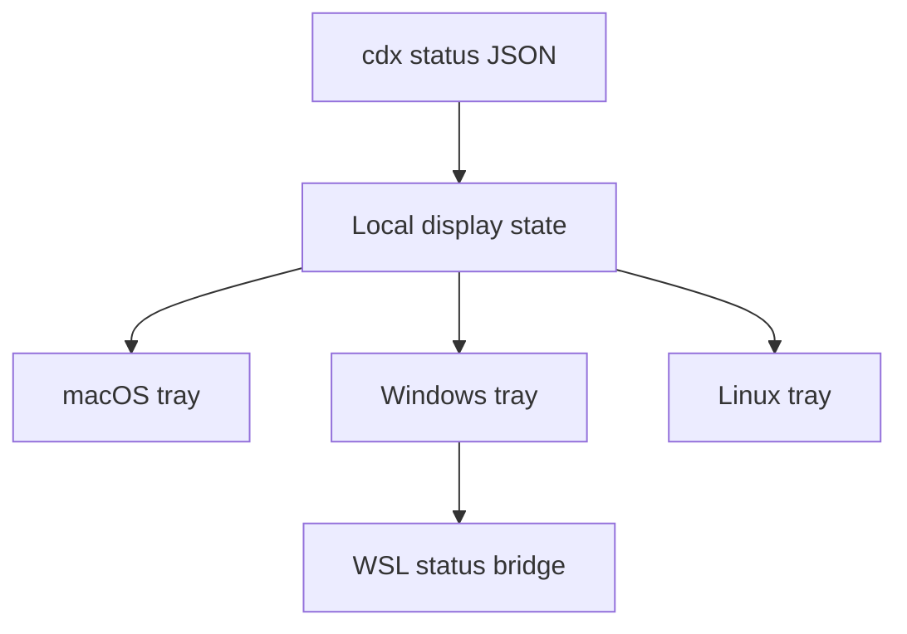

## prod_024_cdx_tray_usage_monitor - CDX tray usage monitor
> Date: 2026-08-10
> Status: Proposed
> Related request: `req_035_add_an_optional_cross_platform_cdx_tray_usage_monitor`
> Related backlog: `item_079_define_the_minimal_tray_status_contract_and_cdx_command_surface`, `item_080_build_native_tray_companions_for_macos_and_windows_plus_wsl`, `item_081_add_linux_tray_support_and_explicit_release_asset_installation`
> Related task: `task_046_orchestrate_the_optional_cross_platform_cdx_tray_usage_monitor`
> Related architecture: `adr_005_cdx_tray_runtime_and_companion_transport_boundary`
> Reminder: Update status, linked refs, scope, decisions, success signals, and open questions when you edit this doc.
> Indicators reviewed: 2026-08-10 20:01:56

# Overview
Provide an optional native system-tray companion that turns existing CDX status data into a glanceable usage indicator across desktop operating systems.

# Goals
- Make remaining CDX capacity and reset timing visible without opening a terminal.
- Reuse CDX status as the only source of usage truth.
- Support macOS, Windows, Windows plus WSL, and practical Linux tray environments.
- Keep tray installation explicit, removable, and independent from the normal CLI runtime.
- Update an installed tray companion only when the user explicitly updates CDX, keeping both components on the same release.
- Ship a useful v1 with a free self-signed identity before investing in commercial distribution infrastructure.

# Non-goals
- No account authentication, remote service, telemetry, cloud synchronization, or quota recalculation.
- No app store publishing, Developer ID signing, macOS notarization, Windows SmartScreen reputation work, or independent background tray self-update in v1.
- No browser download or .dmg for the macOS companion. Installation goes through cdx tray install, which is what keeps the bundle out of quarantine.
- No replacement GUI for the CDX CLI, session launcher, or Logics viewer.
- No guarantee for Linux desktops without a supported StatusNotifier or system-tray implementation.
- No automatic installation, startup registration, or modification of host settings without an explicit tray install operation.

# Scope and guardrails
- In: an optional native companion showing CDX capacity in the system tray on macOS, native Windows, Windows hosting WSL, and Linux desktops exposing a StatusNotifierItem watcher.
- Out: any change to how quota is computed, any provider call from the companion, and any behaviour change for users who never install the tray.
- Guardrail: installing CDX must never install, start, or register the tray. Every tray effect follows an explicit cdx tray command.

# Key product decisions
- The tray is a cache consumer, not a data source. It reads the snapshot CDX already maintains and never probes a provider on its own schedule, because a background probe would race the Codex auth lock and can invalidate a rotating OAuth refresh token.
- Freshness is part of the product, not an error path. The tray shows cached, stale, unknown, and not-refreshable-while-a-session-runs as first-class states, because a live probe cannot succeed while an interactive session holds the auth lock.
- The closed icon carries urgency only. Accounts, sessions, and quota figures appear only after the user opens the menu.
- Capacity state is carried by the glyph, not by a tint. The macOS menu bar icon is a monochrome template that the system inverts per theme, so colour is not available there and must not be the mechanism anywhere; the mockups' tinted macOS icon no longer describes the intended rendering.
- The companion is a separate artifact with its own release asset. The CLI keeps its single runtime dependency, and a version difference between the two degrades gracefully instead of forcing a lockstep upgrade.

# Success signals
- Remaining capacity and reset timing can be read at a glance without opening a terminal, in the states the tray can honestly report.
- Installing or removing the tray leaves no trace beyond what cdx tray recorded, verified by uninstall on the managed hosts.
- The tray never triggers a provider probe on a timer, verified by test rather than by inspection.
- A CDX upgrade never leaves a working tray broken or silent.

# Open questions
- Whether the macOS notification grant survives a companion update under a self-signed identity. The answer comes from the managed macOS smoke run, and the fallback is osascript delivery without the CDX icon rather than buying a certificate.

# References
- Product back-reference: `req_035_add_an_optional_cross_platform_cdx_tray_usage_monitor`
- Task back-reference: `task_046_orchestrate_the_optional_cross_platform_cdx_tray_usage_monitor`
