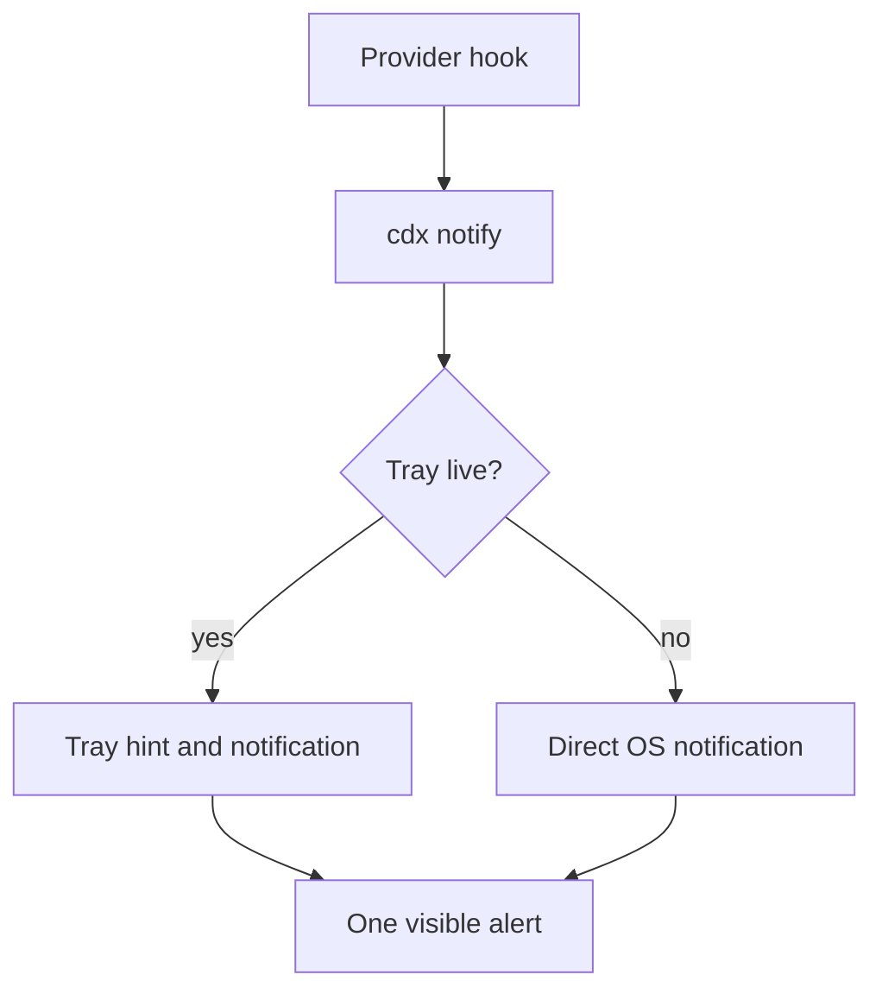

## prod_025_tray_aware_agent_alerts - Tray-aware agent alerts
> Date: 2026-08-10
> Status: Proposed
> Related request: `req_036_route_cdx_agent_alerts_through_an_active_tray_companion`
> Related backlog: `item_082_deliver_agent_hook_events_through_the_active_cdx_tray_with_safe_fallback`
> Related task: `task_047_orchestrate_tray_aware_cdx_agent_alert_delivery`
> Related architecture: (none yet)
> Reminder: Update status, linked refs, scope, decisions, success signals, and open questions when you edit this doc.
> Indicators reviewed: 2026-08-10 13:22:19

# Overview
Let the optional CDX tray companion own visual delivery of agent completion and attention alerts while retaining the existing direct notification path as a non-blocking fallback.

# Goals
- Give an active tray a visible, actionable hint when an agent finishes or needs attention.
- Deliver exactly one user-facing alert for each hook event.
- Preserve current hook safety, opt-in preview privacy, and direct desktop notifications when the tray is absent.
- Support Windows-hosted WSL without relying on variable cross-boundary network topology.

# Non-goals
- No new provider hooks, remote notification service, cloud relay, account, telemetry, or LAN listener.
- No tray notification when agent alerts are disabled for the CDX session.
- No full assistant response, raw tool arguments, transcript content, or arbitrary hook payload stored in the event spool.
- No background self-update, second tray process, WSL GUI server, or requirement to enable mirrored networking.
- No replacement of the current direct-notification fallback when a usable tray is not active.

# Scope and guardrails
- In: making an active tray companion the single visible owner of agent completion and attention alerts, with the current direct desktop notification preserved as the fallback.
- Out: any change to provider hook schemas, notification opt-in defaults, or the behaviour a user without a tray sees today.
- Guardrail: a hook must never wait on, fail because of, or be slowed by the tray. Every delivery decision is best-effort and non-blocking.

# Key product decisions
- One event, one visible notification. When a fresh tray heartbeat exists the tray owns delivery; otherwise the existing direct path runs unchanged. There is no state in which both fire.
- Delivery is polled through a local spool, not pushed over a socket, because WSL localhost is directional in NAT mode and mirrored mode cannot be assumed on a user machine.
- Latency is a stated product property, not an accident: at most one poll period, 30 seconds natively and 60 seconds across the Windows-to-WSL boundary.
- The tray receives only the already-composed title and body. Preview text stays governed by the existing per-session opt-in, and raw provider payload never reaches the spool.

# Success signals
- An agent finishing produces exactly one visible notification, whatever the tray state.
- Stopping or killing the tray restores direct notifications with no user action.
- No agent turn is ever delayed or failed by notification delivery.
- An idle machine with no enabled session shows no tray polling, and a stopped WSL distribution is not restarted by the tray.

# References
- Product back-reference: `req_036_route_cdx_agent_alerts_through_an_active_tray_companion`
- Task back-reference: `task_047_orchestrate_tray_aware_cdx_agent_alert_delivery`
