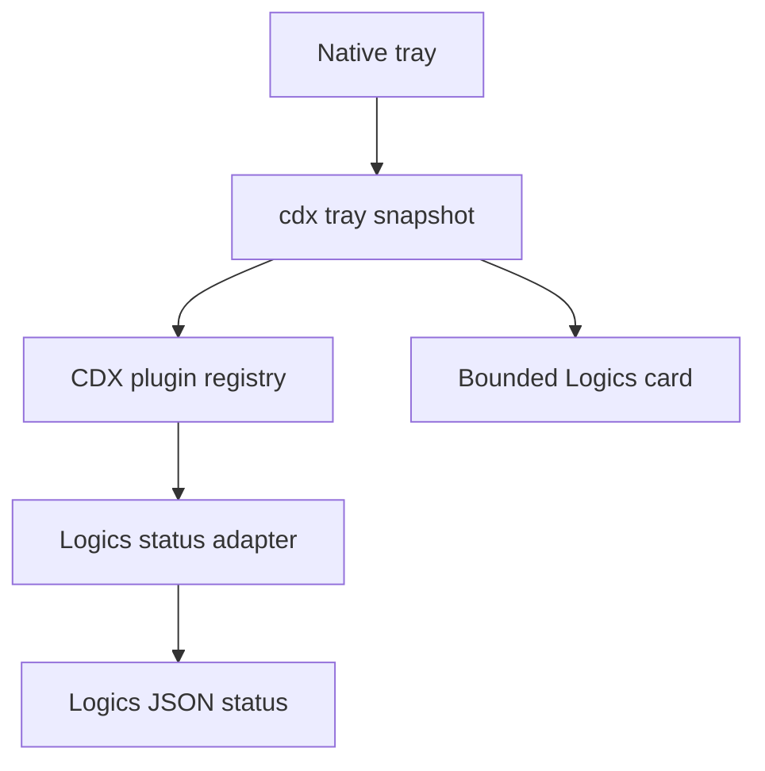

## prod_026_extensible_cdx_tray_with_a_first_party_logics_card - Extensible CDX tray with a first-party Logics card
> Date: 2026-08-10
> Status: Settled
> Related request: `req_037_add_a_first_party_logics_plugin_surface_to_the_cdx_tray`
> Related backlog: `item_083_add_the_cdx_tray_plugin_contract_and_built_in_logics_status_card`
> Related task: `task_048_orchestrate_the_first_party_logics_cdx_tray_plugin`
> Related architecture: (none yet)
> Reminder: Update status, linked refs, scope, decisions, success signals, and open questions when you edit this doc.
> Indicators reviewed: 2026-08-10 13:29:55

# Overview
Add one narrow, CDX-owned tray-plugin contract and use it to surface Logics workflow health in the existing tray menu when the local Logics manager is available.

# Goals
- Show Logics workflow health at a glance from the optional CDX tray.
- Keep the native tray independent from external tool paths and plugin implementation details.
- Ship the first-party adapter with cdx-manager while making it optional and reversible.
- Keep the v1 Logics menu to one count summary and two actionable rows, refreshed every 60 seconds or on demand.
- Establish only the minimum contract needed to add a second adapter later.

# Non-goals
- No plugin marketplace, remote catalog, dynamic download, arbitrary third-party code loading, or separate Logics tray package.
- No embedded Logics browser, workflow mutation, document parsing, background daemon, or persistent plugin process.
- No change to tray usage gauges, tray-aware agent alerts, Logics lifecycle semantics, or normal cdx status output.
- No guarantee that an unavailable or disabled Logics manager appears in the tray as an error.

# Scope and guardrails
- In: one narrow, versioned card contract owned by CDX, and one built-in Logics adapter shipped in this repository as its first and only consumer.
- Out: a marketplace, plugin discovery, downloaded plugin code, plugin processes inside the tray, and any Logics mutation from the tray.
- Guardrail: the tray never executes plugin code. CDX invokes the adapter, validates its output, and hands the companion one bounded card.

# Key product decisions
- One real plugin before a plugin platform. The contract stays deliberately small until a second adapter proves what generality is actually needed.
- The card is fixed in v1: one summary line, at most two rows, the first blocked document then the highest-priority ready task. No configurable layout.
- Read-only by construction. Rows open cdx view; nothing in the tray starts, finishes, or promotes a Logics doc.
- The adapter is opt-in and silent when logics-manager is absent, so the tray is never degraded by a tool the user does not have.
- The card rides the base tray snapshot and its existing refresh cadence, adding no second polling loop and no extra WSL interop call.

# Success signals
- A user with logics-manager sees what is blocked and what is next without opening a terminal or a browser.
- A user without logics-manager sees no error, no empty card, and no behaviour change.
- A slow, broken, or malformed adapter never degrades the quota tray itself.
- Adding the card costs no extra wsl.exe call per refresh on the Windows-to-WSL path.

# References
- Product back-reference: `item_083_add_the_cdx_tray_plugin_contract_and_built_in_logics_status_card`
- Task back-reference: `task_048_orchestrate_the_first_party_logics_cdx_tray_plugin`
