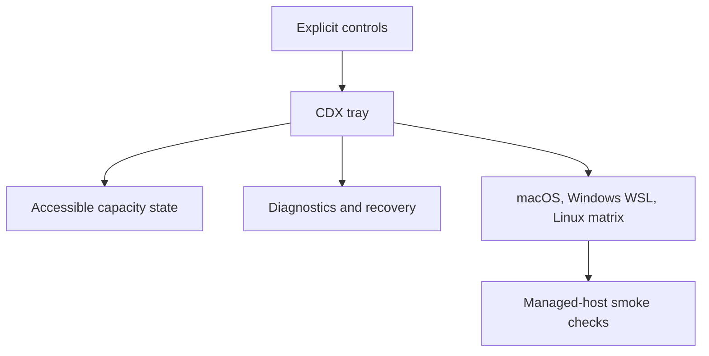

## prod_027_trustworthy_cdx_tray_operation - Trustworthy CDX tray operation
> Date: 2026-08-10
> Status: Proposed
> Related request: `req_038_harden_cdx_tray_lifecycle_clarity_and_platform_validation`
> Related backlog: `item_084_add_explicit_cdx_tray_lifecycle_capacity_privacy_and_recovery_controls`, `item_085_constrain_wsl_and_linux_tray_support_and_validate_it_on_real_hosts`
> Related task: `task_049_orchestrate_trustworthy_cdx_tray_operation_and_platform_validation`
> Related architecture: (none yet)
> Reminder: Update status, linked refs, scope, decisions, success signals, and open questions when you edit this doc.
> Indicators reviewed: 2026-08-10 13:36:21

# Overview
Make the CDX tray companion a quiet, explicit, accessible, and testable desktop utility across supported operating systems.

# Goals
- Keep launch, startup, update, and removal under direct user control.
- Offer one truthful glanceable capacity signal and clear diagnostics when it cannot be resolved.
- Support one configured WSL source and a documented Linux desktop matrix.
- Validate native behaviour on managed macOS and Windows plus WSL machines.

# Non-goals
- No automatic startup at installation, auto-update daemon, multiple simultaneous tray icons, WSL distribution aggregation, or remote fleet service.
- No bypass of Focus or Do Not Disturb, new quota toasts, telemetry, closed-icon sensitive details, or colour-only states.
- No promise of universal Linux desktop support or change to the tray alert and plugin feature scopes.

# Scope and guardrails
- In: the lifecycle, diagnostic, accessibility, privacy, and recovery controls that make the tray shippable, plus validation on real managed macOS and Windows-with-WSL hosts.
- Out: background self-update, automatic activation, cross-machine monitoring, and quota alerting.
- Guardrail: this is a release gate, not a later polish pass. No tray release ships without single-instance ownership, explicit startup control, and cdx tray doctor.

# Key product decisions
- Nothing starts by itself. Installing does not enable startup; autostart is a separate, explicit, reversible command.
- One instance owns the icon. A second launch reports the first rather than duplicating it.
- The icon shows the most constrained usable capacity, never an average, and never carries meaning in colour alone.
- Updates are staged: the replacement must start before the previous companion is retired, so a failed update leaves a working tray.
- Platform support is claimed only where it was tested, and capability is detected at runtime rather than inferred from a distribution name.

# Success signals
- A user who never asked for the tray never sees it start, register, or notify.
- Any failure state is explainable from cdx tray doctor alone, without reading logs or source.
- A failed or interrupted update never leaves the user without a working tray.
- The managed macOS and Windows-plus-Ubuntu-WSL smoke runs pass and record measured latency and poll cost.

# References
- Product back-reference: `req_038_harden_cdx_tray_lifecycle_clarity_and_platform_validation`
- Task back-reference: `task_049_orchestrate_trustworthy_cdx_tray_operation_and_platform_validation`
