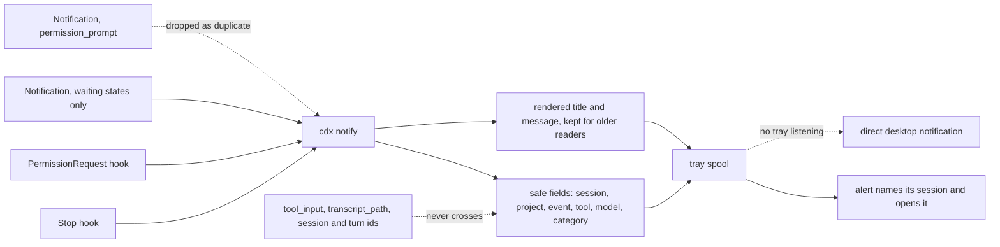

## prod_028_structured_actionable_tray_agent_alerts - Structured, actionable tray agent alerts
> Date: 2026-08-11
> Status: Settled
> Related request: `req_039_make_cdx_tray_agent_alerts_structured_and_actionable`
> Related backlog: `item_086_deliver_structured_private_hook_context_to_actionable_tray_alerts`
> Related task: `task_050_orchestrate_structured_actionable_cdx_tray_alerts`
> Related architecture: (none yet)
> Reminder: Update status, linked refs, scope, decisions, success signals, and open questions when you edit this doc.

# Overview
Give the active CDX tray the small structured context it needs to show useful completion and permission alerts, while retaining the existing direct-notification fallback and privacy defaults.

# Goals
- Show the session, project, and useful completion preview at a glance.
- Make permission alerts immediately identify the requested tool without exposing its arguments.
- Let a recent tray alert open its originating CDX session without parsing user-facing text.
- Keep Codex and Claude alerts semantically aligned and free of duplicate permission banners.

# Non-goals
- No transcript parsing, remote delivery, telemetry, persistent notification archive, or new global preference.
- No raw tool command, MCP arguments, session or turn identifier, or arbitrary hook payload in the spool, tray, or OS notification.
- No new tray process, networking protocol, notification backend, or change to the direct fallback path.
- No configurable notification templates, custom actions beyond opening the originating session, or model-generated summaries.

# Scope and guardrails
- In: scaffolded request, product, backlog, orchestration task, validation, and handoff context.
- Out: unrelated workflow docs and implementation of generated tasks.

# Key product decisions
- Use structured input as the source of truth for generated docs.
- Keep generated write paths local and repo-bounded.

# Success signals
- Generated docs pass lint and audit without broad manual rewrites.
- Context-pack output can be handed to an implementation agent directly.

# References
- Product back-reference: `item_086_deliver_structured_private_hook_context_to_actionable_tray_alerts`
- Task back-reference: `task_050_orchestrate_structured_actionable_cdx_tray_alerts`
