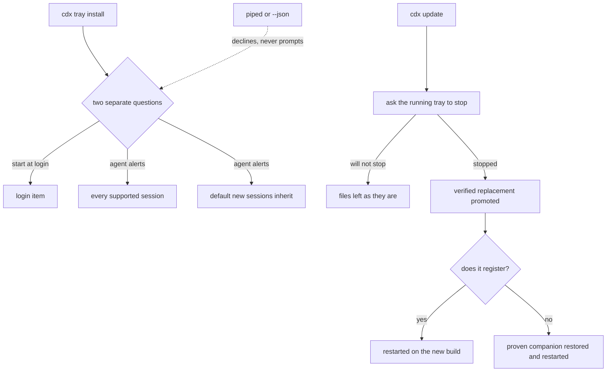

## prod_030_accepted_automatic_cdx_tray_experience - Accepted automatic CDX tray experience
> Date: 2026-08-11
> Status: Settled
> Related request: `req_041_make_accepted_cdx_tray_onboarding_and_updates_automatic`
> Related backlog: `item_088_add_consented_tray_onboarding_defaults_and_safe_running_companion_restart`
> Related task: `task_052_orchestrate_accepted_automatic_cdx_tray_onboarding_and_updates`
> Related architecture: (none yet)
> Reminder: Update status, linked refs, scope, decisions, success signals, and open questions when you edit this doc.

# Overview
Offer one explicit tray onboarding choice set, then keep installation, session alerts, and user-initiated companion updates automatic and recoverable.

# Goals
- Let a user accept autostart and agent alerts once during tray installation.
- Apply accepted alert intent to supported current and future sessions without touching unsupported providers.
- Keep a running tray current after a user-initiated CDX update without a manual restart step.
- Retain clear state, reversibility, provider hook trust, and safe rollback boundaries.

# Non-goals
- No silent consent, background update daemon, forced login item, or notification enablement before the user accepts it.
- No bypass of Codex hook trust, provider permission controls, system notification permission, or Focus and Do Not Disturb settings.
- No automatic tray launch after an update when the tray was not already running.
- No termination of unknown PIDs, external process manager, telemetry, remote update service, or change to checksum and staging verification.

# Scope and guardrails
- In: scaffolded request, product, backlog, orchestration task, validation, and handoff context.
- Out: unrelated workflow docs and implementation of generated tasks.

# Key product decisions
- Use structured input as the source of truth for generated docs.
- Keep generated write paths local and repo-bounded.

# Success signals
- Generated docs pass lint and audit without broad manual rewrites.
- Context-pack output can be handed to an implementation agent directly.

# References
- Product back-reference: `item_088_add_consented_tray_onboarding_defaults_and_safe_running_companion_restart`
- Task back-reference: `task_052_orchestrate_accepted_automatic_cdx_tray_onboarding_and_updates`
