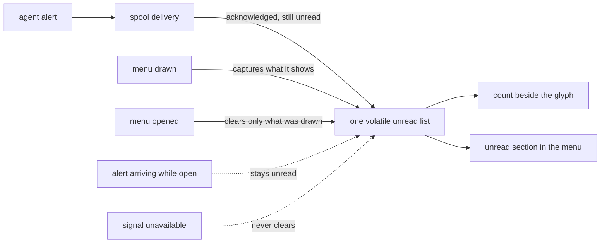

## prod_031_coherent_cdx_tray_unread_alerts - Coherent CDX tray unread alerts
> Date: 2026-08-11
> Status: Settled
> Related request: `req_042_synchronize_cdx_tray_alert_badges_with_menu_reading`
> Related backlog: `item_089_unify_tray_alert_marker_and_recent_alert_read_state`
> Related task: `task_053_orchestrate_coherent_cdx_tray_alert_read_state`
> Related architecture: (none yet)
> Reminder: Update status, linked refs, scope, decisions, success signals, and open questions when you edit this doc.

# Overview
Make one lightweight unread state drive the tray badge and recent-alert menu, with opening the tray as the sole read action.

# Goals
- Make the tray marker and recent-alert list agree on what remains unread.
- Let a user read alerts once from the menu without accumulating a permanent notification log.
- Preserve alerts that arrive during a consultation for the next one.
- Keep reliable delivery and crash recovery separate from ephemeral UI read state.

# Non-goals
- No persistent read archive, unread counter in CDX state, clear-history button, custom toast action, or OS-notification read receipt.
- No changes to provider hooks, alert payloads, tray spool format, acknowledgement protocol, mute preference, or direct notification fallback.
- No timeout-based approximation of reading and no automatic clearing merely because a toast was sent.

# Scope and guardrails
- In: scaffolded request, product, backlog, orchestration task, validation, and handoff context.
- Out: unrelated workflow docs and implementation of generated tasks.

# Key product decisions
- Use structured input as the source of truth for generated docs.
- Keep generated write paths local and repo-bounded.

# Success signals
- Generated docs pass lint and audit without broad manual rewrites.
- Context-pack output can be handed to an implementation agent directly.

# References
- Product back-reference: `item_089_unify_tray_alert_marker_and_recent_alert_read_state`
- Task back-reference: `task_053_orchestrate_coherent_cdx_tray_alert_read_state`
