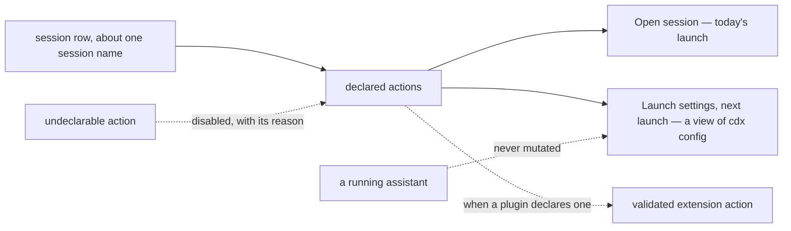

## prod_032_actionable_cdx_tray_session_controls - Actionable CDX tray session controls
> Date: 2026-08-11
> Status: Settled
> Related request: `req_043_make_cdx_tray_session_rows_actionable_without_misleading_live_settings`
> Related backlog: `item_090_add_an_explicit_capability_safe_action_submenu_to_every_tray_session_row`
> Related task: `task_054_orchestrate_actionable_and_truthful_cdx_tray_session_controls`
> Related architecture: (none yet)
> Reminder: Update status, linked refs, scope, decisions, success signals, and open questions when you edit this doc.

# Overview
Turn each capacity-first CDX tray row into a compact, explicit session control surface while preserving truthful boundaries between current-session actions and next-launch configuration.

# Goals
- Let users open the intended session or inspect its launch configuration from one unambiguous session submenu.
- Keep the capacity gauge, provider context, and global capacity ordering as the fast-scanning surface.
- Make action availability capability-driven and safely extensible for the existing Logics tray plugin contract.
- Prevent a tray menu from implying that launch-time settings can mutate a running assistant.

# Non-goals
- No custom cross-platform configuration editor, inline model picker, in-place working-directory change, terminal-title change, or automatic restart.
- No stop, kill, restart, rename, delete, authentication, or provider-account mutation from the first session submenu.
- No generic plugin marketplace, arbitrary plugin command strings, empty extension placeholders, or duplicate implementation of the Logics card owned by req_037.
- No change to quota collection, capacity ranking, alert delivery/read state, tray installation, or provider launch semantics.

# Scope and guardrails
- In: scaffolded request, product, backlog, orchestration task, validation, and handoff context.
- Out: unrelated workflow docs and implementation of generated tasks.

# Key product decisions
- Use structured input as the source of truth for generated docs.
- Keep generated write paths local and repo-bounded.

# Success signals
- Generated docs pass lint and audit without broad manual rewrites.
- Context-pack output can be handed to an implementation agent directly.

# References
- Product back-reference: `item_090_add_an_explicit_capability_safe_action_submenu_to_every_tray_session_row`
- Task back-reference: `task_054_orchestrate_actionable_and_truthful_cdx_tray_session_controls`
