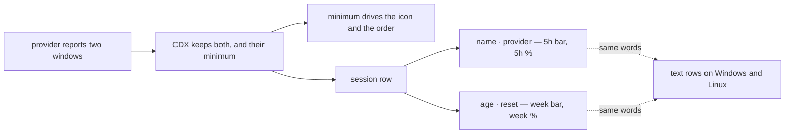

## prod_033_a_tray_session_row_that_answers_before_it_is_clicked - A tray session row that answers before it is clicked
> Date: 2026-08-11
> Status: Settled
> Related request: `req_046_show_the_whole_session_row_on_macos_including_both_limit_windows`
> Related backlog: `item_093_draw_freshness_and_reset_on_the_macos_session_row`
> Related task: `task_057_orchestrate_the_fuller_tray_session_row`
> Related architecture: (none yet)
> Reminder: Update status, linked refs, scope, decisions, success signals, and open questions when you edit this doc.

# Overview
Make the drawn macOS row carry everything the text rows carry, and let both limit windows be visible at once so the constrained one cannot hide behind the other.

# Goals
- Let a user judge a percentage without opening anything: how old it is, and when it resets.
- Show the five-hour and weekly windows together, so the one about to run out is the one that is seen.
- Keep the drawn row and the text rows saying the same things.

# Non-goals
- A configurable row layout, a chart, or history of past usage.
- New quota collection, new provider probes, or a change to refresh cadence.
- Drawing on Windows or Linux, which have no cell to draw into.

# Scope and guardrails
- In: scaffolded request, product, backlog, orchestration task, validation, and handoff context.
- Out: unrelated workflow docs and implementation of generated tasks.

# Key product decisions
- Use structured input as the source of truth for generated docs.
- Keep generated write paths local and repo-bounded.

# Success signals
- Generated docs pass lint and audit without broad manual rewrites.
- Context-pack output can be handed to an implementation agent directly.

# References
- Product back-reference: `item_093_draw_freshness_and_reset_on_the_macos_session_row`
- Task back-reference: `task_057_orchestrate_the_fuller_tray_session_row`
