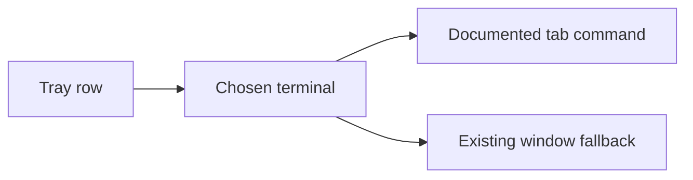

## prod_036_a_session_row_that_opens_where_you_already_are - A session row that opens where you already are
> Date: 2026-08-11
> Status: Settled
> Related request: `req_049_open_a_tab_rather_than_a_window_where_the_platform_documents_one`
> Related backlog: `item_097_open_a_tab_where_the_terminal_documents_how`
> Related task: `task_060_orchestrate_tabs_instead_of_windows`
> Related architecture: (none yet)
> Reminder: Update status, linked refs, scope, decisions, success signals, and open questions when you edit this doc.
> Indicators reviewed: 2026-08-11 14:24:12

# Overview
Open a tab in the terminal already in front of the operator, wherever the platform says how, and say plainly where it cannot.

# Goals
- Stop a row costing a window to arrange.
- Use each platform's own documented mechanism rather than a simulated keystroke.
- Keep the fallback silent and working.

# Non-goals
- Simulated keyboard input, Accessibility permissions, or anything that breaks when a dialog has focus.
- Arbitrary terminal flags, profiles, or working-directory control.
- Reusing a specific existing window or session beyond what a platform's own flag targets.

# Scope and guardrails
- In: scaffolded request, product, backlog, orchestration task, validation, and handoff context.
- Out: unrelated workflow docs and implementation of generated tasks.

# Key product decisions
- Use structured input as the source of truth for generated docs.
- Keep generated write paths local and repo-bounded.

# Success signals
- Generated docs pass lint and audit without broad manual rewrites.
- Context-pack output can be handed to an implementation agent directly.

# References
- Product back-reference: `item_097_open_a_tab_where_the_terminal_documents_how`
- Task back-reference: `task_060_orchestrate_tabs_instead_of_windows`
