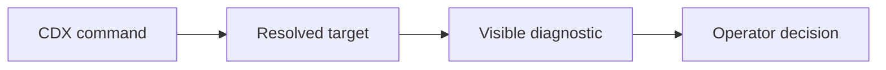

## prod_037_commands_that_name_what_they_are_about_to_touch - Commands that name what they are about to touch
> Date: 2026-08-11
> Status: Settled
> Related request: `req_050_say_which_installation_and_which_home_a_command_is_acting_on`
> Related backlog: `item_098_name_the_prefix_an_install_or_update_acted_on`
> Related task: `task_061_orchestrate_commands_that_name_what_they_touch`
> Related architecture: (none yet)
> Reminder: Update status, linked refs, scope, decisions, success signals, and open questions when you edit this doc.
> Indicators reviewed: 2026-08-11 14:23:04

# Overview
Make CDX say which installation, which store and which binary a command is acting on, at the moment the answer is not the obvious one.

# Goals
- Turn a silent surprise into a visible statement.
- Answer, in the tool, the four questions the diagnosis runbook asks by hand.
- Add nothing to the output of an ordinary run.

# Non-goals
- Refusing to act on a profile home, or guessing which home the operator meant.
- Changing how HOME, CDX_HOME or PATH are resolved.
- A new diagnostics command: the existing doctor is where this belongs.

# Scope and guardrails
- In: scaffolded request, product, backlog, orchestration task, validation, and handoff context.
- Out: unrelated workflow docs and implementation of generated tasks.

# Key product decisions
- Use structured input as the source of truth for generated docs.
- Keep generated write paths local and repo-bounded.

# Success signals
- Generated docs pass lint and audit without broad manual rewrites.
- Context-pack output can be handed to an implementation agent directly.

# References
- Product back-reference: `item_098_name_the_prefix_an_install_or_update_acted_on`
- Task back-reference: `task_061_orchestrate_commands_that_name_what_they_touch`
