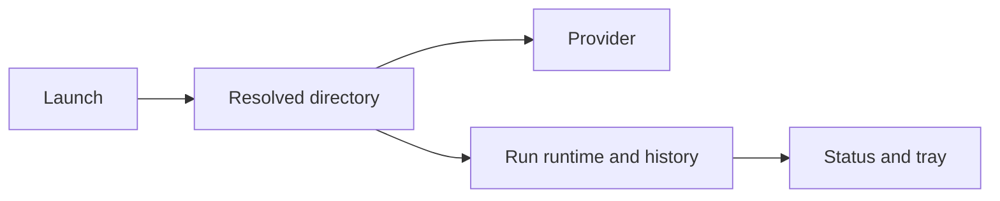

## prod_038_sessions_that_know_what_they_are_working_on - Sessions that know what they are working on
> Date: 2026-08-11
> Status: Settled
> Related request: `req_051_launch_a_session_in_the_directory_it_belongs_to`
> Related backlog: `item_100_record_and_honour_a_per_session_working_directory`
> Related task: `task_062_orchestrate_the_per_session_working_directory`
> Related architecture: (none yet)
> Reminder: Update status, linked refs, scope, decisions, success signals, and open questions when you edit this doc.
> Indicators reviewed: 2026-08-11 14:04:40

# Overview
Make the working directory a property of the session rather than of the shell that launched it, with a per-launch override and a clear refusal when it has gone.

# Goals
- Stop a launch from a home directory producing an assistant with no project.
- Make what a session works on stable and inspectable, like every other launch setting.
- Give the tray a reliable answer to which repositories are in play.

# Non-goals
- Guessing a directory from history, from git, or from the last launch.
- Refusing to launch outside a recorded directory, or managing worktrees and branches.
- Changing how providers are invoked beyond the directory they are given.

# Scope and guardrails
- In: scaffolded request, product, backlog, orchestration task, validation, and handoff context.
- Out: unrelated workflow docs and implementation of generated tasks.

# Key product decisions
- Use structured input as the source of truth for generated docs.
- Keep generated write paths local and repo-bounded.

# Success signals
- Generated docs pass lint and audit without broad manual rewrites.
- Context-pack output can be handed to an implementation agent directly.

# References
- Product back-reference: `item_100_record_and_honour_a_per_session_working_directory`
- Task back-reference: `task_062_orchestrate_the_per_session_working_directory`
