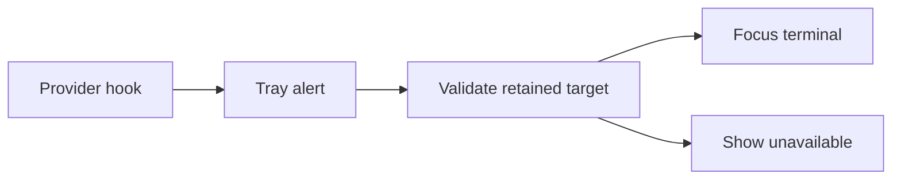

## prod_040_alerts_that_lead_back_to_their_terminal - Alerts that lead back to their terminal
> Date: 2026-08-12
> Status: Settled
> Related request: `req_053_bring_back_the_terminal_an_alert_came_from`
> Related backlog: `item_104_record_which_terminal_a_hook_fired_from_and_carry_it_to_the_tray`
> Related task: `task_064_deliver_alerts_that_lead_back_to_their_terminal`
> Related architecture: (none yet)
> Reminder: Update status, linked refs, scope, decisions, success signals, and open questions when you edit this doc.
> Indicators reviewed: 2026-08-13 01:57:07

# Overview
An agent alert knows which terminal produced it, and acting on the alert returns the operator to that window.

# Goals
- Close the loop between an alert and the session it is about.
- Cover the terminals and platforms where a documented mechanism exists, and say so honestly where none does.
- Keep a stale target harmless: nothing visible rather than the wrong window.

# Non-goals
- Inventing a focus mechanism where the platform provides none, notably Windows Terminal tabs and Wayland.
- Letting anything but closed-vocabulary terminal metadata into the spool.
- Relaunching or reopening a session whose terminal has been closed.
- Making notification-banner activation work on Windows, where a non-packaged app cannot register the required activator.

# Scope and guardrails
- In: scaffolded request, product, backlog, orchestration task, validation, and handoff context.
- Out: unrelated workflow docs and implementation of generated tasks.

# Key product decisions
- Use structured input as the source of truth for generated docs.
- Keep generated write paths local and repo-bounded.

# Success signals
- Generated docs pass lint and audit without broad manual rewrites.
- Context-pack output can be handed to an implementation agent directly.

# References
- Product back-reference: `item_104_record_which_terminal_a_hook_fired_from_and_carry_it_to_the_tray`
- Task back-reference: `task_064_deliver_alerts_that_lead_back_to_their_terminal`
