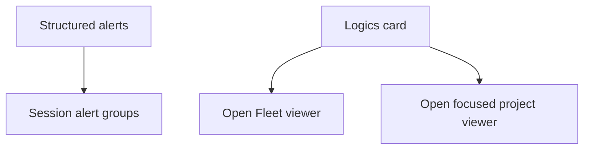

## prod_041_contextual_cdx_tray_recovery_paths - Contextual CDX tray recovery paths
> Date: 2026-08-13
> Status: Proposed
> Related request: `req_054_group_tray_alerts_by_session_and_make_logics_actions_reliably_open_the_viewer`
> Related backlog: `item_107_group_unread_tray_alerts_by_their_originating_session`, `item_108_launch_the_correct_logics_fleet_or_project_viewer_from_tray_actions`
> Related task: `task_065_orchestrate_grouped_tray_alerts_and_reliable_logics_viewer_actions`
> Related architecture: (none yet)
> Reminder: Update status, linked refs, scope, decisions, success signals, and open questions when you edit this doc.

# Overview
Make the CDX tray a reliable place to recover work: group agent alerts by their session and open the supported Logics viewer in the correct global or project context.

# Product map

# Goals
- Let an operator scan unread alerts by session before reading individual messages.
- Keep alert actions tied to structured stable identities rather than rendered text.
- Make global and focused Logics tray actions visibly open the supported viewer without blocking the tray.
- Reuse the Logics Fleet viewer/server lifecycle instead of adding CDX viewer infrastructure.

# Non-goals
- No persistent alert archive, per-message read receipts, notification templates, or changes to provider hook payloads.
- No embedded browser, CDX-owned Logics server, arbitrary plugin command, or Logics workflow mutation from the tray.
- No filesystem scan to find a repository and no full repository path in a tray label or alert spool.
- No change to session capacity ordering, tray installation, WSL transport, or direct desktop-notification fallback.

# Scope and guardrails
- In: scaffolded request, product, backlog, orchestration task, validation, and handoff context.
- Out: unrelated workflow docs and implementation of generated tasks.

# Key product decisions
- Use structured input as the source of truth for generated docs.
- Keep generated write paths local and repo-bounded.

# Success signals
- Generated docs pass lint and audit without broad manual rewrites.
- Context-pack output can be handed to an implementation agent directly.

# References
- Product back-reference: `req_054_group_tray_alerts_by_session_and_make_logics_actions_reliably_open_the_viewer`
- Task back-reference: `task_065_orchestrate_grouped_tray_alerts_and_reliable_logics_viewer_actions`
