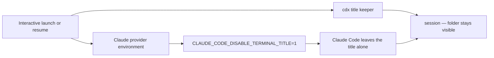

## prod_041_stable_terminal_titles_for_cdx_managed_claude_sessions - Stable terminal titles for cdx-managed Claude sessions
> Date: 2026-08-12
> Status: Settled
> Related request: `req_054_keep_cdx_terminal_titles_stable_while_claude_is_working`
> Related backlog: `item_107_disable_claude_s_competing_terminal_title_writes_for_cdx_sessions`
> Related task: `task_065_keep_the_cdx_title_stable_during_interactive_claude_actions`
> Related architecture: (none yet)
> Reminder: Update status, linked refs, scope, decisions, success signals, and open questions when you edit this doc.

# Overview
cdx remains the sole terminal-title owner for its interactive Claude sessions, so the session and working folder stay identifiable while Claude works.

# Goals
- Make the shared cdx title stable during Claude activity.
- Use Claude's supported opt-out instead of increasing cdx title-refresh frequency.
- Keep the provider-specific change constrained and testable.

# Non-goals
- Change Codex, Antigravity, or Ollama terminal-title behaviour.
- Disable Claude's in-terminal spinner or other interactive UI feedback.
- Introduce user-configurable title formats or refresh intervals.
- Change global user Claude configuration outside cdx's per-session process environment.

# Scope and guardrails
- In: scaffolded request, product, backlog, orchestration task, validation, and handoff context.
- Out: unrelated workflow docs and implementation of generated tasks.

# Key product decisions
- Use structured input as the source of truth for generated docs.
- Keep generated write paths local and repo-bounded.

# Success signals
- Generated docs pass lint and audit without broad manual rewrites.
- Context-pack output can be handed to an implementation agent directly.

# References
- Product back-reference: `req_054_keep_cdx_terminal_titles_stable_while_claude_is_working`
- Task back-reference: `task_065_keep_the_cdx_title_stable_during_interactive_claude_actions`
