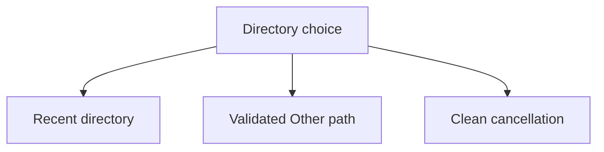

## prod_042_recoverable_interactive_cdx_launch_choices - Recoverable interactive CDX launch choices
> Date: 2026-08-13
> Status: Proposed
> Related request: `req_055_make_interactive_launch_directory_selection_writable_and_cancellation_safe`
> Related backlog: `item_109_add_a_validated_other_path_to_the_interactive_launch_directory_prompt`, `item_110_make_interactive_launch_directory_cancellation_a_clean_no_op`
> Related task: `task_066_orchestrate_writable_and_cancellable_launch_directory_selection`
> Related architecture: (none yet)
> Reminder: Update status, linked refs, scope, decisions, success signals, and open questions when you edit this doc.

# Overview
Let an interactive CDX operator choose an unlisted launch directory or cancel the prompt cleanly, without turning the selector into a second configuration system.

# Product map

# Goals
- Make any valid local launch directory reachable from the existing prompt.
- Treat cancellation as a normal no-op rather than an exception traceback.
- Reuse the current explicit-directory validation and launch flow.

# Non-goals
- No directory browser, filesystem scan, persisted favourites, shell expansion beyond existing path normalization, or changes to non-interactive commands.
- No provider launch, session mutation, or recent-directory write after cancellation or invalid input.

# Scope and guardrails
- In: scaffolded request, product, backlog, orchestration task, validation, and handoff context.
- Out: unrelated workflow docs and implementation of generated tasks.

# Key product decisions
- Use structured input as the source of truth for generated docs.
- Keep generated write paths local and repo-bounded.

# Success signals
- Generated docs pass lint and audit without broad manual rewrites.
- Context-pack output can be handed to an implementation agent directly.

# References
- Product back-reference: `req_055_make_interactive_launch_directory_selection_writable_and_cancellation_safe`
- Task back-reference: `task_066_orchestrate_writable_and_cancellable_launch_directory_selection`
