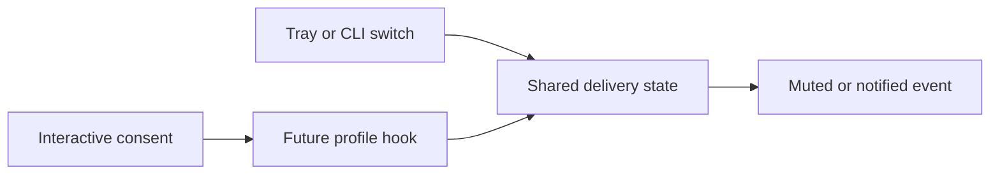

## prod_043_live_tray_control_for_consented_agent_alerts - Live tray control for consented agent alerts
> Date: 2026-08-13
> Status: Proposed
> Related request: `req_056_make_tray_agent_alert_muting_live_and_hook_consent_explicit_at_launch`
> Related backlog: `item_111_request_and_persist_provider_hook_consent_at_interactive_launch`, `item_112_make_the_tray_alert_switch_the_live_delivery_authority`
> Related task: `task_067_orchestrate_live_tray_muting_and_launch_time_hook_consent`
> Related architecture: (none yet)
> Reminder: Update status, linked refs, scope, decisions, success signals, and open questions when you edit this doc.
> Indicators reviewed: 2026-08-13 01:57:07

# Overview
Make agent-alert delivery a global live mode once an operator has explicitly consented to provider hooks, so the tray can mute or restore notifications for existing sessions without conflating silence with hook removal.

# Goals
- Make tray muting effective on the next agent event from an already-running hooked session.
- Ask for provider-hook consent at a clear interactive launch boundary and preserve a safe muted delivery default.
- Keep tray history useful while banners are muted and make unavailable versus muted states understandable.

# Non-goals
- No silent installation or removal of provider hooks, no background polling of providers, and no attempt to retrofit a hook into an already-running provider that has never authorised one.
- No changes to notification preview privacy rules, provider event filtering, tray alert grouping, or unsupported-provider behaviour.

# Scope and guardrails
- In: scaffolded request, product, backlog, orchestration task, validation, and handoff context.
- Out: unrelated workflow docs and implementation of generated tasks.

# Key product decisions
- Use structured input as the source of truth for generated docs.
- Keep generated write paths local and repo-bounded.

# Success signals
- Generated docs pass lint and audit without broad manual rewrites.
- Context-pack output can be handed to an implementation agent directly.

# References
- Product back-reference: `req_056_make_tray_agent_alert_muting_live_and_hook_consent_explicit_at_launch`
- Task back-reference: `task_067_orchestrate_live_tray_muting_and_launch_time_hook_consent`
