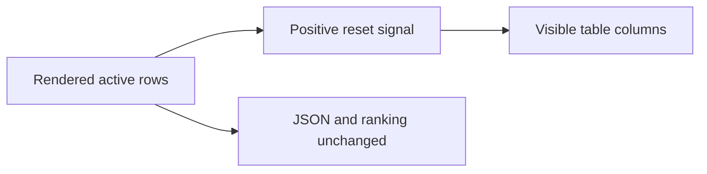

## prod_044_signal_only_cdx_status_reset_columns - Signal-only CDX status reset columns
> Date: 2026-08-13
> Status: Proposed
> Related request: `req_057_hide_empty_reset_columns_from_cdx_status`
> Related backlog: `item_113_derive_reset_column_visibility_from_rendered_status_data`, `item_114_prove_conditional_reset_columns_preserve_status_contracts`
> Related task: `task_068_orchestrate_conditional_reset_columns_in_cdx_status`
> Related architecture: (none yet)
> Reminder: Update status, linked refs, scope, decisions, success signals, and open questions when you edit this doc.
> Indicators reviewed: 2026-08-13 01:57:07

# Overview
Keep the cdx status table compact by displaying reset columns only when they carry information an operator can act on, without changing stored quota data or scheduling decisions.

# Goals
- Remove reset columns that contain no signal across the rendered table.
- Preserve independent visibility for bonus, five-hour, and weekly reset information.
- Leave programmatic status data and availability ranking unchanged.

# Non-goals
- No change to quota fetching, reset timestamp parsing, recommendation policy, JSON schema, or detailed status output.
- No new display configuration flag, per-column preference, or terminal-width layout system.

# Scope and guardrails
- In: scaffolded request, product, backlog, orchestration task, validation, and handoff context.
- Out: unrelated workflow docs and implementation of generated tasks.

# Key product decisions
- Use structured input as the source of truth for generated docs.
- Keep generated write paths local and repo-bounded.

# Success signals
- Generated docs pass lint and audit without broad manual rewrites.
- Context-pack output can be handed to an implementation agent directly.

# References
- Product back-reference: `req_057_hide_empty_reset_columns_from_cdx_status`
- Task back-reference: `task_068_orchestrate_conditional_reset_columns_in_cdx_status`
