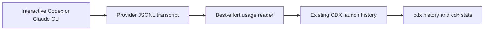

## prod_046_interactive_cli_usage_accounting - Interactive CLI usage accounting
> Date: 2026-08-13
> Status: Settled
> Related request: `req_059_record_interactive_codex_and_claude_cli_token_usage`
> Related backlog: `item_117_capture_and_normalize_interactive_provider_token_snapshots`, `item_118_persist_interactive_usage_in_existing_cdx_history_and_statistics`
> Related task: `task_070_orchestrate_interactive_codex_and_claude_cli_usage_accounting`
> Related architecture: (none yet)
> Reminder: Update status, linked refs, scope, decisions, success signals, and open questions when you edit this doc.

# Overview
Make the existing CDX usage history and statistics complete by recording local token totals from interactive Codex and Claude CLI sessions.

# Goals
- Use provider-native structured transcript data rather than terminal-screen scraping.
- Persist one accurate cumulative usage record per interactive session in the existing CDX history model.
- Expose the result through existing cdx history and cdx stats contracts, including JSON output.
- Keep capture non-blocking and records free of user prompts, tool inputs, paths, and model output.

# Non-goals
- No new cloud telemetry service, account-wide billing estimate, or provider quota recalculation.
- No live per-token stream or terminal UI overlay.
- No parsing of ANSI terminal transcripts when provider JSONL data is available.
- No claim that undocumented provider transcript schemas are permanently stable.

# Scope and guardrails
- In: scaffolded request, product, backlog, orchestration task, validation, and handoff context.
- Out: unrelated workflow docs and implementation of generated tasks.

# Key product decisions
- Read the provider-native transcript when the existing interactive launch process returns; do not add a hook daemon or parse terminal capture.
- Keep cached input separate from provider total tokens.

# Success signals
- Generated docs pass lint and audit without broad manual rewrites.
- Context-pack output can be handed to an implementation agent directly.

# References
- Product back-reference: `item_117_capture_and_normalize_interactive_provider_token_snapshots`
- Task back-reference: `task_070_orchestrate_interactive_codex_and_claude_cli_usage_accounting`
