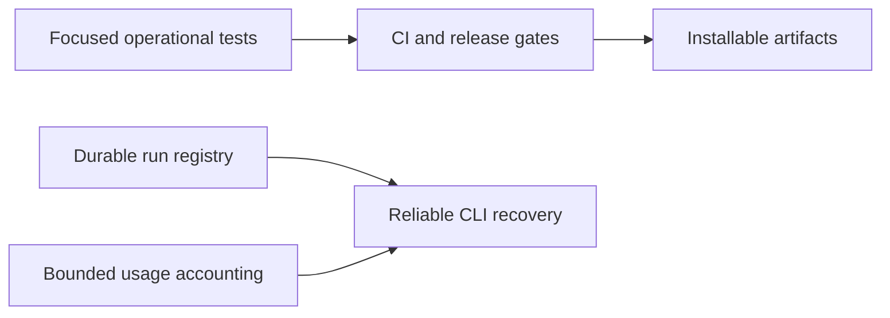

## prod_047_reliable_delivery_and_runtime_contracts - Reliable delivery and runtime contracts
> Date: 2026-08-13
> Status: Settled
> Related request: `req_061_harden_repository_reliability_release_verification_and_cli_contracts`
> Related backlog: `item_119_run_tray_tests_and_macos_validation_in_continuous_integration`
> Related task: `task_071_orchestrate_repository_reliability_and_release_contract_hardening`
> Related architecture: (none yet)
> Reminder: Update status, linked refs, scope, decisions, success signals, and open questions when you edit this doc.

# Overview
Make CDX releases, tray validation, detached-run recovery, and interactive usage accounting reliably verifiable without introducing a new framework, service, or user-facing command.

# Goals
- Run the tray and package paths that users receive before publication.
- Keep registry recovery bounded and durable after crashes or lock contention.
- Make token accounting fields and transcript-reading limits explicit and consistent.
- Reduce change risk in high-coupling modules through small domain extractions and targeted tests.
- Keep contributor and Logics workflow signals trustworthy.

# Non-goals
- No new telemetry service, analytics database, or live token dashboard.
- No rewrite of provider runtime, CLI parsing, CI, or the tray companion.
- No new provider feature or change to provider-owned transcript formats.
- No broad historical documentation rewrite beyond the identified guidance and workflow-state corrections.

# Scope and guardrails
- In: scaffolded request, product, backlog, orchestration task, validation, and handoff context.
- Out: unrelated workflow docs and implementation of generated tasks.

# Key product decisions
- Use structured input as the source of truth for generated docs.
- Keep generated write paths local and repo-bounded.

# Success signals
- Generated docs pass lint and audit without broad manual rewrites.
- Context-pack output can be handed to an implementation agent directly.

# References
- Product back-reference: `item_119_run_tray_tests_and_macos_validation_in_continuous_integration`
- Task back-reference: `task_071_orchestrate_repository_reliability_and_release_contract_hardening`
