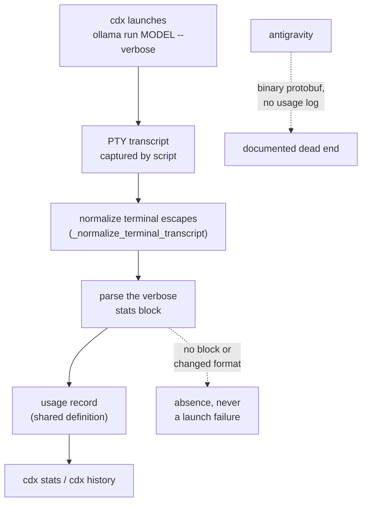

## prod_048_ollama_sessions_report_real_token_usage - Ollama sessions report real token usage
> Date: 2026-08-14
> Status: Proposed
> Related request: `req_062_track_token_usage_for_interactive_ollama_sessions`
> Related backlog: `item_125_parse_ollama_s_verbose_token_stats_from_the_captured_session_transcript`
> Related task: `task_072_orchestrate_ollama_token_usage_tracking`
> Related architecture: (none yet)
> Reminder: Update status, linked refs, scope, decisions, success signals, and open questions when you edit this doc.
> Indicators reviewed: 2026-08-14 12:13:17

# Overview
Extend cdx's existing usage-tracking to cover interactive ollama sessions by turning on ollama's built-in verbose token-count output and parsing it from the terminal transcript cdx already captures, so `cdx stats`/`cdx history` stop showing a hardcoded zero for ollama.

# Goals
- Make `cdx stats`/`cdx history` show real token counts for ollama sessions, matching the coverage claude and codex already have.
- Reuse the existing per-provider usage-parser pattern instead of building a new usage-source abstraction.
- Keep the best-effort, fail-soft contract: an ollama output-format change degrades to absent usage, never a launch failure.
- Record, rather than silently drop, the finding that antigravity usage is not retrievable with current provider surfaces.

# Non-goals
- No antigravity/agy usage tracking in this pass — its transcripts are schema-less binary protobuf with no available `.proto` definitions, and its CLI logs carry no usage line at any exposed verbosity; this is a documented dead end, not deferred work to pick up incidentally here.
- No change to ollama's own CLI behavior beyond adding the `--verbose` flag already supported by its documented interface.
- No new usage-source abstraction layer for future providers beyond what's needed for ollama.
- No retroactive backfill of usage for past ollama sessions that were captured without `--verbose`.
- No support for the non-interactive path. Opening `run_usage`'s provider gate for ollama without a text parser would change no behavior while making the gate claim a support it cannot deliver; nothing runs ollama headless through cdx today, so the gate stays closed until something does.
- No renegotiation of the shared usage-field definition — the token-accounting request settles that, and this work lands after it and adopts it.

# Scope and guardrails
- In: scaffolded request, product, backlog, orchestration task, validation, and handoff context.
- Out: unrelated workflow docs and implementation of generated tasks.

# Key product decisions
- Use structured input as the source of truth for generated docs.
- Keep generated write paths local and repo-bounded.

# Success signals
- Generated docs pass lint and audit without broad manual rewrites.
- Context-pack output can be handed to an implementation agent directly.

# References
- Product back-reference: req_062_track_token_usage_for_interactive_ollama_sessions
- Task back-reference: `task_072_orchestrate_ollama_token_usage_tracking`
