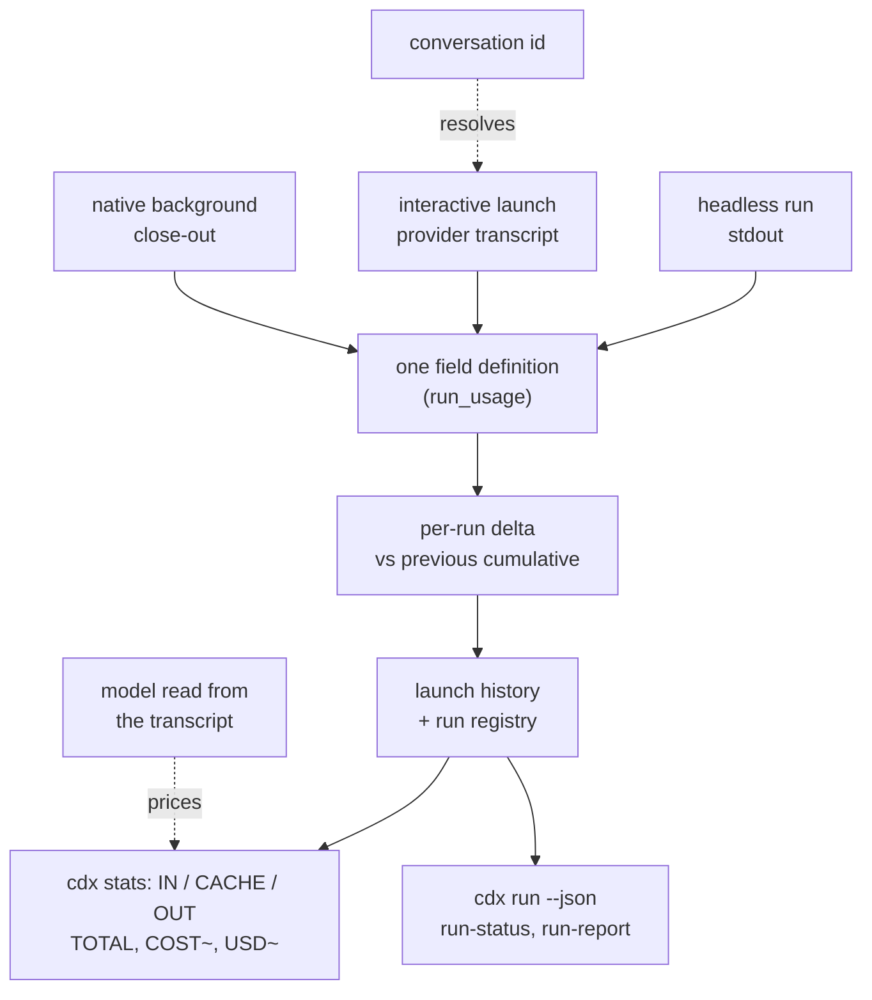

## prod_049_token_numbers_a_user_can_act_on - Token numbers a user can act on
> Date: 2026-08-14
> Status: Settled
> Related request: `req_063_make_cdx_stats_report_the_tokens_a_session_actually_spent`
> Related backlog: `item_126_define_one_token_accounting_shared_by_both_usage_readers`
> Related task: `task_073_orchestrate_truthful_token_accounting_for_cdx_stats`
> Related architecture: (none yet)
> Reminder: Update status, linked refs, scope, decisions, success signals, and open questions when you edit this doc.
> Indicators reviewed: 2026-08-14 12:13:18

# Overview
Make `cdx stats` an honest account of what each session spent: totals that include cached input, per-run figures that do not re-bill history on resume, measurements taken from the session's own transcript, and one column meaning across providers.

# Goals
- Report a total that reflects real consumption, cache included.
- Bill each run for its own tokens and nothing else.
- Measure the session that ran, identified rather than guessed.
- Give every token field one definition shared by all three usage readers and both providers, with cache creation and cache reads kept apart because they cost differently.
- Raise how often usage is captured at all, so the table describes the fleet rather than a sample of it.
- Rank sessions by what they cost rather than by raw token count, weighting the token classes by their published ratios.
- Make a currency figure reachable once the serving model is known, without putting a perishable price table in the code.

# Non-goals
- No network price lookup or provider billing integration — usage reporting stays offline and local-transcript based.
- No invoice reconciliation: a currency figure is an estimate at list prices, not an account statement.
- No new filters or output formats; the only new columns are the weighted figure and, later, the cost.
- No retroactive repair of usage already recorded in launch history.
- No change to how launches are performed or to launch success semantics.

# Scope and guardrails
- In: scaffolded request, product, backlog, orchestration task, validation, and handoff context.
- Out: unrelated workflow docs and implementation of generated tasks.

# Key product decisions
- Use structured input as the source of truth for generated docs.
- Keep generated write paths local and repo-bounded.

# Success signals
- Generated docs pass lint and audit without broad manual rewrites.
- Context-pack output can be handed to an implementation agent directly.

# References
- Product back-reference: `item_126_define_one_token_accounting_shared_by_both_usage_readers`
- Task back-reference: `task_073_orchestrate_truthful_token_accounting_for_cdx_stats`
