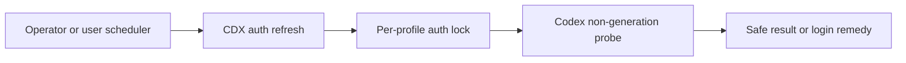

## prod_050_opt_in_codex_authentication_refresh_probes - Opt-in Codex authentication refresh probes
> Date: 2026-08-20
> Status: Proposed
> Related request: `req_066_offer_opt_in_refresh_probes_for_managed_codex_sessions`
> Related backlog: `item_133_add_a_locked_non_generation_codex_auth_refresh_command`, `item_134_document_manual_and_scheduler_controlled_credential_maintenance`
> Related task: `task_076_orchestrate_opt_in_codex_authentication_refresh_probes`
> Related architecture: (none yet)
> Reminder: Update status, linked refs, scope, decisions, success signals, and open questions when you edit this doc.
> Indicators reviewed: 2026-08-20 11:29:03

# Overview
Give operators a small, safe CDX command to validate and refresh managed Codex credentials before an interactive session needs them, while leaving scheduling under the user's control.

# Goals
- Reuse the existing provider-native non-generation probe and auth lock.
- Make manual and scheduled operation scriptable through a stable JSON and exit-status contract.
- Give a direct login remedy when a refresh token can no longer be used.
- Keep credentials and conversation content entirely local and absent from output.

# Non-goals
- No automatic cron installation, cross-host credential synchronization, or copying of auth files.
- No model prompt, agent launch, quota-consuming generation, or background polling daemon.
- No attempt to bypass an interactive OAuth login when the provider rejects the refresh token.
- No changes to authentication semantics for non-Codex providers in this request.

# Scope and guardrails
- In: scaffolded request, product, backlog, orchestration task, validation, and handoff context.
- Out: unrelated workflow docs and implementation of generated tasks.

# Key product decisions
- Use structured input as the source of truth for generated docs.
- Keep generated write paths local and repo-bounded.

# Success signals
- Generated docs pass lint and audit without broad manual rewrites.
- Context-pack output can be handed to an implementation agent directly.

# References
- Product back-reference: `req_066_offer_opt_in_refresh_probes_for_managed_codex_sessions`
- Task back-reference: `task_076_orchestrate_opt_in_codex_authentication_refresh_probes`
