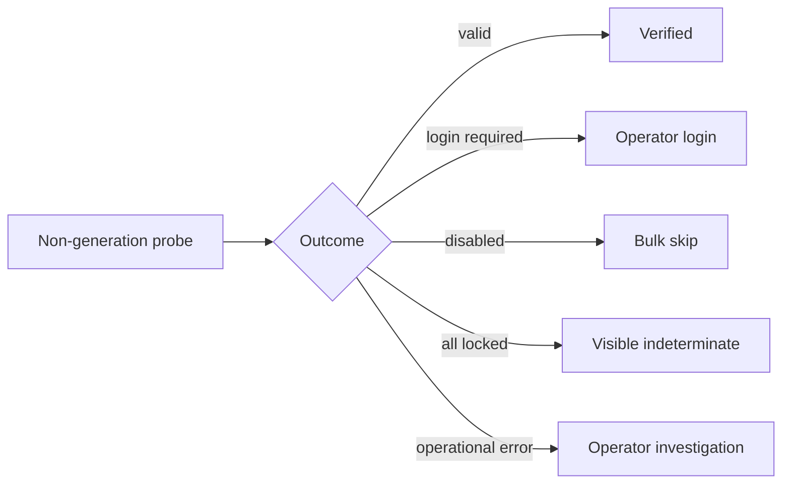

## prod_051_truthful_codex_authentication_health_signals - Truthful Codex authentication health signals
> Date: 2026-08-22
> Status: Proposed
> Related request: `req_068_harden_codex_authentication_observability`
> Related backlog: `item_135_classify_live_codex_diagnostic_failures_safely`, `item_136_exclude_disabled_profiles_from_bulk_codex_refresh`, `item_137_make_all_locked_bulk_refresh_results_explicit`
> Related task: `task_077_orchestrate_truthful_codex_authentication_health_signals`
> Related architecture: (none yet)
> Reminder: Update status, linked refs, scope, decisions, success signals, and open questions when you edit this doc.

# Overview
Make CDX authentication diagnostics and opt-in scheduled probes tell operators whether a profile needs a login, has an operational probe failure, is intentionally disabled, or could not be verified because it is busy.

# Goals
- Preserve safe, non-generation provider probes while making their outcomes actionable.
- Prevent intentionally disabled profiles from generating false scheduler failures.
- Ensure automation never mistakes an all-locked probe for confirmed credential health.

# Non-goals
- No scheduler installation, host-to-host credential copying, or automatic interactive login.
- No provider-response, token, account, or prompt disclosure.
- No change to the per-profile refresh lock or to interactive session ownership.

# Scope and guardrails
- In: scaffolded request, product, backlog, orchestration task, validation, and handoff context.
- Out: unrelated workflow docs and implementation of generated tasks.

# Key product decisions
- Use structured input as the source of truth for generated docs.
- Keep generated write paths local and repo-bounded.

# Success signals
- Generated docs pass lint and audit without broad manual rewrites.
- Context-pack output can be handed to an implementation agent directly.

# References
- Product back-reference: `req_068_harden_codex_authentication_observability`
- Task back-reference: `task_077_orchestrate_truthful_codex_authentication_health_signals`
