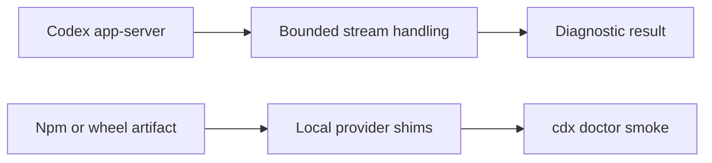

## prod_052_reliable_codex_diagnostics_in_packaged_installs - Reliable Codex diagnostics in packaged installs
> Date: 2026-08-22
> Status: Proposed
> Related request: `req_069_harden_codex_probe_process_and_package_smoke_coverage`
> Related backlog: `item_138_drain_codex_app_server_diagnostic_stderr_safely`, `item_139_smoke_test_doctor_from_packed_npm_and_wheel_artifacts`
> Related task: `task_078_orchestrate_reliable_codex_diagnostics_and_package_smokes`
> Related architecture: (none yet)
> Reminder: Update status, linked refs, scope, decisions, success signals, and open questions when you edit this doc.

# Overview
Keep a provider diagnostic responsive under noisy subprocess output and verify that both published package forms can run the operator health command.

# Goals
- Eliminate stderr backpressure as a false authentication diagnostic failure.
- Verify the operational doctor command from npm and wheel artifacts before release.
- Keep CI provider-independent and credential-free.

# Non-goals
- No live provider integration test, network call, release publication, or credential fixture.
- No redesign of the app-server JSON-RPC protocol or provider diagnostics.
- No new test framework or external CI service.

# Scope and guardrails
- In: scaffolded request, product, backlog, orchestration task, validation, and handoff context.
- Out: unrelated workflow docs and implementation of generated tasks.

# Key product decisions
- Use structured input as the source of truth for generated docs.
- Keep generated write paths local and repo-bounded.

# Success signals
- Generated docs pass lint and audit without broad manual rewrites.
- Context-pack output can be handed to an implementation agent directly.

# References
- Product back-reference: `req_069_harden_codex_probe_process_and_package_smoke_coverage`
- Task back-reference: `task_078_orchestrate_reliable_codex_diagnostics_and_package_smokes`
