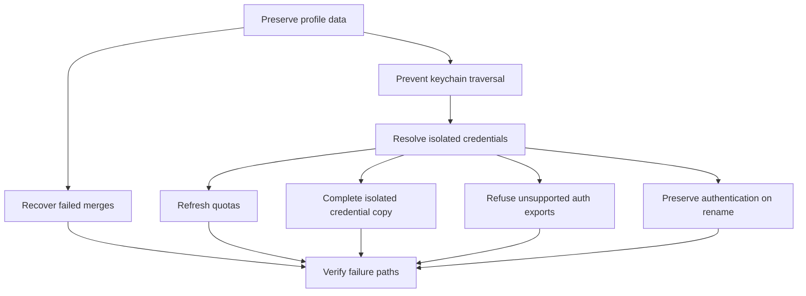

## prod_053_safe_profile_operations_with_isolated_claude_keychain_authentication - Safe profile operations with isolated Claude keychain authentication
> Date: 2026-09-06
> Status: Proposed
> Related request: `req_070_review_findings_profile_data_safety_and_keychain_integration`
> Related backlog: item_140_preserve_existing_profiles_on_merge_import_failure, item_141_copy_claude_profiles_without_traversing_the_system_keychain, item_142_read_profile_scoped_claude_keychain_credentials_for_quota_refresh, item_143_report_unsupported_keychain_credential_exports_explicitly, item_144_preserve_claude_keychain_authentication_across_session_rename
> Related task: task_079_orchestrate_profile_data_safety_and_claude_keychain_integration
> Related architecture: (none yet)
> Reminder: Update status, linked refs, scope, decisions, success signals, and open questions when you edit this doc.
> Indicators reviewed: 2026-09-06 11:40:39

# Overview
- Preserve the safety and authentication guarantees of CDX profile operations after Claude credentials move into the macOS keychain. Operators must be able to copy and rename isolated profiles without traversing the system keychain, and see truthful quota and export outcomes.

# Goals
- A failed merge preserves local credentials, history, metadata and state.
- Copies never duplicate the operator's keychain databases and only transfer the source profile credential.
- Quota lookup and rename follow the credential identity Claude actually uses.
- Unsupported auth portability is explicit before an export replaces any file.

# Non-goals
- No new secret-store framework, bundle format or keychain database export.
- No host-to-host token synchronization, automatic login or background token rotation.
- No wholesale cleanup of old keychain entries or copied directories.

# Scope and guardrails
- In: the five scoped review findings, existing profile operations, safe diagnostics, focused regression tests and operator documentation.
- Out: redesign of logout/remove, unrelated CLI/tray behavior, or cross-session transactional storage.
- Use temporary directories, fake keychain responses and synthetic tokens in automated validation. Never print tokens or invoke a model just to test credential resolution.

# Key product decisions
- Start with merge rollback and link-traversal protection. Resolve and verify the provider's per-profile credential naming before implementing credential copy or rename.
- For request AC4, implement explicit unsupported-export refusal: a selected keychain-only profile prevents the entire --include-auth export, with a non-zero text/JSON outcome, before the destination is written. Metadata-only export remains available with login required after import.
- Preserve source authentication until the destination credential, filesystem and store update are usable. Refuse unrelated destination credential collisions; report recoverable cleanup failures without hiding them.
- Keep native file-backed credential behavior on other platforms. Do not add an abstraction beyond what these concrete callers require.

# Success signals
- Failure-injection checks prove local data survives merge and rename failures.
- An unreadable fake external keychain sentinel cannot break or be duplicated by profile copy.
- Distinct fake profile credentials remain isolated through quota lookup, copy and rename.
- Mixed-profile exports cannot report successful auth portability when credentials are omitted.
- Focused checks and the existing Python/Rust suites, lint and packaging dry-run pass.

# References
- Product back-reference: (none yet)
- Task back-reference: (none yet)
