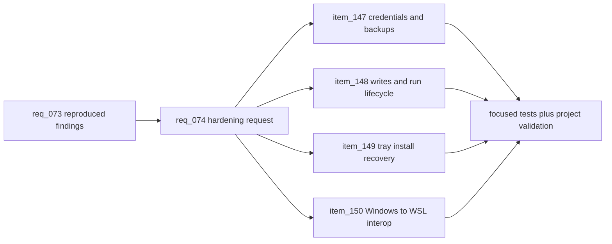

## prod_054_recoverable_cdx_operations_across_credentials_runs_and_tray_interop - Recoverable CDX operations across credentials, runs, and tray interop
> Date: 2026-09-07
> Status: Proposed
> Related request: `req_074_harden_review_findings_for_credential_safety_process_lifecycle_and_tray_interop`
> Related backlog: `item_147_preserve_credentials_and_portable_encrypted_backups`, `item_148_make_accepted_local_writes_and_run_processes_owned_by_cdx`, `item_149_make_tray_installation_and_probes_recoverable`, `item_150_repair_windows_to_wsl_tray_command_and_terminal_interop`
> Related task: `task_082_orchestrate_review_finding_hardening_across_credentials_runs_and_tray_interop`
> Related architecture: (none yet)
> Reminder: Update status, linked refs, scope, decisions, success signals, and open questions when you edit this doc.
> Indicators reviewed: 2026-09-07 09:28:51

# Overview
Turn reproduced review findings into bounded fixes that keep authentication, local writes, provider processes, and tray launch surfaces recoverable across macOS, Windows, and WSL.

# Goals
- Preserve user credentials and backup readability during import, force rollback, and runtime changes.
- Keep background runs and local memory writes under deterministic CDX ownership.
- Make tray updates recoverable and tray actions truthful across native Windows, macOS, and Windows-hosted WSL.
- Validate the repaired paths with small regressions plus the existing project gates.

# Non-goals
- No provider generation, live credential mutation, release publication, UI redesign, or broad tray feature expansion.
- No new dependency unless an existing standard or installed primitive cannot provide the needed locking, process cleanup, or path handling.
- No claim of universal Linux desktop support beyond the scoped WSL and existing tray capability contracts.

# Scope and guardrails
- In: scaffolded request, product, backlog, orchestration task, validation, and handoff context.
- Out: unrelated workflow docs and implementation of generated tasks.

# Key product decisions
- Use structured input as the source of truth for generated docs.
- Keep generated write paths local and repo-bounded.

# Success signals
- Generated docs pass lint and audit without broad manual rewrites.
- Context-pack output can be handed to an implementation agent directly.

# References
- Product back-reference: `req_074_harden_review_findings_for_credential_safety_process_lifecycle_and_tray_interop`
- Task back-reference: `task_082_orchestrate_review_finding_hardening_across_credentials_runs_and_tray_interop`
