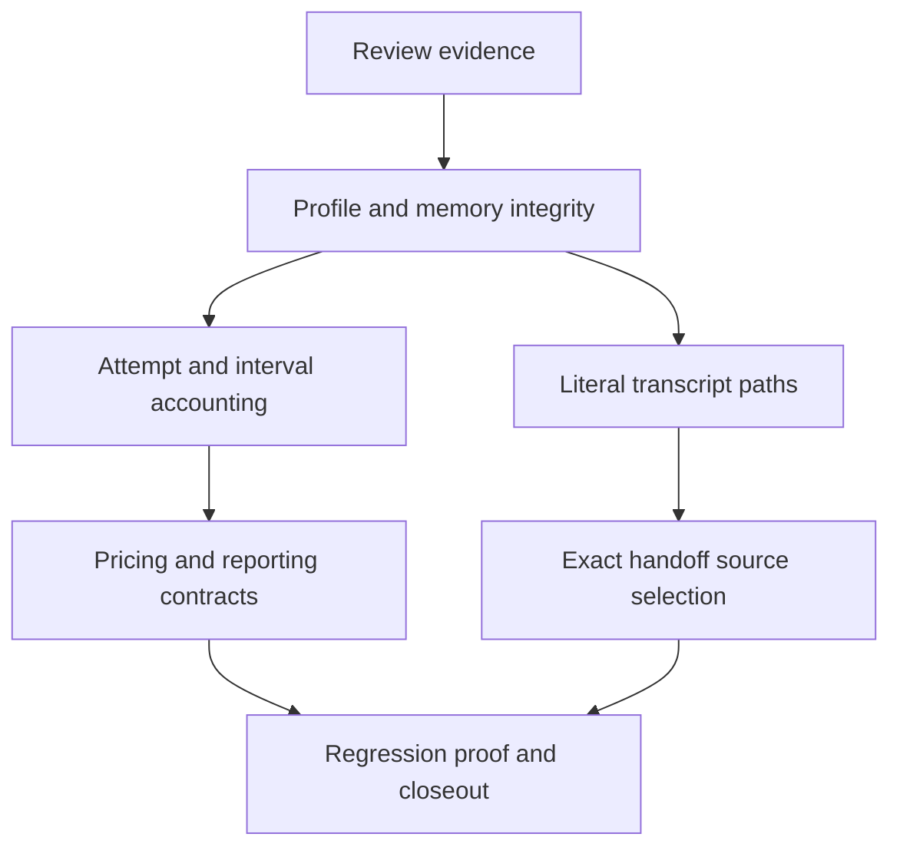

## prod_056_trustworthy_local_recovery_and_usage_attribution - Trustworthy local recovery and usage attribution
> Date: 2026-10-04
> Status: Proposed
> Related request: `req_080_harden_reviewed_data_integrity_stats_accounting_and_handoff_recovery`
> Related backlog: `item_156_preserve_live_profiles_on_early_force_import_credential_failures`, `item_157_serialize_memory_appends_across_independent_cli_processes`, `item_158_account_for_every_headless_failover_attempt_under_its_actual_session`, `item_159_measure_interactive_usage_at_real_launch_boundaries_without_a_history_cap`, `item_160_validate_custom_token_rates_and_support_undefined_relative_weights`, `item_161_persist_observed_model_attribution_for_headless_usage_pricing`, `item_162_clarify_stats_period_and_cost_contracts_and_remove_duplicate_finalization`, `item_163_bind_handoff_selection_to_one_exact_native_source_file`, `item_164_treat_profile_paths_literally_in_native_and_terminal_transcript_discovery`
> Related task: `task_085_orchestrate_review_hardening_across_persistence_stats_and_handoff`
> Related architecture: (none yet)
> Reminder: Update status, linked refs, scope, decisions, success signals, and open questions when you edit this doc.

# Overview
Keep accepted local changes recoverable, account for usage at the correct execution boundaries, and recover work from exactly the selected source evidence.

# Delivery overview

# Goals
- Preserve original profiles and accepted notes under failure or concurrent writers.
- Attribute consumption to actual attempts, sessions and measurable intervals with explicit uncertainty.
- Make custom rates and estimated-cost presentation robust and understandable.
- Bind handoff to the chosen source and support literal filesystem paths without weakening provenance.

# Non-goals
- No worktree management, persistent session-to-branch association or new parallel-workspace feature.
- No invoicing engine, live token meter, telemetry service, provider calls, speculative database or background service.
- No retroactive reconstruction of old unmeasured tokens or fabricated split of run totals across clock intervals.
- No promise of automatic cross-workspace handoff, transcript archival, or proof of target-agent comprehension.
- No new provider pricing refresh or per-request long-context/TTL/service-tier reconstruction without evidence.

# Scope and guardrails
- In: failure-safe profile import, process-safe accepted notes, attempt/session/interval usage attribution, validated rate overrides, model price coverage and exact-source handoff.
- Preserve existing CLI forms and history readability. Any additive attribution or availability metadata must be documented and tested in JSON and text surfaces.
- All validation uses synthetic local data. Real credential changes, generation, publishing, telemetry and external communication are excluded.
- Implementation is a subsequent task; the present delivery prepares and commits its corpus only.

# Key product decisions
- A failed import must not strand the live profile; an accepted note must survive competing appenders.
- Keep one logical registry run across failover while accounting for each execution attempt once under its actual session.
- A current-run measurement needs a current-run baseline. Missing or ambiguous evidence stays unknown, never silently zero or another run's consumption.
- Currency rates must be finite and nonnegative. Free input is valid currency data; an undefined input-relative ratio is explicitly unavailable.
- Only provider-observed model attribution supports pricing. Configured model preference alone is insufficient evidence of service.
- Preserve whole-run overlap period filtering; crossing-run daily totals remain non-additive and must be explained.
- Preserve model-relative weighting and current-list-price estimates, with explicit partial coverage and approximation boundaries. This is not a billing ledger.
- Handoff selection binds an exact eligible native file. A native-path selector cannot silently become the existing degraded terminal fallback.
- Preserve full source evidence and instruction-first recovery; neither transcript availability forever nor agent comprehension is guaranteed.

# Success signals
- All seven reproduced failures have regressions that fail before the fix and pass afterward.
- Synthetic failover accounting preserves 300 input/30 output across the 100/10 and 200/20 attempts under their own sessions.
- Intervening transcript growth no longer inflates a later run; absence/uncertainty is explicit when precise attribution is impossible.
- Duplicate-ID selection preserves the chosen file; native sources resolve under literal-bracket profile paths.
- Secondary observations have implementation or explicit contract coverage; focused/full validation and closeout traceability establish delivery proof.

# Open questions
- No product decision blocks starting the chain. Exact additive JSON field names and internal lock helper choice remain bounded implementation details, constrained by the contracts above.

# References
- Product back-reference: `req_080_harden_reviewed_data_integrity_stats_accounting_and_handoff_recovery`
- Task back-reference: `task_085_orchestrate_review_hardening_across_persistence_stats_and_handoff`
