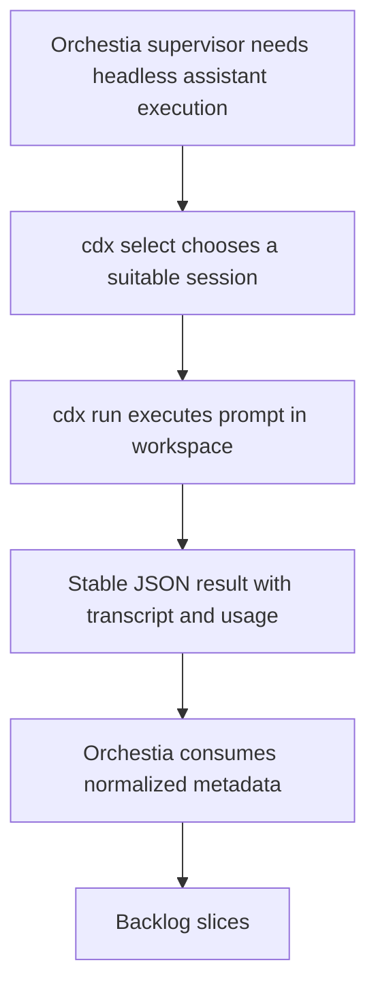

## req_000_orchestia_headless_json_task_runner - Headless JSON task runner for Orchestia
> From version: 0.6.5
> Schema version: 1.0
> Status: Draft
> Understanding: 88
> Confidence: 82
> Complexity: High
> Theme: Integration
> Reminder: Update status/understanding/confidence and linked backlog/task references when you edit this doc.

# Needs
- Provide a stable, non-interactive CLI surface that lets Orchestia launch assistant work through `cdx-manager` without directly managing provider accounts, quotas, readiness, cooldowns, transcripts, or provider-specific power controls.
- Expose task execution as a JSON-first contract so a supervisor process can select a suitable session, run a prompt in a target workspace, and consume a normalized result with execution metadata and usage information when available.
- Keep provider details behind `cdx-manager` while still allowing callers to request a provider, model, reasoning effort or power level, permissions, and workspace path explicitly.

# Context
- Stakeholder request from Paul Mondou for Orchestia on 2026-05-29.
- Orchestia needs to launch Codex cleanly with structured launcher metadata such as:

```json
{
  "launcher": "cdx",
  "session": "codex-work",
  "provider": "codex"
}
```

- The requested integration depends on a headless `cdx run` command that can execute a task in a given workspace with a given prompt, model, power level, and permission mode.
- The result must be machine-readable and stable, with normalized fields for success, selected session, provider, model, power, working directory, process exit code, duration, transcript paths, and token usage when available.
- `cdx-manager` already has relevant primitives: session registry, provider status, readiness checks, quota/cooldown data, `cdx status`, `cdx ready`, JSON response envelopes, launch transcript capture, and provider-specific power/effort mapping.
- Orchestia should not need to know whether the target provider expects Codex `model_reasoning_effort`, Claude `--effort`, or another provider-specific flag. It should pass a stable cdx-level contract.
- Client confirmation: Orchestia agrees with this JSON-first framing and explicitly prefers final-JSON-only stdout, captured provider artifacts, public `--reasoning-effort`, `run_id`, explicit-session or `--provider` auto-selection, first-version `--timeout-seconds`, distinct cdx/provider error reporting, and Codex-first delivery with a provider-neutral contract.

## Requested CLI surface

### Headless task execution

```bash
cdx run codex-work \
  --cwd /path/to/workspace \
  --prompt-file task_prompt.md \
  --model gpt-5.3-codex \
  --reasoning-effort low \
  --permission workspace-write \
  --json
```

Expected stable JSON shape:

```json
{
  "ok": true,
  "session": "codex-work",
  "provider": "codex",
  "model": "gpt-5.3-codex",
  "reasoning_effort": "low",
  "power": "low",
  "cwd": "/path/to/workspace",
  "run_id": "...",
  "exit_code": 0,
  "duration_seconds": 123.4,
  "transcript_path": "...",
  "stdout_path": "...",
  "stderr_path": "...",
  "usage": {
    "input_tokens": null,
    "output_tokens": null,
    "reasoning_tokens": null,
    "total_tokens": null
  }
}
```

The final contract should follow the existing cdx JSON response conventions where practical, including stable `ok`, `schema_version`, `warnings`, and `error` handling.

Recommended behavior for `--json`:

- Reserve stdout for the final JSON payload.
- Capture provider stdout/stderr into files instead of streaming provider output to stdout.
- Return absolute paths for `transcript_path`, `stdout_path`, and `stderr_path`.
- Include a stable `run_id` for supervisor correlation, retries, and support.
- Support both `--prompt-file PATH` for production jobs and `--prompt TEXT` for small jobs, smoke tests, and simple integrations.
- Support either an explicit session argument (`cdx run codex-work ...`) or automatic session selection via `--provider codex` when no session argument is supplied.
- Support `--timeout-seconds N`; on timeout, attempt graceful provider termination first, then force-kill if required.
- Distinguish cdx-side errors from provider-side errors through `error.source` (`cdx` or `provider`) plus stable `error.code` and `error.message`.

Recommended error shape:

```json
{
  "ok": false,
  "schema_version": 1,
  "session": "codex-work",
  "provider": "codex",
  "exit_code": 1,
  "transcript_path": "/absolute/path/to/transcript",
  "stdout_path": "/absolute/path/to/stdout",
  "stderr_path": "/absolute/path/to/stderr",
  "error": {
    "source": "provider",
    "code": "provider_failed",
    "message": "Provider process exited with a non-zero status.",
    "provider_code": null
  },
  "warnings": []
}
```

### Automatic session selection

```bash
cdx select \
  --provider codex \
  --min-power low \
  --require-ready \
  --json
```

Expected stable JSON shape:

```json
{
  "ok": true,
  "session": "codex-work",
  "provider": "codex",
  "reason": "lowest available suitable session",
  "selection_policy": "ready_then_cooldown_then_health_then_priority_then_name"
}
```

This lets Orchestia or another supervisor delegate account choice to `cdx-manager` instead of duplicating quota, readiness, cooldown, and provider-status logic.

Recommended ranking policy:

- Filter to sessions matching requested provider and minimum reasoning capability.
- If `--require-ready` is set, keep only sessions that are ready according to cdx readiness/status logic.
- Prefer sessions that are not in cooldown.
- Prefer the healthiest quota or availability state.
- Apply explicit user/session priority when configured.
- Use a stable tie-breaker such as session name to keep results deterministic.

### Stable reasoning and power contract

- Use `--reasoning-effort low|medium|high` as the primary public headless-run contract.
- Keep `--power low|medium|high` as a cdx compatibility alias that resolves to the same normalized value.
- Map the cdx-level contract to provider-specific runtime flags, including Codex `model_reasoning_effort` and Claude `--effort`.
- Return the normalized requested/resolved power or reasoning level in JSON so the caller can audit what was run.
- Prioritize Codex support in the first implementation while keeping the schema and mapping provider-neutral enough for Claude and future providers.

### Transcript and usage output

- `cdx run --json` should always return `transcript_path` when a transcript exists.
- Return `stdout_path` and `stderr_path` when streams are captured separately.
- Prefer absolute file paths for all returned artifact paths.
- Return normalized token usage fields even when values are unavailable, using `null` for unknown token counts.
- Preserve enough execution metadata for a supervisor to diagnose failures without parsing terminal UI output.



# Acceptance criteria
- AC1: The request captures a non-interactive `cdx run` command that accepts session, workspace path, prompt file, model, power or reasoning effort, permission mode, and `--json`.
- AC2: The request captures a stable JSON result contract with `ok`, session, provider, model, `reasoning_effort`, power alias, cwd, `run_id`, `exit_code`, `duration_seconds`, absolute transcript paths, and normalized usage token fields.
- AC3: The request captures a `cdx select --json` command that can choose a suitable session by provider, minimum power or reasoning effort, and readiness requirements.
- AC4: The request captures the need for provider-independent power/reasoning mapping across Codex, Claude, and future providers.
- AC5: The request captures transcript, stdout, stderr, and usage reporting as first-class machine-readable outputs.
- AC6: The request captures recommended stdout/stderr behavior for `--json`, error semantics, timeout handling, auto-selection from `cdx run`, and session ranking policy.
- AC7: The request records Orchestia's confirmed preferences for final-JSON-only stdout, `--reasoning-effort`, `run_id`, explicit or auto-selected sessions, `--timeout-seconds`, cdx/provider error distinction, and Codex-first provider-neutral delivery.
- AC8: The request is ready to promote into backlog slices for CLI contract design, execution implementation, session selection policy, and regression coverage.

# Scope boundaries
- In scope: CLI contract design, JSON schema stability, provider/session selection, task execution wrapper behavior, transcript path reporting, usage normalization, and power/reasoning mapping.
- In scope: compatibility with existing cdx JSON envelope conventions and existing status/readiness/session primitives.
- Out of scope for the first backlog slice: building an Orchestia-specific SDK, implementing Orchestia supervisor logic, or guaranteeing token extraction for providers that do not expose usage data.
- Out of scope unless promoted separately: remote job queues, daemon mode, web APIs, and multi-step orchestration beyond launching a single headless task.

# Risks and open questions
- Confirmed by Orchestia: stdout should contain only final JSON when `--json` is active; provider output should be captured in transcript/stdout/stderr artifacts.
- Confirmed by Orchestia: `--reasoning-effort low|medium|high` should be the stable public name; `--power` can remain a cdx alias.
- Confirmed by Orchestia: include stable `run_id` for logs, retries, transcripts, and database correlation.
- Confirmed by Orchestia: support both explicit session mode and automatic selection via `--provider codex`.
- Confirmed by Orchestia: `--timeout-seconds` is useful in the first version.
- Confirmed by Orchestia: errors should distinguish cdx errors and provider errors with `ok: false`, `error.code`, and `error.message`.
- Confirmed by Orchestia: Codex-only is acceptable for the first implementation if the contract stays compatible with Claude/Ollama later.
- Open: define the default timeout policy when `--timeout-seconds` is omitted.
- Open: define transcript retention, cleanup policy, and file naming requirements for supervisor audit trails.

# Definition of Ready (DoR)
- [x] Problem statement is explicit and user impact is clear.
- [x] Scope boundaries (in/out) are explicit.
- [x] Acceptance criteria are testable.
- [x] Dependencies and known risks are listed.

# Companion docs
- Product brief(s): (none yet)
- Architecture decision(s): (none yet)

# AI Context
- Summary: Orchestia needs a stable headless JSON CLI contract for selecting a ready cdx session and running assistant tasks in a workspace with normalized result metadata.
- Keywords: headless, json, runner, orchestia, codex, provider, session, transcript, usage, reasoning, power
- Use when: Use when designing or grooming cdx headless task execution, automatic session selection, provider-independent power mapping, or transcript/usage result contracts.
- Skip when: Skip when the work targets another feature, repository, or workflow stage.
# Backlog
- `item_006_headless_cdx_run_json_execution_contract`
- `item_007_automatic_headless_session_selection`
- `item_008_provider_neutral_reasoning_effort_mapping`
- `item_009_headless_run_artifacts_usage_and_error_reporting`
