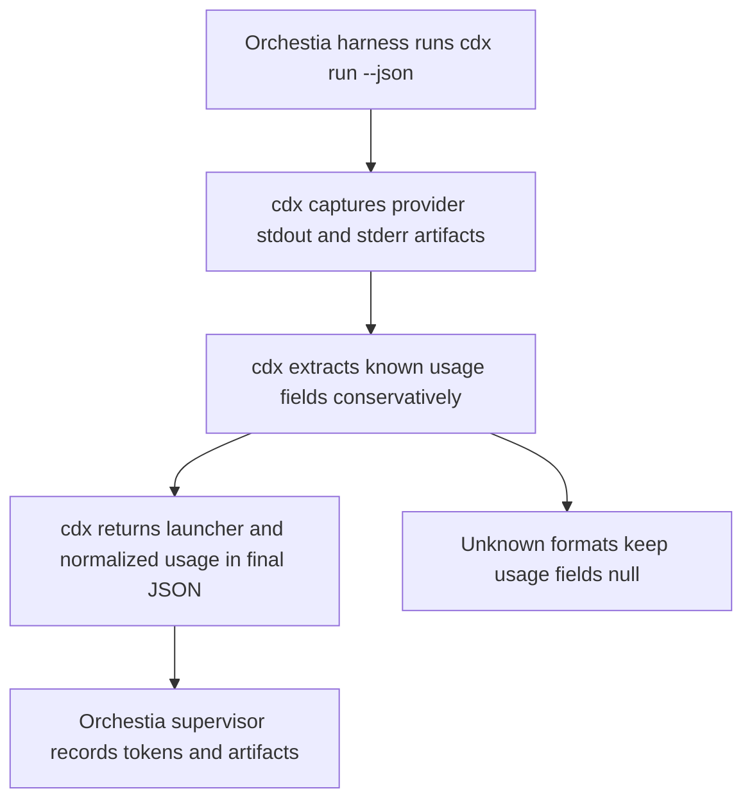

## req_001_populate_headless_run_usage_tokens_for_orchestia - Populate headless run usage tokens for Orchestia
> From version: 0.7.1
> Schema version: 1.0
> Status: Done
> Understanding: 100%
> Confidence: 92%
> Complexity: Medium
> Theme: Headless automation
> Reminder: Update status/understanding/confidence and linked backlog/task references when you edit this doc.

# Needs
- Orchestia's `codex-task-harness`, planner, and supervisor need to call `cdx run --json` as a subprocess and parse a stable machine-readable result that includes token usage when the selected provider exposes it.
- The `cdx run --json` response should identify itself as coming from cdx-manager and should preserve the existing null-token behavior when usage cannot be extracted reliably.

# Context
- `cdx-manager` v0.7.0 already provides the main headless automation surface:
  - explicit or provider-selected `cdx run --json`;
  - `cdx select --provider ... --require-ready --json`;
  - prompt-file and inline-prompt support;
  - cwd validation, timeout handling, run IDs, exit codes, duration, and artifact paths;
  - normalized `reasoning_effort` / `power` handling.
- The remaining integration gap is that the `usage` object in `cdx run --json` is always populated with null values, even when provider stdout contains token information.
- The harness should not need to parse provider-specific stdout directly when cdx-manager already owns provider launch and artifact capture.
- The implementation should be additive and non-breaking: existing consumers that ignore usage should continue to work, and providers without readable token output should still return null usage fields.
- Local fixture runs on 2026-05-29 showed that the current `cdx run` provider launch mode is not enough to populate tokens:
  - Codex launched through the current interactive command path failed in non-TTY mode with `stdin is not a terminal`;
  - Claude launched successfully, but stdout contained only the final text response, not JSONL usage metadata.
- The installed provider CLIs expose more suitable non-interactive modes: `claude --print --output-format json|stream-json` and `codex exec --json`. Any implementation that promises token extraction should first decide whether `cdx run` should switch its headless provider launch path to those modes, or keep tokens null until verified provider output is available.
- Implemented in this repository by switching Codex headless runs to `codex exec --json`, Claude headless runs to `claude --print --output-format json`, adding top-level `launcher: "cdx"`, and parsing known JSON/JSONL usage shapes from captured stdout artifacts.

# Acceptance criteria
- AC1: `cdx run --json` returns a stable top-level `launcher` field with value `cdx`, allowing subprocess callers to confirm the response source without inspecting executable paths.
- AC2: `cdx run --json` attempts to populate `usage.input_tokens`, `usage.output_tokens`, `usage.reasoning_tokens`, and `usage.total_tokens` from captured run artifacts when the provider output exposes a known machine-readable usage shape.
- AC3: If usage extraction fails, the artifact is missing, the provider is unsupported, or the output shape is unknown, all usage fields remain `null` and the run result still succeeds or fails according to the provider exit status.
- AC4: Usage extraction is conservative: it should parse known JSON or JSONL usage shapes, and should avoid broad free-text regexes unless backed by real provider fixtures.
- AC5: Claude JSONL usage parsing is covered with fixtures that clarify whether observed values are cumulative counters or deltas; the implementation must either keep the final cumulative value or sum deltas based on the verified provider behavior.
- AC6: Codex usage parsing is covered only for verified output shapes emitted by the Codex CLI in the headless launch mode used by cdx-manager.
- AC7: The `cdx run --json` integration path is tested end-to-end with a simulated provider process that writes usage to stdout and verifies the final JSON payload includes `launcher`, populated `usage`, and existing artifact paths.
- AC8: Tests use the repository's current `unittest` discovery style and local import pattern rather than relying on pytest-only free functions.
- AC9: The change does not alter `cdx select` reason text or other public selection strings unless a separate compatibility decision is made.
- AC10: If stable usage requires changing the headless provider launch mode, the change preserves the existing cdx JSON stdout contract and captures provider stdout/stderr in artifacts without leaking provider event streams to cdx stdout.

# Definition of Ready (DoR)
- [x] Problem statement is explicit and user impact is clear.
- [x] Scope boundaries (in/out) are explicit.
- [x] Acceptance criteria are testable.
- [x] Dependencies and known risks are listed.

# Scope
- In: Add a small provider-aware usage extraction module for headless run artifacts.
- In: Wire extracted usage into the existing `cdx run --json` result payload.
- In: Add the additive `launcher: "cdx"` field to `cdx run --json`.
- In: Add focused unit tests for usage extraction and an integration-style CLI test for the final run payload.
- In: Evaluate provider-native non-interactive modes if the current launch mode cannot expose stable usage data.
- Out: Changing the provider launch mode for interactive `cdx <session>` launches.
- Out: Changing `cdx select` ranking, reason text, or selection policy strings.
- Out: Making token usage mandatory for every provider.
- Out: Parsing arbitrary human-readable terminal text as authoritative usage data.

# Risks
- Provider stdout formats may drift or differ between interactive and headless modes.
- Codex does not work reliably in the current non-TTY `cdx run` launch path on local fixture evidence, so Codex support may require using `codex exec --json` for headless runs.
- Claude's current `cdx run` launch path returns plain text stdout; usage support may require `claude --print --output-format json` or `stream-json`.
- Claude may emit cumulative usage or per-event deltas; choosing the wrong aggregation strategy would overcount or undercount tokens.
- Overly broad regex parsing could convert unrelated terminal text into false token counts.

# Validation
- `python -m py_compile bin/cdx src/*.py test/test_*_py.py`
- `python -m unittest discover -s test -p 'test_*_py.py'`
- `npm run lint`
- `npm test`
- `python3 -m logics_manager lint --require-status`

# Report
- Implemented provider-native headless launch modes for Codex and Claude without changing interactive launches.
- Added conservative usage extraction from provider stdout artifacts and the additive `launcher: "cdx"` result field.
- Validation evidence:
  - `python -m unittest discover -s test -p 'test_runtime_py.py'`
  - `python -m unittest discover -s test -p 'test_cli_py.py' -k 'run_'`
  - `npm run lint`

# Companion docs
- Product brief(s): (none yet)
- Architecture decision(s): (none yet)

# References
- `src/cli_commands.py`
- `src/provider_runtime.py`
- `test/test_cli_py.py`
- `test/test_runtime_py.py`
- `logics/request/req_000_orchestia_headless_json_task_runner.md`

# AI Context
- Summary: Add conservative token usage extraction and a launcher identifier to the headless `cdx run --json` contract for Orchestia subprocess integration.
- Keywords: cdx run, headless, json, usage, tokens, launcher, Orchestia, codex-task-harness, supervisor
- Use when: Planning or implementing the next additive headless automation contract improvement after v0.7.0.
- Skip when: The work is only about interactive session launch, release checksums, or selection-ranking behavior.

# Backlog
- `logics/backlog/item_011_use_provider_native_headless_launch_modes_for_cdx_run.md`
- `logics/backlog/item_010_populate_cdx_run_usage_and_launcher_payload.md`
