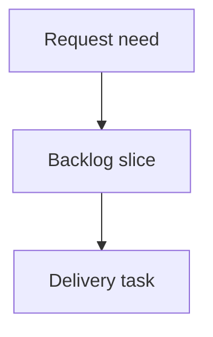

## req_002_support_logics_manager_suggestions_and_update_notices - Support logics-manager suggestions and update notices
> From version: 0.7.6
> Schema version: 1.0
> Status: Ready
> Understanding: 95%
> Confidence: 85%
> Complexity: Medium
> Theme: Operator workflow
> Reminder: Update status/understanding/confidence and linked backlog/task references when you edit this doc.

# Needs
- When `logics-manager` is available, `cdx` should help assistants use it for Logics workflow navigation, validation, viewer/focus workflows, and quick operational commands.
- `cdx` should surface update suggestions for `cdx-manager`, RTK, and/or `logics-manager` when a newer version can be detected reliably.

# Context
- `cdx` already has an RTK launch preference that injects shell hygiene guidance into assistant prompts.
- `logics-manager` now exposes richer workflow surfaces: `status`, `health`, `audit`, `lint`, `view`, MCP, quick document search/read/list/context-pack commands, and flow commands.
- The default should be ergonomic: if `logics-manager` is detected on `PATH`, Logics guidance is ON unless explicitly disabled for a session.
- Update suggestions should appear in the same family of surfaces as the existing `cdx-manager` update notice, without making `logics-manager` or RTK hard runtime dependencies.

# Acceptance criteria
- AC1: `cdx` detects `logics-manager` availability and reports it in diagnostics.
- AC2: Assistant launch prompts include Logics usage guidance by default when `logics-manager` is available, and sessions can explicitly disable it.
- AC3: The guidance mentions established and new high-value commands, including viewer/focus workflows, status, health, audit/lint, flow, search/read/list, context-pack, and MCP surfaces.
- AC4: Launch configuration displays and persists the Logics preference alongside RTK.
- AC5: Update warnings can represent multiple tools and include `logics-manager` when a newer version can be checked reliably.
- AC6: RTK update suggestions are considered only when the version source is explicit enough to avoid false positives.

# Definition of Ready (DoR)
- [x] Problem statement is explicit and user impact is clear.
- [x] Scope boundaries (in/out) are explicit.
- [x] Acceptance criteria are testable.
- [x] Dependencies and known risks are listed.

# Scope
- In: detection, diagnostics, launch preference, default-on prompt behavior, config/help rendering, tests, and multi-warning update payload groundwork.
- In: `logics-manager` update warning if the installed CLI or known package metadata provides a reliable latest-version check.
- Out: forcing commands through `logics-manager`; replacing existing filesystem reads; mandatory Logics dependency; RTK update checks without a reliable version source.

# Risks
- Running version checks too often can slow ordinary `cdx` commands; cache and short timeouts are required.
- Injecting Logics guidance outside Logics repositories could add noise; the guidance should stay concise and bounded to cases where `logics-manager` is present.
- Different install managers may report `logics-manager` versions differently; update suggestions must degrade silently when uncertain.

# Companion docs
- Product brief(s): (none yet)
- Architecture decision(s): (none yet)

# References
- `logics_manager/flow.py`
- `logics_manager/assist.py`
- `tests/python/test_logics_manager_cli.py`

# AI Context
- Summary: Draft a bounded request for support logics-manager suggestions and update notices.
- Keywords: request-draft, logics-manager, python runtime, bundled CLI
- Use when: You need a new bounded request doc for the Logics workflow.
- Skip when: The work already has an existing request or should go straight to a backlog slice.

# Backlog
- none
