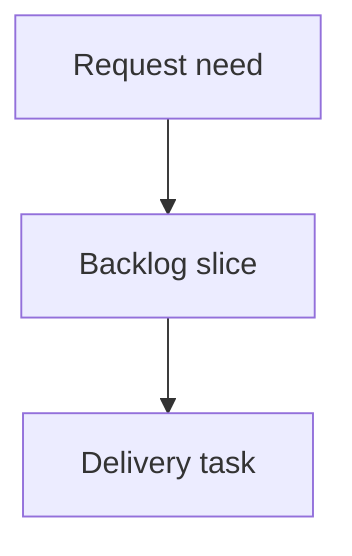

## req_003_historical_cdx_session_manager_baseline - Historical cdx session manager baseline
> From version: 0.1.0
> Schema version: 1.0
> Status: Done
> Understanding: 100%
> Confidence: 95%
> Complexity: Medium
> Theme: Operator workflow
> Reminder: Update status/understanding/confidence and linked backlog/task references when you edit this doc.

# Needs
- Capture the historical baseline request that produced the initial `cdx-manager` session manager backlog.
- Preserve traceability for the seed backlog items that predated the current request/backlog/task audit rules.

# Context
- The earliest `cdx-manager` Logics docs were created as direct backlog/task slices rather than from a managed request document.
- The delivered baseline covers session listing, creation, persistence, provider support, command ergonomics, status overview, and auth management.
- This request exists to normalize traceability for historical docs without rewriting their original product intent.

# Definition of Ready (DoR)
- [x] Problem statement is explicit and user impact is clear.
- [x] Scope boundaries (in/out) are explicit.
- [x] Acceptance criteria are represented by linked historical backlog items.
- [x] Dependencies and known risks are represented by linked historical backlog/tasks and companion docs.

# Companion docs
- Product brief(s): `prod_000_codex_multi_account_session_manager`, `prod_001_per_session_codex_status_recall`
- Architecture decision(s): `adr_000_persist_and_restore_cdx_sessions`, `adr_001_code_quality_and_security_improvements`

# References
- `logics/product/prod_000_codex_multi_account_session_manager.md`
- `logics/product/prod_001_per_session_codex_status_recall.md`
- `logics/architecture/adr_000_persist_and_restore_cdx_sessions.md`
- `logics/architecture/adr_001_code_quality_and_security_improvements.md`
- `logics/backlog/item_000_cdx_core_session_manager.md`
- `logics/backlog/item_001_persistent_codex_session_storage_and_rehydration.md`
- `logics/backlog/item_002_multi_provider_session_support_for_codex_and_claude.md`
- `logics/backlog/item_003_command_ergonomics_validation_and_safety.md`
- `logics/backlog/item_004_cdx_status_global_session_overview.md`
- `logics/backlog/item_005_cdx_session_auth_management.md`
- `logics/tasks/task_000_command_ergonomics_validation_and_safety.md`
- `logics/tasks/task_000_persistent_codex_session_storage_and_rehydration.md`
- `logics/tasks/task_001_cdx_core_session_manager.md`
- `logics/tasks/task_002_cdx_status_global_session_overview.md`
- `logics/tasks/task_003_multi_provider_session_support_for_codex_and_claude.md`
- `logics/tasks/task_005_cdx_session_auth_management.md`

# AI Context
- Summary: Draft a bounded request for historical cdx session manager baseline.
- Keywords: request-draft, logics-manager, python runtime, bundled CLI
- Use when: You need a new bounded request doc for the Logics workflow.
- Skip when: The work already has an existing request or should go straight to a backlog slice.

# Delivery
- Delivered across the historical baseline backlog and task docs listed below.
- This request is a traceability normalization for audit consistency; it does not introduce new product scope.

# Backlog
- `logics/backlog/item_000_cdx_core_session_manager.md`
- `logics/backlog/item_001_persistent_codex_session_storage_and_rehydration.md`
- `logics/backlog/item_002_multi_provider_session_support_for_codex_and_claude.md`
- `logics/backlog/item_003_command_ergonomics_validation_and_safety.md`
- `logics/backlog/item_004_cdx_status_global_session_overview.md`
- `logics/backlog/item_005_cdx_session_auth_management.md`
