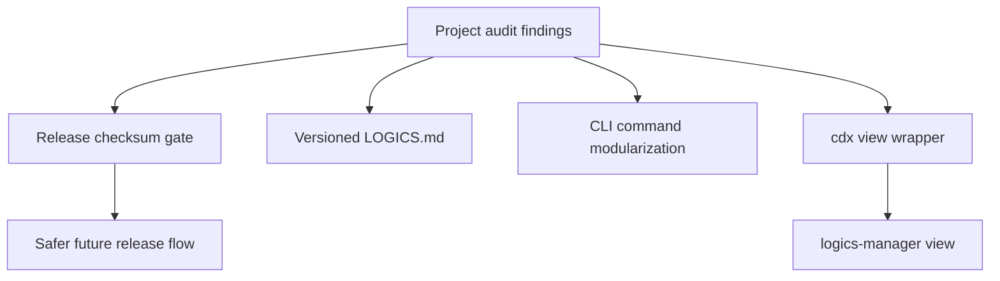

## req_004_harden_release_governance_and_add_logics_viewer_command - Harden release governance and add Logics viewer command
> From version: 0.7.8
> Schema version: 1.0
> Status: Ready
> Understanding: 95%
> Confidence: 90%
> Complexity: High
> Theme: Release governance and operator workflow
> Reminder: Update status/understanding/confidence and linked backlog/task references when you edit this doc.

# Needs
- Prevent future releases from publishing a package or tag whose bundled checksum metadata is stale or missing for the released version.
- Make `LOGICS.md` a versioned project instruction file instead of an ignored local artifact.
- Reduce the long-term change risk in `src/cli_commands.py` by extracting coherent command domains into smaller modules without changing CLI behavior.
- Add a user-facing `cdx view` command that delegates to `logics-manager view` when `logics-manager` is available, and suggests an update when the installed companion CLI is behind.
- Keep user-facing documentation and helper surfaces aligned whenever these changes land: README, CLI help text, changelog/release notes, Logics docs, and any helper command output should be updated together.

# Context
- The `0.7.8` release exposed a governance gap: `v0.7.8` checksum metadata was added on `main` after the release tag/package publication, so the published npm package contains stale checksum metadata even though `main` now has the `v0.7.8` entry.
- `LOGICS.md` has become important local project guidance and was force-added to git, but `.gitignore` still lists it as ignored.
- `src/cli_commands.py` is now the largest risk concentration in the repository, with many parsers, handlers, JSON contracts, and workflow commands living in one file.
- The Logics workflow is now a first-class operator workflow. A `cdx view` shortcut would let users open the same browser/focus surface as `logics-manager view` without remembering which companion command to run.

# Acceptance criteria
- AC1: Release validation fails when the current release version does not have a `vX.Y.Z` entry in `checksums/release-archives.json` with both `github_tarball_sha256` and `github_zip_sha256`.
- AC2: The npm and PyPI publication workflows run the checksum/version validation before publishing, so a stale release tag/package cannot be published silently.
- AC3: The release workflow documentation or changelog guidance explains the required ordering for version bump, checksum generation, tag alignment, and publication.
- AC4: `LOGICS.md` is removed from `.gitignore`, remains tracked, and has a validation guard that fails if it is missing or no longer mentions the core Logics command families.
- AC5: `src/cli_commands.py` is split incrementally into at least one smaller command-domain module while preserving the existing public CLI contract and test behavior.
- AC6: The first modularization slice keeps imports and handler routing easy to audit, with focused tests proving the moved command domain still works.
- AC7: `cdx view` is documented in help/README and delegates to `logics-manager view` from the current working directory when `logics-manager` is available.
- AC8: `cdx view` fails with a clear actionable message when `logics-manager` is missing, without making `logics-manager` a hard runtime dependency for ordinary `cdx` commands.
- AC9: When a newer `logics-manager` version is reliably detectable, `cdx view` surfaces a non-blocking update suggestion consistent with existing companion-tool update notices.
- AC10: `cdx view --json` returns a structured payload describing the delegated command, availability/update state, and failure reason without opening the viewer.
- AC11: The implementation includes focused tests for checksum validation, `LOGICS.md` tracking expectations, the modularized command domain, and `cdx view` delegation/error paths.
- AC12: Each delivered slice updates the relevant README sections, CLI help/usage text, changelog or release guidance, Logics docs, and helper output examples so user-facing documentation matches the shipped behavior.

# Definition of Ready (DoR)
- [x] Problem statement is explicit and user impact is clear.
- [x] Scope boundaries (in/out) are explicit.
- [x] Acceptance criteria are testable.
- [x] Dependencies and known risks are listed.

# Scope
- In: release checksum validation script/command and workflow integration.
- In: `.gitignore` cleanup and validation for versioned `LOGICS.md`.
- In: one or more incremental `src/cli_commands.py` extractions, starting with a bounded domain such as `run/select`, `export/import`, or status/history.
- In: `cdx view` command routing, JSON mode, documentation, tests, and update hint behavior.
- In: documentation/help alignment for every delivered slice, including README, CLI help strings, changelog/release guidance, Logics docs, and helper command output when applicable.
- Out: pushing the current local commit to remote.
- Out: rewriting the already-published `0.7.8` tag/package history.
- Out: broad CLI redesign or behavior changes beyond the delegated `cdx view` command.
- Out: making `logics-manager` mandatory for installing or using `cdx-manager`.

# Risks
- GitHub release archive checksums depend on the exact commit/tag state, so the release process must avoid computing checksums for one commit and publishing another.
- Publication workflows currently trigger from release publication; any checksum gate must run before registry upload and fail clearly.
- Moving code out of `src/cli_commands.py` can create circular imports or subtle JSON contract drift if done too broadly.
- `logics-manager view` flags may evolve; `cdx view` should be a thin delegation layer and keep unsupported options explicit.
- Update checks should remain cached and non-blocking so `cdx view` does not feel slow.

# Companion docs
- Product brief(s): `prod_000_codex_multi_account_session_manager`, `prod_002_headless_automation_contract_for_orchestia`
- Architecture decision(s): `adr_003_logics_and_companion_tool_launch_guidance`

# References
- `LOGICS.md`
- `.gitignore`
- `checksums/release-archives.json`
- `scripts/update_release_checksums.py`
- `.github/workflows/publish-npm.yml`
- `.github/workflows/publish-pypi.yml`
- `src/cli.py`
- `src/cli_commands.py`
- `src/update_check.py`
- `src/provider_runtime.py`
- `README.md`
- `changelogs/CHANGELOGS_0_7_8.md`
- CLI usage/help strings in `src/cli.py` and `src/cli_commands.py`

# AI Context
- Summary: Harden release checksum governance, version project Logics instructions, begin reducing `cli_commands.py` risk, add a `cdx view` shortcut, and keep README/help/changelog/Logics docs aligned with shipped behavior.
- Keywords: release checksum, LOGICS.md, cli_commands modularization, cdx view, logics-manager view, update suggestion, workflow governance, README, CLI help, changelog
- Use when: Planning or implementing release guardrails, Logics workflow command shortcuts, or the next CLI command modularization slice.
- Skip when: Work is only about provider auth, status quota parsing, or a release that does not touch governance/operator workflow.

# Backlog
- `item_013_release_checksum_governance_gate`
- `item_014_version_logics_md_as_project_guidance`
- `item_015_add_cdx_view_logics_viewer_delegation`
- `item_016_modularize_cli_command_domains`
