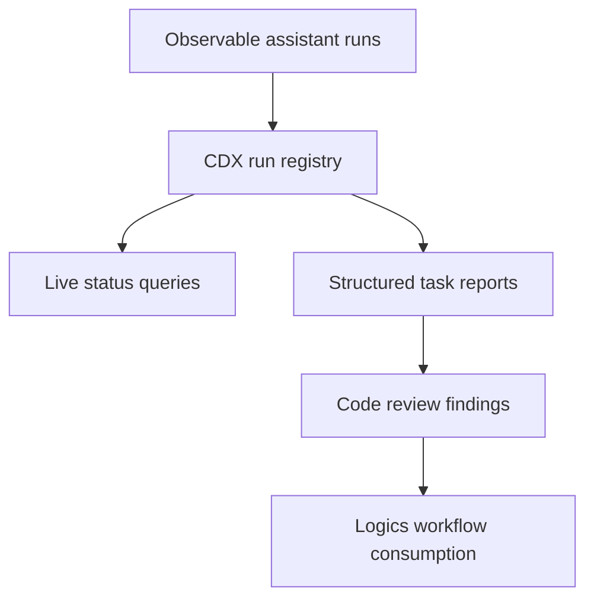

## req_005_add_observable_assistant_run_registry_and_structured_task_reports - Add observable assistant run registry and structured task reports
> From version: 0.8.0
> Schema version: 1.0
> Status: Draft
> Understanding: 95%
> Confidence: 90%
> Complexity: High
> Theme: Assistant orchestration
> Reminder: Update status/understanding/confidence and linked backlog/task references when you edit this doc.

# Needs
- CDX headless assistant runs should become observable jobs, not only blocking subprocess calls that return a final JSON payload.
- Operators and upstream tools need to know when a run is queued, running, completed, failed, timed out, or cancelled.
- Specialized assistant workflows such as code review should produce structured reports that can be consumed by Logics or another workflow layer without scraping raw transcripts.

# Context
- `cdx run --json` already returns a stable final result with `run_id`, session/provider metadata, duration, exit code, artifact paths, usage, and error fields.
- CDX already tracks active interactive sessions with runtime state (`status: running`, `pid`, `runId`) and clears stale PIDs.
- Headless `cdx run` currently waits for the provider process and records launch history only after completion; it does not expose live run state while the provider is still executing.
- Logics needs a future integration point for a runs cockpit and report-to-workflow actions, but CDX should remain the owner of provider execution, process lifecycle, run artifacts, and normalized task reports.
- The first specialized workflow should prove the model with a code-review run kind that returns machine-readable findings and a human-readable report.

# Scope
- In: persist a headless run registry with stable `run_id`, run kind, session, provider, model, cwd, status, timestamps, PID when available, artifact paths, final exit code, usage, and error summary.
- In: update `cdx run --json` so a headless run is written as `running` before provider launch and transitioned to `succeeded`, `failed`, `timed_out`, or `cancelled` when it ends.
- In: expose read APIs through CLI commands such as `cdx runs --json`, `cdx run-status <run_id> --json`, and `cdx run-report <run_id> --json` or an equivalent stable surface.
- In: provide stale-process detection so a `running` headless run whose PID no longer exists is marked stale or failed with a clear reason.
- In: add a structured assistant task/report abstraction for specialized runs, starting with a code-review run kind.
- In: make code-review reports include normalized findings, severities, file/line references when available, summary, recommended next steps, transcript/report artifact paths, and enough metadata for Logics to create workflow docs.
- In: preserve the existing final JSON stdout contract for callers that simply wait for `cdx run --json`.
- Out: building the Logics UI cockpit; that belongs in the paired Logics request.
- Out: automatically creating Logics requests/backlog/tasks from CDX alone.
- Out: replacing provider-specific transcripts; raw artifacts remain available for diagnosis.

# Acceptance criteria
- AC1: Headless runs are persisted before provider execution starts with a stable `run_id`, `status: running`, session/provider metadata, cwd, timestamps, and artifact paths.
- AC2: Headless runs transition to a terminal status on success, provider failure, timeout, cancellation, or detected stale process.
- AC3: A caller can list recent runs and fetch a single run status as JSON without parsing transcripts or launch history text.
- AC4: A caller can fetch a completed run report as JSON, including final result metadata, usage, errors, artifact paths, and any structured task output.
- AC5: Existing `cdx run --json` consumers remain compatible and still receive exactly one final JSON object on stdout.
- AC6: A first `code-review` run kind can produce a structured report with findings, severities, file/line references when available, summary, and recommended next steps.
- AC7: The code-review report shape is documented and stable enough for Logics to consume and offer report-to-workflow actions.
- AC8: Tests cover run lifecycle persistence, stale PID cleanup, status/report CLI JSON output, final payload compatibility, and code-review report parsing or fallback behavior.

# Definition of Ready (DoR)
- [x] Problem statement is explicit and user impact is clear.
- [x] Scope boundaries (in/out) are explicit.
- [x] Acceptance criteria are testable.
- [x] Dependencies and known risks are listed.

# Dependencies and risks
- Depends on the existing headless `cdx run --json` contract and artifact capture remaining stable.
- The run registry needs concurrency-safe writes because multiple assistant jobs may run at once.
- PID-based liveness checks are platform-sensitive and need Windows/macOS/Linux coverage.
- Provider outputs can be unstructured or inconsistent, so specialized reports need a strict schema plus a fallback report artifact when structured extraction fails.
- Logics integration should consume CDX status/report JSON rather than reading CDX internal files directly.

# Companion docs
- Product brief(s): `prod_002_headless_automation_contract_for_orchestia`
- Architecture decision(s): `adr_002_provider_native_headless_run_boundary`

# References
- `src/provider_runtime.py`
- `src/run_command.py`
- `src/session_service.py`
- `src/cli_commands.py`
- `logics/product/prod_002_headless_automation_contract_for_orchestia.md`
- Paired Logics request: `req_230_add_logics_assistant_runs_cockpit_and_report_to_workflow_actions` in `logics-manager`

# AI Context
- Summary: Make CDX headless assistant runs observable through a persisted run registry, live status/report JSON commands, and structured task reports starting with code review.
- Keywords: cdx run, headless, run registry, run_id, assistant jobs, code review, structured findings, report artifact, Logics integration
- Use when: Designing or implementing live assistant run tracking, specialized CDX task runs, or report shapes consumed by Logics.
- Skip when: Work is only about the Logics UI consuming an already available CDX run registry.

# Backlog
- none
