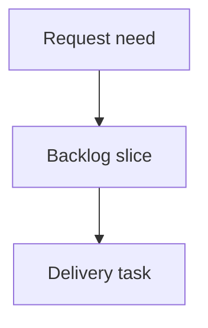

## req_006_codex_fast_mode_opt_in_upgrade_safe - Keep Codex Fast mode opt-in and normalize launch settings
> From version: 0.9.2
> Schema version: 1.0
> Status: Done
> Understanding: 95%
> Confidence: 85%
> Complexity: Medium
> Theme: Codex launch settings
> Reminder: Update status/understanding/confidence and linked backlog/task references when you edit this doc.

# Needs
- `cdx-manager` must keep OpenAI Codex Fast mode disabled by default after users upgrade to newer Codex CLI releases.
- Fast mode must be strictly opt-in: `cdx` must not enable the Codex Fast service tier unless the user explicitly asks for it.
- `cdx` launch settings must use current Codex CLI semantics so stored `--fast off` preferences reliably prevent unintended Fast billing or credit consumption.
- `cdx` must normalize its persisted launch settings so `power`, `fast`, permissions, and headless/runtime behavior mean the same thing across supported Codex CLI versions.

# Context
- Current `cdx` behavior treats `fast=true` as provider-neutral "low effort": Codex launches receive `-c model_reasoning_effort="low"` and Claude launches receive `--effort low`.
- Current OpenAI Codex docs describe Fast mode as a Codex service tier controlled in the CLI by `/fast on|off|status`, and persisted with `service_tier = "fast"` plus `[features].fast_mode = true`.
- Codex docs also list `[features].fast_mode` as enabled by default, meaning the feature can be selected unless disabled; that is not the same as forcing Fast mode on.
- User expectation for `cdx` is stricter than Codex's selectable default: new and existing `cdx` sessions should be Fast-off unless the user explicitly opts in.
- The upgrade risk is that a session-scoped `CODEX_HOME/config.toml` or newer Codex default behavior could preserve or re-enable `service_tier = "fast"` while `cdx` only changes reasoning effort.
- The existing command wording, README, and tests currently make `--fast on` mean "low effort", which now conflicts with Codex's product term "Fast mode".
- `cdx set --power` accepts `xhigh` and `max`, but current OpenAI Codex docs list `model_reasoning_effort` as `minimal|low|medium|high|xhigh`; `max` is not documented for Codex.
- `cdx run --power` and `cdx run --reasoning-effort` only accept `low|medium|high`, which is inconsistent with persisted session settings and current Codex support for `xhigh`.
- Current Codex docs expose `minimal`, but `cdx` does not accept or document it.
- `cdx unset --all` removes launch preferences entirely, which may be correct for provider defaults but is not enough when the product rule is that Codex Fast must remain off by default.

# Acceptance criteria
- AC1: New Codex sessions created by `cdx` do not launch with Codex `service_tier = "fast"` unless the user explicitly configured Fast on.
- AC2: `cdx set <session> --fast off`, default launch state, and any safe-reset/unset flow actively prevent Codex Fast service tier usage, including when a session `CODEX_HOME/config.toml` already contains `service_tier = "fast"`.
- AC3: `cdx set <session> --fast on` uses current Codex semantics for Codex sessions instead of only lowering `model_reasoning_effort`, or the setting is renamed/split so Codex Fast tier and low reasoning effort are not conflated.
- AC4: Provider-neutral "low effort" behavior remains available through `--power low` and does not implicitly opt users into Codex Fast tier.
- AC5: Interactive and headless Codex launches use explicit, documented Codex CLI/config overrides for Fast-on and Fast-off behavior.
- AC6: Persisted `power` values for Codex align with documented Codex `model_reasoning_effort` values: support `minimal|low|medium|high|xhigh` where compatible, and remove, reject, or migrate undocumented `max` for Codex.
- AC7: `cdx run --power` and `cdx run --reasoning-effort` use the same Codex-compatible reasoning effort contract as persisted launch settings, or clearly document and enforce why headless has a narrower contract.
- AC8: Session selection and priority ranking handle `minimal`, `low`, `medium`, `high`, and `xhigh` deterministically without treating unknown values as silently equivalent to `low`.
- AC9: `cdx unset --all` and related unset/default flows preserve the product safety rule that Codex Fast remains off by default, rather than falling through to an unsafe provider or stale session config default.
- AC10: README/help/config output explain that Codex Fast mode is opt-in, more expensive in credits, and disabled by default under `cdx`; they also distinguish Codex Fast tier from reasoning effort.
- AC11: Regression tests cover Codex launch args for default Fast-off, explicit Fast-off, explicit Fast-on, coexistence with `--power minimal|low|medium|high|xhigh`, rejection or migration of `max`, and interactive/headless parity.
- AC12: Any migration handles existing session launch records where `fast=true` currently meant low effort, without silently turning on paid Codex Fast tier.

# Definition of Ready (DoR)
- [x] Problem statement is explicit and user impact is clear.
- [x] Scope boundaries (in/out) are explicit.
- [x] Acceptance criteria are testable.
- [x] Dependencies and known risks are listed.

# Scope
- In: Codex provider launch argument/config mapping for Fast mode and reasoning effort.
- In: headless `cdx run` behavior for Codex sessions.
- In: session defaults, `cdx set/unset/fast/power`, `cdx run --power`, `cdx run --reasoning-effort`, help text, README, and tests.
- In: compatibility handling for existing `launch.fast` values that historically meant low effort.
- In: deterministic migration or rejection strategy for stale/undocumented launch values such as Codex `power=max`.
- Out: changing Claude, Ollama, or Antigravity provider behavior except where wording or shared validation must avoid conflating their effort controls with Codex Fast mode.
- Out: editing users' global `~/.codex/config.toml` outside the isolated `CODEX_HOME` that `cdx` controls.
- Out: forcing organization-managed Codex requirements; if managed policy pins Fast-related feature flags, `cdx` should report or tolerate the constraint but not bypass it.

# Risks
- Existing users may have `fast=true` stored and expect low-latency/low-effort behavior; a migration must not silently convert that into Codex Fast tier credit usage.
- Codex CLI service-tier override syntax may differ by version; the implementation should prefer documented `-c service_tier=...` behavior and test command construction without requiring a specific local Codex version.
- If Codex treats the absence of `service_tier` differently across versions, `cdx` should explicitly pass a non-Fast value or disable the Fast feature where needed.
- Existing users may have `power=max`; rejecting it without a migration or clear error may break launches after update.
- Adding `minimal` and `xhigh` must account for models that do not support those values; command construction tests should not assume every installed Codex binary accepts every documented value at runtime.
- Managed Business/Enterprise requirements can pin feature flags and reject conflicting local config writes.

# Companion docs
- Product brief(s): (none yet)
- Architecture decision(s): (none yet)

# References
- `README.md`
- `src/provider_runtime.py`
- `src/session_service.py`
- `src/run_command.py`
- `src/cli_commands.py`
- `test/test_cli_py.py`
- `test/test_runtime_py.py`
- OpenAI Codex docs: `https://developers.openai.com/codex/speed`
- OpenAI Codex docs: `https://developers.openai.com/codex/config-basic`
- OpenAI Codex docs: `https://developers.openai.com/codex/config-reference`
- OpenAI Codex docs: `https://developers.openai.com/codex/cli/reference`

# AI Context
- Summary: Ensure Codex Fast mode remains disabled by default in cdx-manager, separate Fast tier from reasoning effort, and normalize Codex launch setting values across interactive and headless flows.
- Keywords: codex-fast-mode, service-tier, fast-mode-opt-in, launch-settings, model-reasoning-effort, power-values, headless-parity
- Use when: Updating Codex launch setting semantics, session defaults, reasoning effort values, or upgrade compatibility for Fast mode.
- Skip when: Changing unrelated provider power/permission mappings.

# Backlog
- none
- `item_018_keep_codex_fast_mode_opt_in_and_normalize_launch_settings`
