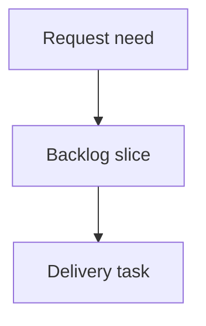

## req_007_harden_codex_multi_account_auth_isolation - Harden Codex multi-account authentication isolation
> From version: 0.9.2
> Schema version: 1.0
> Status: Ready
> Understanding: 90%
> Confidence: 80%
> Complexity: Medium
> Theme: Codex authentication
> Reminder: Update status/understanding/confidence and linked backlog/task references when you edit this doc.

# Needs
- `cdx-manager` should harden Codex authentication isolation for users running multiple Codex accounts through separate `cdx` sessions.
- A user reports that one of two Codex accounts regularly requires reauthentication; `cdx` should make it clear whether this is caused by local session handling, upstream Codex token behavior, or user/global auth state.
- Reauthenticating one Codex session must not accidentally invalidate, overwrite, mask, or confuse the auth state of another Codex session.
- `cdx` should provide enough diagnostics to inspect per-session Codex auth homes, account identity, local token presence, and live `codex login status` results without exposing secrets.

# Context
- Codex sessions are intended to isolate authentication by launching Codex with a dedicated `CODEX_HOME` per session.
- New Codex sessions currently seed their isolated auth home by copying the global `~/.codex/auth.json` when available. This is convenient, but can make two sessions start with the same account tokens if the user creates them while globally logged into one account.
- `cdx login <codex-session>` currently runs `codex logout` before `codex login` for Codex sessions. If newer Codex logout behavior invalidates tokens more broadly than the isolated `CODEX_HOME`, or if logout has server-side effects, logging into one account may disrupt another.
- Codex auth probing currently trusts local `auth.json` token presence before running `codex login status`. This can mark a session as authenticated even if tokens are expired, revoked, or no longer accepted by the installed Codex CLI.
- Status and launch flows should avoid false confidence: a stale local token should not silently pass as usable authentication when a live probe would report "Not logged in".
- Multi-account users need a bounded debugging surface that avoids dumping tokens but can show account email/identity claims where available.

# Acceptance criteria
- AC1: `cdx login <codex-session>` no longer performs an unconditional `codex logout` first, or the logout behavior becomes explicitly opt-in with clear documentation and tests.
- AC2: Reauthenticating one Codex session does not modify another session's isolated `auth.json`, session root, launch settings, or auth state.
- AC3: Session creation either makes global `~/.codex/auth.json` seeding explicit/diagnosable or provides a safer flow for users who need two different Codex accounts.
- AC4: A live Codex auth probe path is available and used by `cdx status --refresh`, `cdx doctor`, or a dedicated diagnostic command to compare local token presence against `codex login status` for each session.
- AC5: Launch authentication checks do not rely solely on token presence when the session is known or suspected stale; stale or invalid tokens produce an actionable "run cdx login <name>" result.
- AC6: Diagnostics report per-session Codex `authHome`, whether `auth.json` exists, decoded non-secret account identity/email when available, and live login status, without printing raw tokens.
- AC7: Tests cover two Codex sessions with distinct isolated auth homes and assert that login/logout/status/refresh operations for one session do not touch the other.
- AC8: Tests cover stale-token behavior where `auth.json` contains tokens but `codex login status` reports "Not logged in".
- AC9: README troubleshooting documents the multi-account auth model, the global-auth seeding caveat, and the safe procedure to create or repair two Codex account sessions.

# Definition of Ready (DoR)
- [x] Problem statement is explicit and user impact is clear.
- [x] Scope boundaries (in/out) are explicit.
- [x] Acceptance criteria are testable.
- [x] Dependencies and known risks are listed.

# Scope
- In: Codex provider authentication flow in `cdx login`, `cdx logout`, launch auth checks, status refresh, and diagnostics.
- In: tests for multiple Codex sessions with distinct `CODEX_HOME` values.
- In: safe parsing of non-secret account identity from Codex `auth.json` tokens.
- In: documentation of session auth isolation and global auth seeding behavior.
- Out: changing Claude, Antigravity, or Ollama auth semantics except where shared diagnostic rendering needs provider-neutral structure.
- Out: storing or displaying raw auth tokens.
- Out: bypassing Codex CLI authentication or implementing an independent OAuth flow.
- Out: assuming upstream Codex token invalidation behavior without a live diagnostic result.

# Risks
- Codex CLI logout behavior may vary by version; tests should verify `cdx` command construction and file isolation without requiring a specific installed Codex release.
- Removing the pre-login logout may leave some broken local auth states unresolved; the repair path should still provide an explicit logout/relogin option.
- Decoding token claims for email is best-effort and may be unavailable depending on token shape.
- Live auth probes can be slower or require a working Codex CLI; diagnostics should degrade clearly when Codex is missing or returns unexpected output.

# Companion docs
- Product brief(s): (none yet)
- Architecture decision(s): (none yet)

# References
- `README.md`
- `src/session_service.py`
- `src/provider_runtime.py`
- `src/cli_commands.py`
- `test/test_cli_py.py`
- `test/test_runtime_py.py`

# AI Context
- Summary: Harden Codex multi-account auth isolation by removing risky implicit logout behavior, improving live auth probes, and adding diagnostics for per-session auth identity.
- Keywords: codex-auth, multi-account, isolated-codeex-home, login-status, auth-json, stale-token, diagnostics
- Use when: Investigating or changing Codex session login/logout/status behavior for users with multiple Codex accounts.
- Skip when: Working on unrelated launch settings, provider quotas, or non-Codex authentication.

# Backlog
- none
- `item_019_harden_codex_multi_account_authentication_isolation`
