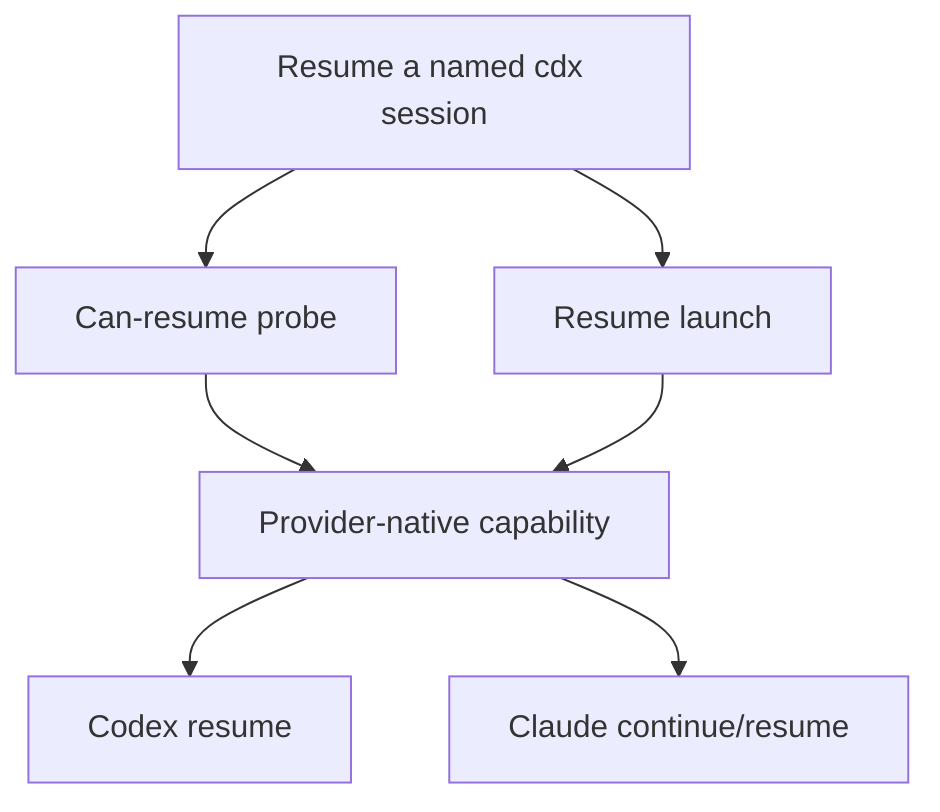

## req_008_add_provider_native_session_resume_commands - Add provider-native session resume commands
> From version: 0.9.3
> Schema version: 1.0
> Status: Ready
> Understanding: 95%
> Confidence: 90%
> Complexity: Medium
> Theme: Provider workflow
> Reminder: Update status/understanding/confidence and linked backlog/task references when you edit this doc.

# Needs
- Add a first-class `cdx` resume workflow so users can continue the previous provider conversation for a named session without remembering provider-specific commands.
- Expose a check command that tells operators and scripts whether a named session can be resumed before launching an interactive provider.
- Keep the behavior provider-native: use Codex and Claude resume features when available instead of recreating continuity through a handoff prompt.

# Context
- Today `cdx <name>` relaunches the provider inside the isolated session home, but it does not intentionally resume the last provider conversation.
- Codex supports `codex resume [SESSION_ID] [PROMPT]` and `codex resume --last`.
- Claude supports `claude --resume [value]`, `claude --continue`, `--fork-session`, `--session-id`, and `--name`; the most direct default for a named `cdx` session is `--continue` within that session's isolated `HOME` and working directory.
- `cdx-manager` already records launch history and terminal transcripts, and status parsing already recognizes Codex transcript lines such as `To continue this session, run codex resume <id>`.
- Users expect `cdx main -r` or `cdx main --resume` to mean "resume `main`", not "resume an unrelated global provider conversation".

# Acceptance criteria
- AC1: A user can run `cdx <name> -r` or `cdx <name> --resume` to resume the provider-native conversation for the named session.
- AC2: A user can run `cdx resume <name>` as the discoverable command form for the same behavior.
- AC3: A user or script can run a non-launching command, such as `cdx can-resume <name> [--json]`, to learn whether provider-native resume is available and which strategy would be used.
- AC4: Codex sessions resume inside the session's isolated `CODEX_HOME` using `codex resume --last` by default, with room to prefer a parsed resume id when a reliable id is known.
- AC5: Claude sessions resume inside the session's isolated `HOME` using `claude --continue` by default, and can use `claude --resume <value>` when an explicit provider conversation value is supplied in a later extension.
- AC6: Providers without a verified native resume mode return a clear `not_supported` result from the check command and fail with a clear message when resume launch is requested.
- AC7: JSON output reports a stable provider-neutral capability contract with `resumable`, `provider`, `strategy`, `reason`, and a redacted command preview.
- AC8: Normal `cdx <name>` launch behavior remains unchanged when resume flags are absent.

# Definition of Ready (DoR)
- [x] Problem statement is explicit and user impact is clear.
- [x] Scope boundaries (in/out) are explicit.
- [x] Acceptance criteria are testable.
- [x] Dependencies and known risks are listed.

# Companion docs
- Product brief(s): `prod_000_codex_multi_account_session_manager`
- Architecture decision(s): `adr_004_provider_native_resume_command_boundary`

# References
- `logics/product/prod_000_codex_multi_account_session_manager.md`
- `logics/architecture/adr_004_provider_native_resume_command_boundary.md`
- `logics/backlog/item_020_add_provider_native_session_resume_commands.md`
- `logics/tasks/task_019_add_provider_native_session_resume_commands.md`

# AI Context
- Summary: Add provider-native resume commands for named `cdx` sessions, covering Codex and Claude.
- Keywords: resume, can-resume, provider-native, Codex, Claude, launch routing, CLI, JSON contract
- Use when: Implementing or reviewing named session resume behavior, provider launch specs, or resume capability reporting.
- Skip when: The work only changes authentication, status parsing, or headless `cdx run` behavior without touching interactive resume.

# Delivery
- Deliver as one implementation slice from `item_020_add_provider_native_session_resume_commands`.
- Do not close this request until README/help, tests, JSON contracts, and linked backlog/task docs are updated with validation evidence.

# Backlog
- `logics/backlog/item_020_add_provider_native_session_resume_commands.md`
