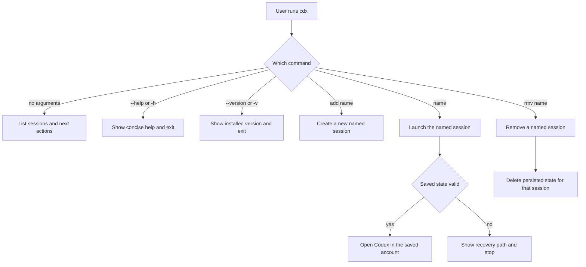

## spec_000_cdx_usage_workflow - cdx usage workflow
> From version: 1.13.0
> Understanding: 90%
> Confidence: 90%

# Overview
This spec defines the user-facing workflow for `cdx` as a terminal-based session manager.
The default experience should be discoverable, fast, and safe: list sessions, add a session, remove a session, or launch a named session with one command.
The command should also expose standard CLI affordances with `--help`/`-h` and `--version`/`-v`.
Persistent session state is part of the workflow, so returning users do not need to reconnect unless the saved state is invalid.

# Goals
- Make the `cdx` command easy to discover and remember.
- Support a complete daily loop for list, add, launch, and remove.
- Preserve login state so named sessions can be resumed without repeated authentication.
- Keep help and version flags available as standard CLI entry points.
- Keep the CLI contract explicit so users can predict how provider selection, deletion, and recovery work.

# Non-goals
- Provide a graphical UI.
- Hide the selected account behind automatic switching.
- Solve enterprise provisioning or shared workspace policy.
- Support arbitrary providers without a documented provider list.

# Users & use cases
- A user who switches between `main`, `work1`, and `work2` from one terminal.
- A user who wants `cdx` with no arguments to show what is available.
- A user who wants to add a new Codex session, then launch it later by name.
- A user who wants to add a Claude session explicitly when needed.
- A user who wants the saved login state to survive terminal restarts.
- A user who wants `cdx --help` and `cdx --version` to behave like a normal CLI.

# Scope
- In: session listing, session creation, session removal, named session launch, help, and version output.
- In: predictable recovery when saved login state is missing, expired, or revoked.
- In: explicit Codex or Claude provider selection when creating a session.
- Out: GUI workflows, enterprise policy management, and account switching without explicit naming.

# Requirements
- `cdx` with no arguments lists known sessions and points to the next action.
- `cdx add <name>` creates a new Codex session by default.
- `cdx add <provider> <name>` creates a session for the named provider, where the provider is `codex` or `claude`.
- `cdx rmv <name>` removes a named session after confirmation.
- `cdx rmv <name> --force` removes a named session without confirmation.
- `cdx <name>` launches the named session and restores valid saved state.
- `cdx --help` and `cdx -h` show concise usage help.
- `cdx --version` and `cdx -v` show the installed version.
- Invalid input returns a short usage or error message instead of a stack trace.
- Unsupported provider values are rejected with a clear error message.

# Acceptance criteria
- Users can discover the available sessions and actions from a single `cdx` command.
- A user can add, launch, and remove sessions using only the documented commands.
- A user can create Codex sessions with `cdx add <name>` and provider-specific sessions with `cdx add <provider> <name>`.
- `--help`/`-h` and `--version`/`-v` work consistently across invocations.
- A valid saved session can be resumed without a fresh login.
- An invalid saved session triggers a clear recovery path instead of silent failure.
- `rmv` requires confirmation unless `--force` is supplied.

# Validation / test plan
- Run the CLI help and version commands and verify they exit cleanly.
- Exercise `cdx`, `cdx add <name>`, `cdx add <provider> <name>`, `cdx <name>`, and `cdx rmv <name>` against a test account set.
- Verify that a persisted session is reused after restarting the terminal or process.
- Verify that expired or missing session state produces a clear recovery path.
- Verify that invalid provider values and unsafe delete flows produce readable errors.

# Companion docs
- Product brief: `logics/product/prod_000_codex_multi_account_session_manager.md`
- Backlog: `logics/backlog/item_000_cdx_core_session_manager.md`
- Backlog: `logics/backlog/item_001_persistent_codex_session_storage_and_rehydration.md`
- Backlog: `logics/backlog/item_002_multi_provider_session_support_for_codex_and_claude.md`
- Backlog: `logics/backlog/item_003_command_ergonomics_validation_and_safety.md`
- ADR: `logics/architecture/adr_000_persist_and_restore_cdx_sessions.md`

# Open questions
- Should session list output remain human-oriented only, or also support a stable machine-readable format later?
- Should the provider appear in the default list output when only Codex is configured, or only when multiple providers exist?
