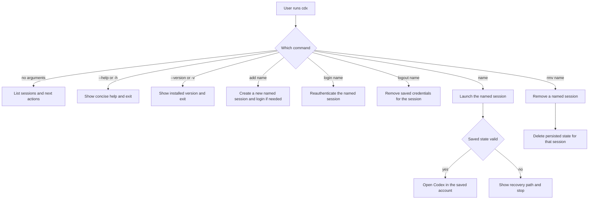

## spec_000_cdx_usage_workflow - cdx usage workflow
> From version: 1.13.0
> Understanding: 90%
> Confidence: 90%

# Overview
This spec defines the user-facing workflow for `cdx` as a terminal-based session manager.
The default experience should be discoverable, fast, and safe: list sessions, add a session, remove a session, launch a named session, or manage that session's login state with one command.
The command should also expose standard CLI affordances with `--help`/`-h` and `--version`/`-v`.
Persistent session state is part of the workflow, so returning users do not need to reconnect unless the saved state is invalid.

# Goals
- Make the `cdx` command easy to discover and remember.
- Support a complete daily loop for list, add, launch, and remove.
- Support explicit session-level login and logout so users can change the account behind one named session without affecting others.
- Preserve login state so named sessions can be resumed without repeated authentication.
- Keep help and version flags available as standard CLI entry points.
- Keep the CLI contract explicit so users can predict how provider selection, deletion, and recovery work.

# Non-goals
- Provide a graphical UI.
- Hide the selected account behind automatic switching.
- Solve enterprise provisioning or shared workspace policy.
- Support arbitrary providers without a documented provider list.

# Users & use cases
- A user who switches between `main`, `work1`, and `work2` from one terminal.
- A user who wants `cdx` with no arguments to show what is available.
- A user who wants to add a new Codex session, then launch it later by name.
- A user who wants to add a Claude session explicitly when needed.
- A user who wants the saved login state to survive terminal restarts.
- A user who wants `cdx --help` and `cdx --version` to behave like a normal CLI.

# Scope
- In: session listing, session creation, session removal, named session launch, session login, session logout, help, and version output.
- In: predictable recovery when saved login state is missing, expired, or revoked.
- In: explicit Codex or Claude provider selection when creating a session.
- Out: GUI workflows, enterprise policy management, and account switching without explicit naming.

# Command contract

| Command | Meaning | Notes |
| --- | --- | --- |
| `cdx` | List known sessions | Shows available names and the next action. |
| `cdx status` | Show the latest usage metrics for all sessions | Orders sessions by most recent status first and keeps empty states visible. |
| `cdx status <name>` | Show the latest usage metrics for one session | Read-only detail view for the named session. |
| `cdx --help` | Show help | Exits cleanly with a concise usage summary. |
| `cdx -h` | Show help | Alias for `cdx --help`. |
| `cdx --version` | Show version | Prints the installed version and exits cleanly. |
| `cdx -v` | Show version | Alias for `cdx --version`. |
| `cdx add <name>` | Create a Codex session | Uses `codex` as the default provider. |
| `cdx add <provider> <name>` | Create a provider-specific session | Provider must be `codex` or `claude`. |
| `cdx login <name>` | Reauthenticate a session | Uses the provider already assigned to the session. |
| `cdx logout <name>` | Remove saved credentials for a session | Clears the stored login state for that session only. |
| `cdx <name>` | Launch a session | Restores valid saved state before starting Codex. |
| `cdx rmv <name>` | Remove a session | Asks for confirmation before deleting. |
| `cdx rmv <name> --force` | Remove a session immediately | Skips confirmation and deletes persisted state. |

# Parsing rules
- Flags `--help`, `-h`, `--version`, and `-v` are standard entry points and must not mutate state.
- `status` is read-only and must not mutate stored session data.
- `cdx add <name>` and `cdx add <provider> <name>` are the only accepted add forms.
- `cdx add` must bootstrap the login flow when the session has no valid credentials yet.
- `cdx login <name>` must reauthenticate the named session without touching other sessions.
- `cdx logout <name>` must clear only the named session's stored credentials.
- `rmv` is the only destructive command in the initial workflow.
- Unknown providers, missing names, and malformed argument orders must return a short readable error.
- Session names are explicit and stable; the CLI must not guess a provider or target account.
- Global status output should sort by most recent status activity first.
- Status output should surface the latest usage metrics extracted from `/status`, including remaining percentages for 5h and week windows when available.
- The initial workflow is human-readable only; machine-readable output is out of scope for v1.
- The default list output should show `provider` only when multiple providers are configured or the distinction is useful.

# Requirements
- `cdx` with no arguments lists known sessions and points to the next action.
- `cdx status` shows the latest known usage metrics for every saved session.
- `cdx status <name>` shows the latest known usage metrics for one session.
- `cdx add <name>` creates a new Codex session by default.
- `cdx add <provider> <name>` creates a session for the named provider, where the provider is `codex` or `claude`.
- `cdx login <name>` reauthenticates the named session using the provider already assigned to it.
- `cdx logout <name>` clears the saved credentials for the named session.
- `cdx rmv <name>` removes a named session after confirmation.
- `cdx rmv <name> --force` removes a named session without confirmation.
- `cdx <name>` launches the named session and restores valid saved state.
- `cdx add` starts the provider login flow immediately when the session has no valid credentials yet.
- `cdx --help` and `cdx -h` show concise usage help.
- `cdx --version` and `cdx -v` show the installed version.
- Invalid input returns a short usage or error message instead of a stack trace.
- Unsupported provider values are rejected with a clear error message.
- The default list output remains concise and human-readable without requiring a machine-readable mode.
- The documented command table is the source of truth for CLI behavior.

# Acceptance criteria
- Users can discover the available sessions and actions from a single `cdx` command.
- A user can add, launch, and remove sessions using only the documented commands.
- A user can create Codex sessions with `cdx add <name>` and provider-specific sessions with `cdx add <provider> <name>`.
- A user can compare the latest usage metrics for all sessions with `cdx status`.
- A user can inspect one session in detail with `cdx status <name>`.
- `--help`/`-h` and `--version`/`-v` work consistently across invocations.
- A valid saved session can be resumed without a fresh login.
- An invalid saved session triggers a clear recovery path instead of silent failure.
- `rmv` requires confirmation unless `--force` is supplied.

# Validation / test plan
- Run the CLI help and version commands and verify they exit cleanly.
- Exercise `cdx`, `cdx status`, `cdx status <name>`, `cdx add <name>`, `cdx add <provider> <name>`, `cdx <name>`, and `cdx rmv <name>` against a test account set.
- Verify that status extraction surfaces usage, remaining 5h, and remaining week values when present in the `/status` output.
- Verify that a persisted session is reused after restarting the terminal or process.
- Verify that expired or missing session state produces a clear recovery path.
- Verify that `cdx add` starts the login flow for a new session when credentials are not already available.
- Verify that `cdx login <name>` and `cdx logout <name>` act only on the targeted session.
- Verify that invalid provider values and unsafe delete flows produce readable errors.
- Verify that each row in the command contract matches the observed CLI behavior.

# Companion docs
- Product brief: `logics/product/prod_000_codex_multi_account_session_manager.md`
- Product brief: `logics/product/prod_001_per_session_codex_status_recall.md`
- Backlog: `logics/backlog/item_000_cdx_core_session_manager.md`
- Backlog: `logics/backlog/item_001_persistent_codex_session_storage_and_rehydration.md`
- Backlog: `logics/backlog/item_002_multi_provider_session_support_for_codex_and_claude.md`
- Backlog: `logics/backlog/item_003_command_ergonomics_validation_and_safety.md`
- Backlog: `logics/backlog/item_004_cdx_status_global_session_overview.md`
- Backlog: `logics/backlog/item_005_cdx_session_auth_management.md`
- Spec: `logics/specs/spec_001_cdx_status_overview.md`
- Spec: `logics/specs/spec_002_cdx_status_output_format.md`
- Spec: `logics/specs/spec_003_cdx_session_auth_management.md`
- ADR: `logics/architecture/adr_000_persist_and_restore_cdx_sessions.md`

# Open questions
- None for v1.
