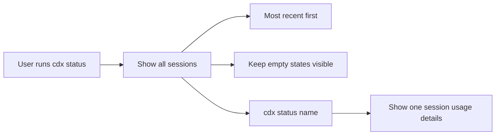

## spec_001_cdx_status_overview - cdx status usage overview
> From version: 0.1.0
> Status: Active
> Related backlog: `item_004_cdx_status_global_session_overview`
> Related task: `task_002_cdx_status_global_session_overview`
> Understanding: 90%
> Confidence: 90%

# Overview
This spec defines the user-facing behavior of `cdx status`.
The command provides a global view of the latest known `/status` result for every saved Codex or Claude session.
The `/status` payload is treated as usage data, with extracted fields such as remaining percentage for the 5h and week windows plus the next reset when available.
The default output is compare-friendly: the most recent session appears first, empty states remain visible, and each session keeps its own stored result.
An optional `cdx status <name>` detail view lets users inspect one session more closely without leaving the same command family.

# Goals
- Show the latest known `/status` for every saved session in one place.
- Make it easy to compare `main`, `work1`, and `work2` at a glance.
- Preserve session isolation so status data never leaks between sessions.
- Keep the command read-only.
- Surface the extracted usage metrics from the stored `/status` payload, including remaining percentage for the 5h and week windows.

# Non-goals
- Browse the full transcript history.
- Search arbitrary text across all sessions.
- Browse the full provider transcript or chat history.
- Mutate stored session data.

# Users & use cases
- A user who wants a quick overview of every session's latest usage data.
- A user who wants to inspect one named session in detail.
- A user who wants sessions with no `/status` yet to still appear in the list.
- A user who wants the freshest status at the top.

# Scope
- In: global session overview, per-session detail view, empty states, most-recent-first ordering.
- Out: transcript browser, search, cross-session aggregation beyond the latest relevant status block, write operations.

# Command contract

| Command | Meaning | Notes |
| --- | --- | --- |
| `cdx status [--json]` | Show the latest usage metrics for all sessions | Read-only global overview. |
| `cdx status <name> [--json]` | Show the latest usage metrics for one session | Read-only detail view for one saved session. |

# Output rules
- Show one row per saved session in the global view.
- Sort rows by the most recent stored status activity first.
- Display a clear empty state for sessions that have never produced a `/status`.
- Keep the output concise enough to compare multiple sessions at once.
- Include only the latest relevant status result, not the full transcript.
- Use the same source of truth as the per-session storage model and artifact resolver.
- Expose at least the remaining-percentage fields extracted from the latest valid `/status`, including 5h and week windows when available.
- Support both human-readable and JSON output.
- Include the `PROVIDER` column only when it adds useful information, such as when multiple providers are present.
- Prefer direct session logs over JSONL conversation artifacts when both exist, to avoid cross-session contamination from quoted transcripts.

# Requirements
- `cdx status` must list every saved session.
- `cdx status` must show the latest stored `/status` result or a clear empty state for each session.
- `cdx status <name>` must show the latest stored `/status` for the named session.
- Sessions with no stored status must remain visible.
- The output must be read-only and safe to run repeatedly.
- The output must surface the extracted remaining percentages and reset time from the latest valid `/status` payload when available.

# Acceptance criteria
- A user can run `cdx status` and see the latest usage metrics for every saved session.
- A user can run `cdx status <name>` and inspect one session in detail.
- The global view shows the most recently updated session first.
- Sessions with no stored `/status` are still listed with a clear placeholder.
- No session's status leaks into another session's output.
- The command remains readable for multi-session comparison.
- The output shows the remaining percentage for both the 5h and week windows when those values are present.

# Validation / test plan
- Run `cdx status` with several saved sessions and verify the order, empty-state handling, and extracted usage fields.
- Run `cdx status <name>` for a session with and without stored status.
- Verify that sessions with no status still appear in the global view.
- Verify that the command does not mutate any stored session data.
- Verify that the 5h and week remaining-percentage fields are surfaced when present in the stored `/status` payload.

# Companion docs
- Product brief: `logics/product/prod_000_codex_multi_account_session_manager.md`
- Product brief: `logics/product/prod_001_per_session_codex_status_recall.md`
- Backlog: `logics/backlog/item_004_cdx_status_global_session_overview.md`
- Spec: `logics/specs/spec_002_cdx_status_output_format.md`

# Open questions
- None for v1.
