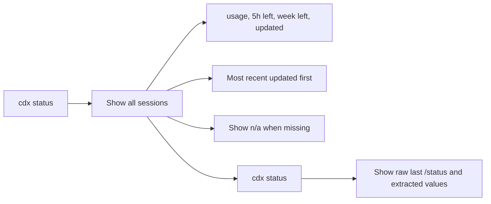

## spec_002_cdx_status_output_format - cdx status output format
> From version: 1.13.0
> Understanding: 90%
> Confidence: 90%

# Overview
This spec defines the canonical console output for `cdx status`.
The command exposes usage metrics extracted from the latest saved `/status` payload for each session, including the current usage value and the remaining percentage for the 5h and week windows when available.
The global view must be easy to scan across multiple sessions, while the detail view must make one session's raw result and extracted fields easy to inspect.



# Goals
- Define the canonical human-readable output for `cdx status`.
- Show the latest usage metrics for every saved session in a compact global table.
- Make it possible to inspect one session in detail with `cdx status <name>`.
- Keep empty states visible when a session has no stored `/status`.
- Surface the 5h and week remaining percentages when present in the stored payload.
- Keep the output read-only and stable enough to compare across multiple sessions.

# Non-goals
- Provide machine-readable JSON output.
- Browse the full transcript history.
- Reconstruct missing `/status` data that was never stored.
- Change the meaning of `/status` inside Codex itself.

# Users & use cases
- A user who wants to compare `main`, `work1`, and `work2` in one glance.
- A user who wants to know how much usage remains on the 5h and week windows.
- A user who wants to inspect one session's last `/status` result in detail.
- A user who wants to see sessions with no data yet instead of hiding them.

# Scope
- In: global table layout, per-session detail layout, ordering, and empty-state behavior.
- In: extraction and display of usage, 5h remaining, week remaining, and last update values when present.
- Out: transcript browsing, export formats, and write operations.

# Output contract

## Normalized data contract
- Every recalled `/status` result must be normalized into the same internal shape before rendering.
- The renderer may read the raw transcript payload, but the output contract is based on normalized fields.
- If a field cannot be extracted, it must render as `n/a` or `-` rather than being omitted.

| Field | Type | Meaning | Required |
| --- | --- | --- | --- |
| `session_name` | string | The saved session name, for example `main` or `work1`. | yes |
| `provider` | string | The session provider, for example `codex` or `claude`. | yes |
| `usage_pct` | integer percentage | Current usage percentage reported by `/status`. | no |
| `remaining_5h_pct` | integer percentage | Remaining percentage for the 5h window. | no |
| `remaining_week_pct` | integer percentage | Remaining percentage for the week window. | no |
| `updated_at` | timestamp or relative age | When the latest `/status` was captured or last refreshed. | no |
| `raw_status_text` | string | The raw latest `/status` payload captured for the session. | no |
| `source_ref` | string | Optional path or internal reference to the transcript source. | no |

## Extraction rules
- `usage_pct` is the primary usage figure to display in the `USAGE` column and the detail view.
- `remaining_5h_pct` is the percentage left before the 5h limit is reached.
- `remaining_week_pct` is the percentage left before the weekly limit is reached.
- `updated_at` should reflect the latest successful capture of `/status`, not the original session creation time.
- `raw_status_text` must be preserved so the detail view can show what was actually captured.
- If `/status` contains multiple candidate values, the latest valid value wins.
- If the captured payload does not contain a field, the field stays unset and renders as `n/a` or `-`.

## Global view
- `cdx status` prints one row per saved session.
- Rows are ordered by the most recent stored status activity first.
- The table includes at least `SESSION`, `USAGE`, `5H LEFT`, `WEEK LEFT`, and `UPDATED`.
- Include `PROVIDER` in the global table only when multiple providers are configured or the distinction is useful.
- Missing fields are shown as `n/a` or `-`, not hidden.
- The output stays concise enough to compare multiple sessions at once.

Example:

```txt
$ cdx status

SESSION   PROVIDER  USAGE   5H LEFT  WEEK LEFT  UPDATED
main      codex     62%     38%      71%        2m ago
work1     codex     84%     16%      55%        18m ago
work2     codex     n/a     n/a      n/a        -
claude1   claude    41%     59%      88%        4h ago
```

## Detail view
- `cdx status <name>` prints one session in a more verbose format.
- The detail view includes the latest usage metrics and the raw latest stored `/status` when available.
- The detail view must make it clear when a session has no stored `/status`.
- The detail view should label the extracted fields exactly as `Usage`, `5h left`, `Week left`, and `Updated`.
- The detail view always shows the provider.

Example:

```txt
$ cdx status main

Session: main
Provider: codex
Usage: 62%
5h left: 38%
Week left: 71%
Updated: 2m ago

Raw last /status:
...stored payload here...
```

## Field mapping
- `SESSION` maps to `session_name`.
- `PROVIDER` maps to `provider`.
- `USAGE` maps to `usage_pct`.
- `5H LEFT` maps to `remaining_5h_pct`.
- `WEEK LEFT` maps to `remaining_week_pct`.
- `UPDATED` maps to `updated_at`.
- The raw detail block maps to `raw_status_text`.
- Rendering must prefer the normalized fields over ad-hoc parsing at render time.

# Requirements
- `cdx status` must show a global list of all saved sessions.
- The global list must be ordered by the most recent status activity first.
- The global list must include usage, 5h remaining, week remaining, and updated fields when present.
- Sessions without stored `/status` data must still appear with explicit empty values.
- `cdx status <name>` must show a detailed view for the named session.
- The detailed view must expose the extracted usage fields and the raw last stored `/status` payload when available.
- The command must remain read-only.
- The renderer must prefer normalized extracted fields over ad-hoc parsing at render time.

# Acceptance criteria
- A user can run `cdx status` and compare the latest usage metrics for all sessions.
- A user can immediately identify the most recently updated session from the first row.
- A user can see `n/a` or `-` for sessions that never produced a `/status`.
- A user can run `cdx status <name>` and inspect the extracted metrics for a single session.
- The output surfaces the 5h and week remaining percentages when they are present in the stored `/status`.
- The command does not mutate session data.

# Validation / test plan
- Run `cdx status` with at least four saved sessions and verify column order, sorting, and empty-state handling.
- Run `cdx status <name>` for a session with and without stored `/status`.
- Verify that the 5h and week remaining values are displayed when present.
- Verify that the raw stored `/status` payload is exposed in the detail view when available.
- Verify that the command is stable enough for repeated comparison runs.

# Open questions
- None for v1.
