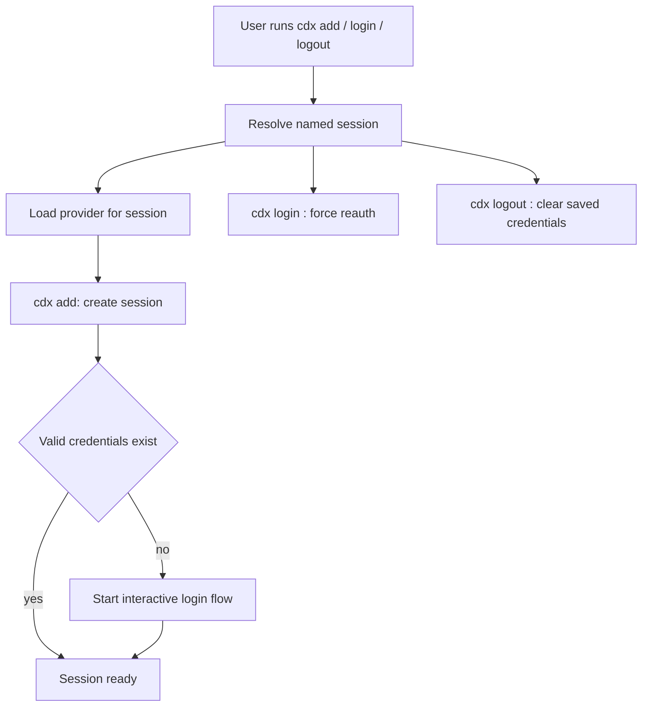

## spec_003_cdx_session_auth_management - cdx session auth management
> From version: 0.1.0
> Status: Active
> Related backlog: `item_005_cdx_session_auth_management`
> Related task: `task_005_cdx_session_auth_management`
> Understanding: 90%
> Confidence: 90%

# Overview
This spec defines how `cdx` manages authentication for one named session at a time.
The command family must keep credentials isolated per session, bootstrap the initial login flow when a new session has no valid credentials yet, and let users explicitly reauthenticate or sign out from one named session without touching the others.
The workflow is intentionally terminal-first: `cdx add` should create the session and immediately start login when needed, while `cdx login <name>` and `cdx logout <name>` provide explicit control later.

# Goals
- Bootstrap login automatically when a new session does not yet have valid credentials.
- Let users explicitly reauthenticate one named session with `cdx login <name>`.
- Let users explicitly clear one named session's stored credentials with `cdx logout <name>`.
- Keep credentials isolated so one named session cannot silently inherit another session's account.
- Preserve the provider assigned to the session while managing auth.

# Non-goals
- Replace the provider's native authentication flow.
- Share credentials between named sessions.
- Add machine-readable auth export or import in v1.
- Change how `/status` is collected or parsed.

# Users & use cases
- A user who creates `main` and wants to log in immediately while setting it up.
- A user who wants to switch the account behind `work1` without affecting `main`.
- A user who wants to clear the saved credentials for one session before reconnecting.
- A user who wants `cdx <name>` to keep using the existing login when it is still valid.

# Scope
- In: per-session authentication bootstrap during `cdx add`.
- In: `cdx login <name>` to force reauthentication for the named session.
- In: `cdx logout <name>` to remove the saved credentials for the named session.
- In: preserving the assigned provider while handling auth.
- In: clear recovery when credentials are missing, invalid, or revoked.
- Out: global account switching without a named session.
- Out: provider discovery beyond the documented provider list.

# Command contract

| Command | Meaning | Notes |
| --- | --- | --- |
| `cdx add <name>` | Create a Codex session and bootstrap login if needed | If valid credentials already exist for that session, skip the login prompt. |
| `cdx add <provider> <name>` | Create a provider-specific session and bootstrap login if needed | Provider must be `codex` or `claude`. |
| `cdx login <name>` | Reauthenticate the named session | Uses the provider already assigned to the session. |
| `cdx logout <name>` | Clear the named session's saved credentials | Does not touch other sessions. |
| `cdx <name>` | Launch the named session | Uses the saved login state if it is still valid. |

# Parsing rules
- `cdx login` and `cdx logout` operate on a single explicit session name.
- The auth commands must not guess a provider or switch accounts implicitly.
- `cdx add` should only be considered ready when the initial auth bootstrap has completed or a clear recovery path has been shown.
- An interactive login flow is required when the provider needs human input to authenticate.
- Non-interactive environments must fail with a short instruction instead of hanging indefinitely.

# Requirements
- `cdx add <name>` creates the session and starts the login flow when no valid credentials exist yet.
- `cdx add <provider> <name>` does the same for the selected provider.
- `cdx login <name>` forces a fresh login for the named session.
- `cdx logout <name>` clears the saved credentials for the named session only.
- `cdx <name>` reuses valid credentials without prompting again.
- Missing, revoked, or invalid credentials produce a clear recovery path.
- Credentials for one session must never be reused silently by another session.

# Acceptance criteria
- A new session can be created and onboarded in one step with `cdx add <name>`.
- `cdx login <name>` reauthenticates only the targeted session.
- `cdx logout <name>` clears only the targeted session's saved credentials.
- A session with valid credentials can be launched without prompting again.
- A session with missing or invalid credentials shows a clear recovery path.
- A named session never silently binds to the wrong account.

# Validation / test plan
- Exercise `cdx add <name>` in a fresh session home and verify it triggers login onboarding.
- Exercise `cdx login <name>` and confirm only the named session's credentials change.
- Exercise `cdx logout <name>` and confirm only the named session's credentials are removed.
- Verify `cdx <name>` reuses valid credentials and does not prompt again.
- Verify non-interactive auth failures return a short recovery instruction.
- Verify auth state stays isolated across `main`, `work1`, and `work2`.

# Companion docs
- Product brief: `logics/product/prod_000_codex_multi_account_session_manager.md`
- Backlog: `logics/backlog/item_005_cdx_session_auth_management.md`
- Spec: `logics/specs/spec_000_cdx_usage_workflow.md`
- ADR: `logics/architecture/adr_000_persist_and_restore_cdx_sessions.md`
