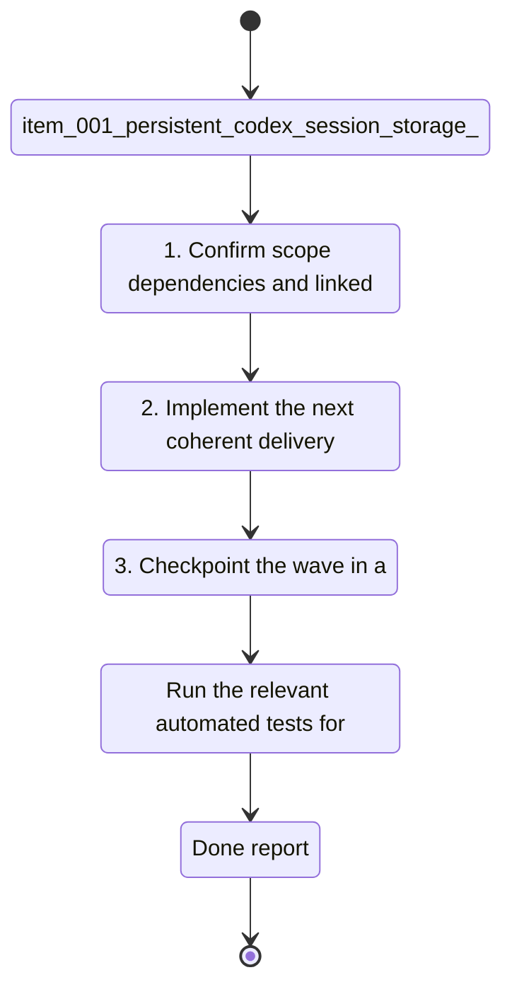

## task_000_persistent_codex_session_storage_and_rehydration - persistent Codex session storage and rehydration
> From version: 1.13.0
> Schema version: 1.0
> Status: Done
> Understanding: 95%
> Confidence: 90%
> Progress: 100%
> Complexity: High
> Theme: Auth
> Reminder: Update status/understanding/confidence/progress and linked request/backlog references when you edit this doc.

# Context
- Derived from backlog item `item_001_persistent_codex_session_storage_and_rehydration`.
- Source file: `logics/backlog/item_001_persistent_codex_session_storage_and_rehydration.md`.
- A named session is not useful if the user has to reconnect every time the terminal restarts or the command is relaunched.

# Plan
- [ ] 1. Confirm scope, dependencies, and linked acceptance criteria.
- [ ] 2. Implement the next coherent delivery wave from the backlog item.
- [ ] 3. Checkpoint the wave in a commit-ready state, validate it, and update the linked Logics docs.
- [ ] CHECKPOINT: leave the current wave commit-ready and update the linked Logics docs before continuing.
- [ ] CHECKPOINT: if the shared AI runtime is active and healthy, run `python logics/skills/logics.py flow assist commit-all` for the current step, item, or wave commit checkpoint.
- [ ] GATE: do not close a wave or step until the relevant automated tests and quality checks have been run successfully.
- [ ] FINAL: Update related Logics docs

# Delivery checkpoints
- Each completed wave should leave the repository in a coherent, commit-ready state.
- Update the linked Logics docs during the wave that changes the behavior, not only at final closure.
- Prefer a reviewed commit checkpoint at the end of each meaningful wave instead of accumulating several undocumented partial states.
- If the shared AI runtime is active and healthy, use `python logics/skills/logics.py flow assist commit-all` to prepare the commit checkpoint for each meaningful step, item, or wave.
- Do not mark a wave or step complete until the relevant automated tests and quality checks have been run successfully.

# AC Traceability
- AC1 -> Scope: A saved session can be reopened after process exit or terminal restart without asking the user to reconnect when credentials remain valid.. Proof: capture validation evidence in this doc.
- AC2 -> Scope: Expired, revoked, or missing state is detected and reported with a clear recovery path.. Proof: capture validation evidence in this doc.
- AC3 -> Scope: Removing a session also removes or invalidates the persisted state tied to that session.. Proof: capture validation evidence in this doc.
- AC4 -> Scope: Rehydration never silently binds the user to the wrong account or session.. Proof: capture validation evidence in this doc.

# Decision framing
- Product framing: Consider
- Product signals: engagement loop
- Product follow-up: Review whether a product brief is needed before scope becomes harder to change.
- Architecture framing: Required
- Architecture signals: data model and persistence, contracts and integration, security and identity
- Architecture follow-up: Create or link an architecture decision before irreversible implementation work starts.

# Links
- Product brief(s): `prod_000_codex_multi_account_session_manager`
- Architecture decision(s): `adr_000_persist_and_restore_cdx_sessions`
- Derived from `item_001_persistent_codex_session_storage_and_rehydration`
- Request(s): `req_XXX_example`

# AI Context
- Summary: Save and restore Codex session state so named sessions survive terminal restarts.
- Keywords: persistence, rehydration, login state, session recovery, Codex
- Use when: Use when working on session persistence, reconnect avoidance, and recovery behavior.
- Skip when: Skip when the change is only about command listing or provider selection.
# Validation
- Run the relevant automated tests for the changed surface before closing the current wave or step.
- Run the relevant lint or quality checks before closing the current wave or step.
- Confirm the completed wave leaves the repository in a commit-ready state.

# Definition of Done (DoD)
- [ ] Scope implemented and acceptance criteria covered.
- [ ] Validation commands executed and results captured.
- [ ] No wave or step was closed before the relevant automated tests and quality checks passed.
- [ ] Linked request/backlog/task docs updated during completed waves and at closure.
- [ ] Each completed wave left a commit-ready checkpoint or an explicit exception is documented.
- [ ] Status is `Done` and progress is `100%`.

# Report
