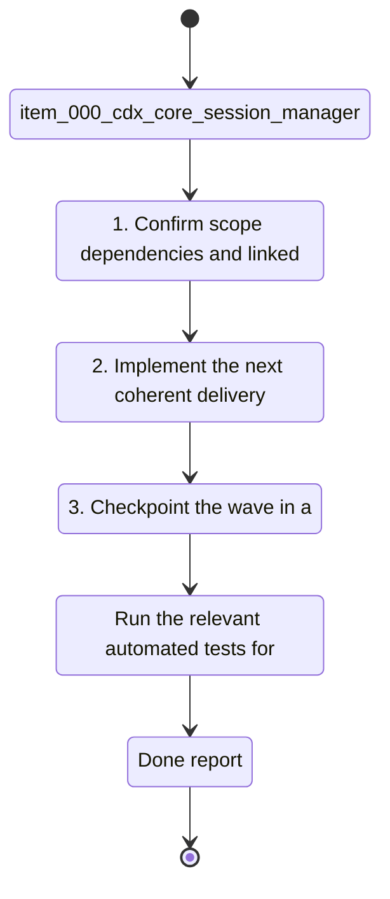

## task_001_cdx_core_session_manager - cdx core session manager
> From version: 1.13.0
> Schema version: 1.0
> Status: Done
> Understanding: 95%
> Confidence: 90%
> Progress: 100%
> Complexity: Medium
> Theme: CLI
> Reminder: Update status/understanding/confidence/progress and linked request/backlog references when you edit this doc.

# Context
- Derived from backlog item `item_000_cdx_core_session_manager`.
- Source file: `logics/backlog/item_000_cdx_core_session_manager.md`.
- The product needs a single terminal entrypoint that can list, create, remove, and launch named Codex sessions without forcing the user to remember separate commands.

# Plan
- [ ] 1. Confirm scope, dependencies, and linked acceptance criteria.
- [ ] 2. Implement the next coherent delivery wave from the backlog item.
- [ ] 3. Checkpoint the wave in a commit-ready state, validate it, and update the linked Logics docs.
- [ ] CHECKPOINT: leave the current wave commit-ready and update the linked Logics docs before continuing.
- [ ] CHECKPOINT: if the shared AI runtime is active and healthy, run `python logics/skills/logics.py flow assist commit-all` for the current step, item, or wave commit checkpoint.
- [ ] GATE: do not close a wave or step until the relevant automated tests and quality checks have been run successfully.
- [ ] FINAL: Update related Logics docs

# Delivery checkpoints
- Each completed wave should leave the repository in a coherent, commit-ready state.
- Update the linked Logics docs during the wave that changes the behavior, not only at final closure.
- Prefer a reviewed commit checkpoint at the end of each meaningful wave instead of accumulating several undocumented partial states.
- If the shared AI runtime is active and healthy, use `python logics/skills/logics.py flow assist commit-all` to prepare the commit checkpoint for each meaningful step, item, or wave.
- Do not mark a wave or step complete until the relevant automated tests and quality checks have been run successfully.

# AC Traceability
- AC1 -> Scope: `cdx` with no arguments prints the current session list and the supported actions.. Proof: capture validation evidence in this doc.
- AC2 -> Scope: `cdx add <name>` creates a new session name and rejects duplicates.. Proof: capture validation evidence in this doc.
- AC2 -> Scope: `cdx add <provider> <name>` creates a provider-specific session and rejects unsupported providers.. Proof: capture validation evidence in this doc.
- AC3 -> Scope: `cdx rmv <name>` removes an existing session and fails cleanly for unknown names.. Proof: capture validation evidence in this doc.
- AC4 -> Scope: `cdx <name>` starts Codex in the named session.. Proof: capture validation evidence in this doc.
- AC5 -> Scope: Invalid syntax returns a concise usage hint instead of a stack trace.. Proof: capture validation evidence in this doc.
- AC6 -> Scope: `cdx --help` and `cdx -h` print a concise help summary.. Proof: capture validation evidence in this doc.
- AC7 -> Scope: `cdx --version` and `cdx -v` print the installed version and exit cleanly.. Proof: capture validation evidence in this doc.

# Decision framing
- Product framing: Not needed
- Product signals: (none detected)
- Product follow-up: No product brief follow-up is expected based on current signals.
- Architecture framing: Required
- Architecture signals: data model and persistence, contracts and integration, security and identity
- Architecture follow-up: Create or link an architecture decision before irreversible implementation work starts.

# Links
- Product brief(s): `prod_000_codex_multi_account_session_manager`
- Architecture decision(s): (none yet)
- Derived from `item_000_cdx_core_session_manager`
- Request(s): `req_XXX_example`

# AI Context
- Summary: Core cdx entrypoint for listing, adding, removing, and launching named Codex sessions.
- Keywords: cdx, session, list, add, remove, launch, help, version, provider, Codex, Claude
- Use when: Use when implementing the terminal-facing command surface for named Codex sessions.
- Skip when: Skip when the work is only about auth storage, provider expansion, or CLI polish outside the core command flow.
# Validation
- Run the relevant automated tests for the changed surface before closing the current wave or step.
- Run the relevant lint or quality checks before closing the current wave or step.
- Confirm the completed wave leaves the repository in a commit-ready state.

# Definition of Done (DoD)
- [ ] Scope implemented and acceptance criteria covered.
- [ ] Validation commands executed and results captured.
- [ ] No wave or step was closed before the relevant automated tests and quality checks passed.
- [ ] Linked request/backlog/task docs updated during completed waves and at closure.
- [ ] Each completed wave left a commit-ready checkpoint or an explicit exception is documented.
- [ ] Status is `Done` and progress is `100%`.

# Report
