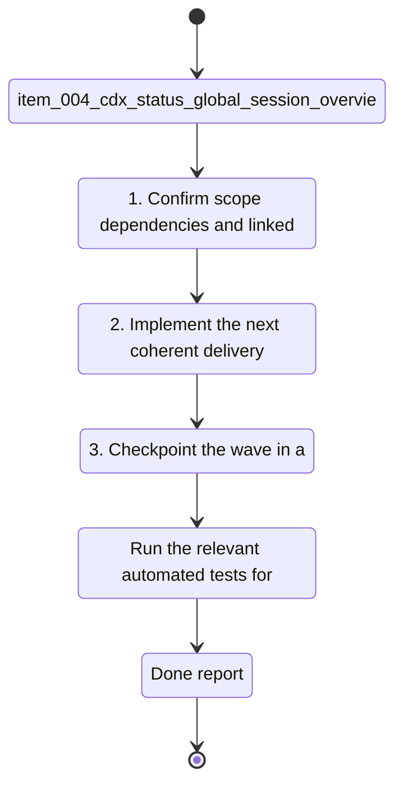

## task_002_cdx_status_global_session_overview - cdx status global session overview
> From version: 1.13.0
> Schema version: 1.0
> Status: Done
> Understanding: 90%
> Confidence: 90%
> Progress: 100%
> Complexity: Medium
> Theme: CLI
> Reminder: Update status/understanding/confidence/progress and linked request/backlog references when you edit this doc.

# Context
- Derived from backlog item `item_004_cdx_status_global_session_overview`.
- Source file: `logics/backlog/item_004_cdx_status_global_session_overview.md`.
- Users need a single command that shows the latest known `/status` usage data for every saved Codex session, so they can compare `main`, `work1`, and `work2` without switching contexts one by one.

# Plan
- [x] 1. Confirm scope, dependencies, and linked acceptance criteria.
- [x] 2. Implement the next coherent delivery wave from the backlog item.
- [x] 3. Checkpoint the wave in a commit-ready state, validate it, and update the linked Logics docs.
- [x] CHECKPOINT: leave the current wave commit-ready and update the linked Logics docs before continuing.
- [x] CHECKPOINT: if the shared AI runtime is active and healthy, run `python logics/skills/logics.py flow assist commit-all` for the current step, item, or wave commit checkpoint.
- [x] GATE: do not close a wave or step until the relevant automated tests and quality checks have been run successfully.
- [x] FINAL: Update related Logics docs

# Delivery checkpoints
- Each completed wave should leave the repository in a coherent, commit-ready state.
- Update the linked Logics docs during the wave that changes the behavior, not only at final closure.
- Prefer a reviewed commit checkpoint at the end of each meaningful wave instead of accumulating several undocumented partial states.
- If the shared AI runtime is active and healthy, use `python logics/skills/logics.py flow assist commit-all` to prepare the commit checkpoint for each meaningful step, item, or wave.
- Do not mark a wave or step complete until the relevant automated tests and quality checks have been run successfully.

# AC Traceability
- AC1 -> Scope: `cdx status` lists every saved session with the latest stored `/status` usage result or a clear empty state.. Proof: capture validation evidence in this doc.
- AC2 -> Scope: `cdx status <name>` shows the latest stored `/status` usage result for the named session.. Proof: capture validation evidence in this doc.
- AC3 -> Scope: The result for one session does not overwrite or leak into another session.. Proof: capture validation evidence in this doc.
- AC4 -> Scope: A session with no stored `/status` is still shown in the global view.. Proof: capture validation evidence in this doc.
- AC5 -> Scope: The command output is readable enough to compare multiple sessions at once.. Proof: capture validation evidence in this doc.
- AC6 -> Scope: The most recently updated session appears first in the global listing.. Proof: capture validation evidence in this doc.

# Decision framing
- Product framing: Required
- Product signals: navigation and discoverability, experience scope
- Product follow-up: Create or link a product brief before implementation moves deeper into delivery.
- Architecture framing: Required
- Architecture signals: data model and persistence, contracts and integration
- Architecture follow-up: Create or link an architecture decision before irreversible implementation work starts.

# Links
- Product brief(s): `prod_000_codex_multi_account_session_manager`, `prod_001_per_session_codex_status_recall`
- Architecture decision(s): (none yet)
- Derived from `item_004_cdx_status_global_session_overview`
- Request(s): `req_XXX_example`

# AI Context
- Summary: Global cdx status view that compares the latest stored usage data for all sessions and supports per-session detail.
- Keywords: cdx, status, global view, session comparison, detail view
- Use when: Use when implementing the session-status overview command and its per-session detail output.
- Skip when: Skip when the change is unrelated to status recall or session comparison.
# Validation
- Run the relevant automated tests for the changed surface before closing the current wave or step.
- Run the relevant lint or quality checks before closing the current wave or step.
- Confirm the completed wave leaves the repository in a commit-ready state.

# Definition of Done (DoD)
- [x] Scope implemented and acceptance criteria covered.
- [x] Validation commands executed and results captured.
- [x] No wave or step was closed before the relevant automated tests and quality checks passed.
- [x] Linked request/backlog/task docs updated during completed waves and at closure.
- [x] Each completed wave left a commit-ready checkpoint or an explicit exception is documented.
- [x] Status is `Done` and progress is `100%`.

# Report
- Implemented `cdx status` as a normalized global usage overview with per-session detail rendering.
- Output now includes the latest usage metrics, remaining 5h and week percentages, relative updated time, and explicit empty states.
- The global view sorts by most recent status activity and hides the provider column unless multiple providers exist.
- Validation evidence:
  - `node --test`
  - `node --check bin/cdx && node --check src/cli.js && node --check src/session-store.js && node --check src/session-service.js && node --check test/session-service.test.js && node --check test/cli.test.js`
  - `logics lint --require-status`
