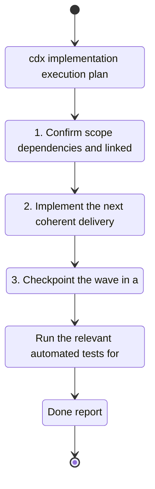

## task_004_cdx_implementation_execution_plan - cdx implementation execution plan
> From version: 0.1.0
> Schema version: 1.0
> Status: Done
> Understanding: 95%
> Confidence: 95%
> Progress: 100%
> Complexity: Medium
> Theme: General
> Reminder: Update status/understanding/confidence/progress and linked request/backlog references when you edit this doc.

# Context
- Orchestrate the execution of the full `cdx` delivery plan in locked waves.
- The wave order is:
  - wave 1: persistence and core session manager
  - wave 2: command ergonomics and safety
  - wave 3: multi-provider support
  - wave 4: `cdx status` global overview and output format
- This task exists to make the delivery order and checkpoints explicit before implementation begins.

# Plan
- [x] 1. Confirm the delivery order, dependencies, and exit criteria for all waves.
- [x] 2. Execute wave 1: persistence and core session manager.
- [x] 3. Execute wave 2: command ergonomics and safety.
- [x] 4. Execute wave 3: multi-provider support.
- [x] 5. Execute wave 4: `cdx status` global overview and output format.
- [x] 6. Run the final validation pass and close the execution plan only after all wave checks pass.
- [x] CHECKPOINT: after each wave, leave the repository commit-ready and update the linked Logics docs before moving on.
- [x] CHECKPOINT: if the shared AI runtime is active and healthy, run `python logics/skills/logics.py flow assist commit-all` at each wave checkpoint.
- [x] GATE: do not advance to the next wave until the current wave validations and quality checks have passed.
- [x] FINAL: Update the plan task report with wave-by-wave status and validation evidence.

# Execution checklist
## Wave 1: Persistence and core session manager
- [x] Implement session persistence and rehydration behavior.
- [x] Implement the core `cdx` commands: list, add, launch, remove, help, version.
- [x] Validate named session creation, launch, duplicate handling, and removal.
- [x] Capture validation evidence and leave the wave commit-ready.

## Wave 2: Command ergonomics and safety
- [x] Stabilize help, version, invalid syntax, duplicate names, and unknown-name errors.
- [x] Confirm safe `rmv` behavior with confirmation and force handling.
- [x] Validate the CLI surface is readable and predictable.
- [x] Capture validation evidence and leave the wave commit-ready.

## Wave 3: Multi-provider support
- [x] Add explicit provider support for Codex and Claude.
- [x] Route launches to the correct provider.
- [x] Show provider information where it adds useful context.
- [x] Capture validation evidence and leave the wave commit-ready.

## Wave 4: Status recall and output format
- [x] Implement `cdx status` as the global usage overview.
- [x] Implement `cdx status <name>` as the per-session detail view.
- [x] Normalize extracted usage fields and render the canonical table/detail format.
- [x] Validate the 5h and week remaining metrics, empty states, and ordering.
- [x] Capture validation evidence and leave the wave commit-ready.

# Delivery checkpoints
- Each completed wave should leave the repository in a coherent, commit-ready state.
- Update the linked Logics docs during the wave that changes the behavior, not only at final closure.
- Prefer a reviewed commit checkpoint at the end of each meaningful wave instead of accumulating several undocumented partial states.
- If the shared AI runtime is active and healthy, use `python logics/skills/logics.py flow assist commit-all` to prepare the commit checkpoint for each meaningful step, item, or wave.
- Do not mark a wave or step complete until the relevant automated tests and quality checks have been run successfully.

# AC Traceability
- AC1 -> Scope: Orchestrate the execution of the full `cdx` delivery plan in locked waves. Proof: capture validation evidence in this doc.

# Decision framing
- Product framing: Not needed
- Product signals: execution order and dependency control
- Product follow-up: Keep the product/backlog docs aligned if the execution order changes.
- Architecture framing: Not needed
- Architecture signals: (none detected)
- Architecture follow-up: No architecture decision follow-up is expected based on current signals.

# Links
- Product brief(s): `logics/product/prod_000_codex_multi_account_session_manager.md`, `logics/product/prod_001_per_session_codex_status_recall.md`
- Architecture decision(s): `logics/architecture/adr_000_persist_and_restore_cdx_sessions.md`
- Derived from: `logics/tasks/task_000_persistent_codex_session_storage_and_rehydration.md`, `logics/tasks/task_001_cdx_core_session_manager.md`, `logics/tasks/task_000_command_ergonomics_validation_and_safety.md`, `logics/tasks/task_003_multi_provider_session_support_for_codex_and_claude.md`, `logics/tasks/task_002_cdx_status_global_session_overview.md`
- Request(s): `logics/backlog/item_000_cdx_core_session_manager.md`, `logics/backlog/item_001_persistent_codex_session_storage_and_rehydration.md`, `logics/backlog/item_002_multi_provider_session_support_for_codex_and_claude.md`, `logics/backlog/item_003_command_ergonomics_validation_and_safety.md`, `logics/backlog/item_004_cdx_status_global_session_overview.md`

# AI Context
- Summary: Orchestration task for the full cdx implementation plan across the four delivery waves.
- Keywords: cdx, implementation, execution, waves, validation, checkpoints
- Use when: Use when coordinating the delivery order and checkpoints for the cdx rollout.
- Skip when: Skip when the work belongs to a single feature slice rather than the delivery plan.
# Validation
- Confirm each wave leaves the repository in a commit-ready state before the next wave starts.
- Run the relevant automated tests and lint/quality checks for each wave before closing it.
- Validate that the wave order remains: persistence/core, ergonomics/safety, multi-provider, status recall.

# Definition of Done (DoD)
- [x] The four delivery waves were executed in order.
- [x] Validation commands were executed and results captured for each wave.
- [x] No wave was closed before its automated tests and quality checks passed.
- [x] Linked request/backlog/task docs were updated during completed waves and at closure.
- [x] Each completed wave left a commit-ready checkpoint or an explicit exception is documented.
- [x] Status is `Done` and progress is `100%`.

# Report
- Wave 1 completed: session persistence, core commands, and base CLI were bootstrapped and validated.
- Wave 2 completed: CLI ergonomics, validation, and safe removal flows were hardened and tested.
- Wave 3 completed: explicit Codex/Claude provider support was added and validated.
- Wave 4 completed: `cdx status` now renders a normalized global overview and per-session detail view with remaining 5h/week percentages, reset times, ordering, and empty states.
- Follow-up hardening completed: the active implementation was migrated from JS to Python, and the status parser now prefers real transcript logs over conversational JSONL noise.
- Validation evidence:
  - `npm test`
  - `npm run lint`
  - `logics lint --require-status`
