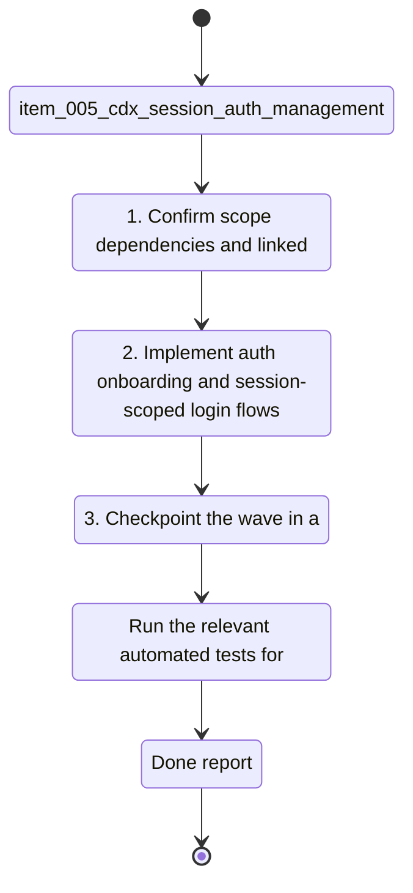

## task_005_cdx_session_auth_management - cdx session auth management
> From version: 0.1.0
> Schema version: 1.0
> Status: Done
> Understanding: 95%
> Confidence: 95%
> Progress: 100%
> Complexity: High
> Theme: Auth
> Reminder: Update status/understanding/confidence/progress and linked request/backlog references when you edit this doc.

# Context
- Derived from backlog item `item_005_cdx_session_auth_management`.
- Source file: `logics/backlog/item_005_cdx_session_auth_management.md`.
- A named session is not truly usable if the first login is still a separate manual step, and users also need a clean way to reauthenticate or clear credentials for one session without touching the others.
- The implementation must keep auth state isolated per named session and preserve the assigned provider while handling onboarding, login, and logout.

# Plan
- [x] 1. Confirm scope, dependencies, and linked acceptance criteria.
- [x] 2. Extend the session model so auth state can be tracked per named session without leaking across profiles.
- [x] 3. Implement `cdx add` onboarding so new sessions trigger the provider login flow when no valid credentials exist.
- [x] 4. Implement `cdx login <name>` as an explicit reauthentication path for one named session.
- [x] 5. Implement `cdx logout <name>` as a targeted credential reset for one named session.
- [x] 6. Add or update tests for first-run onboarding, reauth, logout, and isolation between `main`, `work1`, and `work2`.
- [x] 7. Checkpoint the wave in a commit-ready state, validate it, and update the linked Logics docs.
- [x] CHECKPOINT: leave the current wave commit-ready and update the linked Logics docs before continuing.
- [x] CHECKPOINT: if the shared AI runtime is active and healthy, run `python logics/skills/logics.py flow assist commit-all` for the current step, item, or wave commit checkpoint.
- [x] GATE: do not close a wave or step until the relevant automated tests and quality checks have been run successfully.
- [x] FINAL: Update related Logics docs

# Delivery checkpoints
- Each completed wave should leave the repository in a coherent, commit-ready state.
- Update the linked Logics docs during the wave that changes the behavior, not only at final closure.
- Prefer a reviewed commit checkpoint at the end of each meaningful wave instead of accumulating several undocumented partial states.
- If the shared AI runtime is active and healthy, use `python logics/skills/logics.py flow assist commit-all` to prepare the commit checkpoint for each meaningful step, item, or wave.
- Do not mark a wave or step complete until the relevant automated tests and quality checks have been run successfully.

# Validation
- Run `npm test` after wiring the auth flow and session isolation changes.
- Run `npm run lint` before checkpointing.
- Run `rtk python3 logics/skills/logics.py lint --require-status` after updating the linked docs.
- Re-run the focused CLI smoke tests for `cdx add`, `cdx login`, `cdx logout`, and `cdx <name>` against a temporary `CDX_HOME`.

# AC Traceability
- AC1 -> Scope: Bootstrap the login flow when `cdx add <name>` creates a session that does not yet have valid credentials.. Proof: capture validation evidence in this doc.
- AC2 -> Scope: Bootstrap the login flow when `cdx add <provider> <name>` creates a provider-specific session with missing credentials.. Proof: capture validation evidence in this doc.
- AC3 -> Scope: `cdx login <name>` to force reauthentication for one named session.. Proof: capture validation evidence in this doc.
- AC4 -> Scope: `cdx logout <name>` to remove saved credentials for one named session.. Proof: capture validation evidence in this doc.
- AC5 -> Scope: Keep auth isolated per named session and reuse valid credentials on launch.. Proof: capture validation evidence in this doc.
- AC6 -> Scope: Keep auth isolated per named session so one account cannot bleed into another.. Proof: capture validation evidence in this doc.

# Decision framing
- Product framing: Consider
- Product signals: onboarding and explicit reauthentication are part of the visible CLI flow
- Product follow-up: Keep the product brief aligned if the auth lifecycle changes again
- Architecture framing: Required
- Architecture signals: authentication storage, provider-specific login flow, and session isolation
- Architecture follow-up: Create or link an architecture decision before irreversible implementation work starts

# Links
- Product brief(s): `prod_000_codex_multi_account_session_manager`
- Architecture decision(s): `adr_000_persist_and_restore_cdx_sessions`
- Derived from `item_005_cdx_session_auth_management`
- Request(s): `req_XXX_example`

# AI Context
- Summary: Manage the login lifecycle for one named session at a time, including first-run onboarding, explicit reauth, and logout.
- Keywords: auth, login, logout, onboarding, session isolation, Codex, Claude
- Use when: Use when implementing per-session login bootstrap or explicit reauthentication commands.
- Skip when: Skip when the work is only about listing sessions or status extraction.

# Validation
- Run the relevant automated tests for the changed surface before closing the current wave or step.
- Run the relevant lint or quality checks before closing the current wave or step.
- Confirm the completed wave leaves the repository in a commit-ready state.

# Definition of Done (DoD)
- [x] Scope implemented and acceptance criteria covered.
- [x] Validation commands executed and results captured.
- [x] No wave or step was closed before the relevant automated tests and quality checks passed.
- [x] Linked request/backlog/task docs updated during completed waves and at closure.
- [x] Each completed wave left a commit-ready checkpoint or an explicit exception is documented.
- [x] Status is `Done` and progress is `100%`.

# Report
- Implemented session-scoped authentication bootstrap, explicit reauthentication, and targeted logout in the Python CLI.
- `cdx add` now creates the session and immediately probes provider auth; interactive bootstrap is triggered when needed.
- `cdx login <name>` and `cdx logout <name>` now operate on one named session without leaking auth state across profiles.
- Validation evidence:
  - `npm test`
  - `npm run lint`
  - focused Python CLI/auth tests covering onboarding, logout, reauth, non-interactive failures, and per-session isolation
