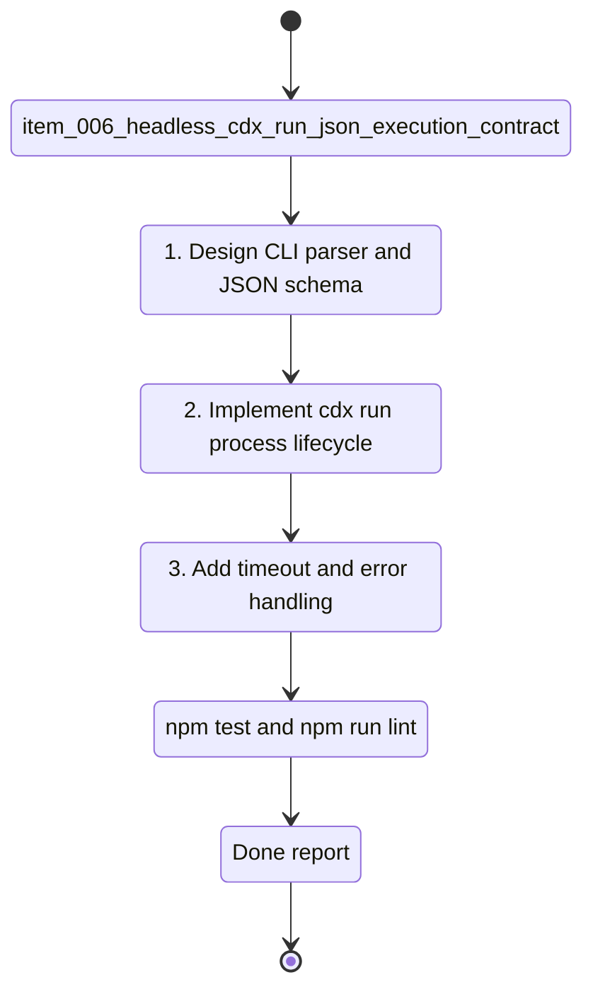

## task_006_headless_cdx_run_json_execution_contract - Headless cdx run JSON execution contract
> From version: 0.6.5
> Schema version: 1.0
> Status: Ready
> Understanding: 88
> Confidence: 78
> Progress: 0
> Complexity: High
> Theme: Integration
> Reminder: Update status/understanding/confidence/progress and linked request/backlog references when you edit this doc.

# Context
- Derived from backlog item `item_006_headless_cdx_run_json_execution_contract`.
- Source file: `logics/backlog/item_006_headless_cdx_run_json_execution_contract.md`.
- Related request(s): `req_000_orchestia_headless_json_task_runner`.
- Build the first non-interactive `cdx run` surface for Orchestia with a stable JSON result contract and JSON-only stdout.
- Coordinate with `task_007_automatic_headless_session_selection`, `task_008_provider_neutral_reasoning_effort_mapping`, and `task_009_headless_run_artifacts_usage_and_error_reporting` so the public contract stays coherent.

# Plan
- [ ] 1. Design the `cdx run` argument contract for explicit session, cwd, prompt file, inline prompt, model, reasoning effort, permission, timeout, and JSON mode.
- [ ] 2. Add parser/help text and JSON envelope plumbing without breaking existing commands.
- [ ] 3. Implement explicit-session headless launch for Codex using the existing session/provider runtime boundaries.
- [ ] 4. Add `run_id`, duration measurement, exit code capture, and success/failure JSON response construction.
- [ ] 5. Enforce JSON-only stdout when `--json` is active.
- [ ] 6. Implement `--timeout-seconds` lifecycle handling with graceful termination then force-kill fallback.
- [ ] 7. Return `error.source: "cdx"` for validation/launch errors and `error.source: "provider"` for provider process failures.
- [ ] 8. Add focused tests for parser validation, success envelope, cdx error envelope, provider failure envelope, JSON-only stdout, inline prompt, prompt file, and timeout.
- [ ] 9. Update README/help docs and linked Logics docs.
- [ ] CHECKPOINT: leave the current wave commit-ready and update linked Logics docs before continuing.
- [ ] GATE: do not close the task until relevant tests and lint pass.

# Validation
- `npm run lint`
- `npm test`
- Focused Python tests for `cdx run` parser and JSON envelopes.
- Manual or mocked smoke test proving stdout contains only final JSON in `--json` mode.

# AC Traceability
- AC1 -> Plan: explicit-session `cdx run` with workspace, prompt file, model, effort, permission, and JSON mode.
- AC2 -> Plan: inline prompt support and prompt-source validation.
- AC3 -> Plan: stable success envelope with run metadata.
- AC4 -> Plan: cdx-side error envelope.
- AC5 -> Plan: provider-side error envelope.
- AC6 -> Plan: timeout handling.
- AC7 -> Plan: JSON-only stdout tests.

# Decision framing
- Product framing: Consider
- Product signals: public headless CLI entry point for Orchestia.
- Product follow-up: Update docs and examples before release.
- Architecture framing: Required
- Architecture signals: process lifecycle, JSON schema, launch boundary.
- Architecture follow-up: Link ADR if implementation changes provider runtime abstractions.

# Links
- Product brief(s): (none yet)
- Architecture decision(s): (none yet)
- Derived from `item_006_headless_cdx_run_json_execution_contract`
- Request(s): `req_000_orchestia_headless_json_task_runner`

# AI Context
- Summary: Implement `cdx run` as a headless JSON-first task launcher with explicit sessions, prompt input, timeout, run metadata, and stable cdx/provider errors.
- Keywords: cdx run, headless, json, run_id, timeout, prompt-file, prompt, exit_code, Orchestia
- Use when: Implementing the task execution command.
- Skip when: Work is only about selection ranking, effort mapping, or artifact token details.

# Definition of Done (DoD)
- [ ] Scope implemented and acceptance criteria covered.
- [ ] Validation commands executed and results captured.
- [ ] Linked request/backlog/task docs updated.
- [ ] Status is `Done` and progress is `100%`.

# Report
