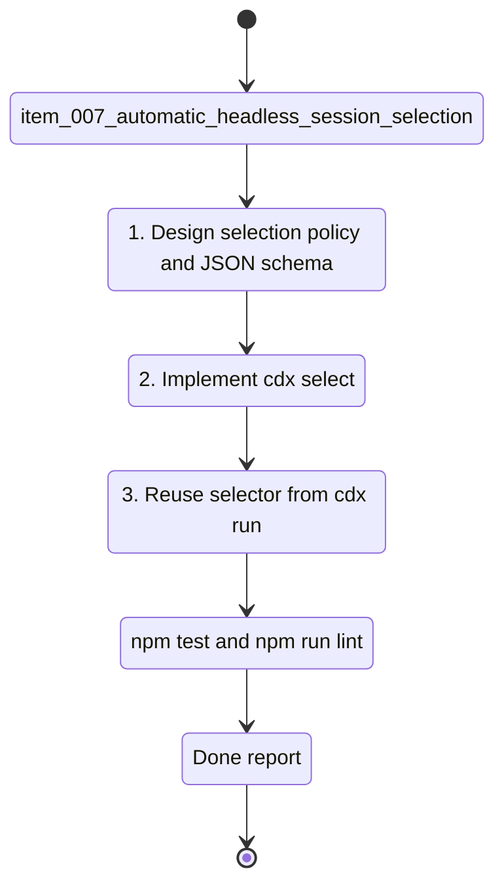

## task_007_automatic_headless_session_selection - Automatic headless session selection
> From version: 0.6.5
> Schema version: 1.0
> Status: Ready
> Understanding: 88
> Confidence: 80
> Progress: 0
> Complexity: Medium
> Theme: Integration
> Reminder: Update status/understanding/confidence/progress and linked request/backlog references when you edit this doc.

# Context
- Derived from backlog item `item_007_automatic_headless_session_selection`.
- Source file: `logics/backlog/item_007_automatic_headless_session_selection.md`.
- Related request(s): `req_000_orchestia_headless_json_task_runner`.
- Orchestia wants cdx-manager to choose a suitable account/session from provider, readiness, cooldown, quota, and priority data.

# Plan
- [ ] 1. Define a reusable selection service that consumes existing session, provider, auth, quota, cooldown, and readiness data.
- [ ] 2. Implement `cdx select --provider PROVIDER --min-reasoning-effort LEVEL --require-ready --json`.
- [ ] 3. Keep `--min-power LEVEL` as a compatibility alias.
- [ ] 4. Apply deterministic ranking: provider match, readiness, cooldown avoidance, healthiest quota/availability, configured priority, then session name.
- [ ] 5. Return stable JSON with `ok`, `session`, `provider`, `reason`, `selection_policy`, warnings, and error fields.
- [ ] 6. Return `ok: false` with `error.source: "cdx"` when no suitable session exists.
- [ ] 7. Wire `cdx run --provider codex` to the same selector once the run command is available.
- [ ] 8. Add tests for ready selection, readiness exclusion, cooldown/quota ranking, alias behavior, deterministic tie-breaking, no-match error, and run-command reuse.
- [ ] 9. Update README/help docs and linked Logics docs.
- [ ] CHECKPOINT: leave the current wave commit-ready and update linked Logics docs before continuing.
- [ ] GATE: do not close the task until relevant tests and lint pass.

# Validation
- `npm run lint`
- `npm test`
- Focused tests for `cdx select` JSON output and selection ordering.
- Focused test for `cdx run --provider` reusing the selector.

# AC Traceability
- AC1 -> Plan: core `cdx select` JSON command.
- AC2 -> Plan: `--min-power` alias.
- AC3 -> Plan: readiness exclusion.
- AC4 -> Plan: deterministic ranking.
- AC5 -> Plan: no-suitable-session error contract.
- AC6 -> Plan: reusable selector for `cdx run --provider`.

# Decision framing
- Product framing: Consider
- Product signals: Orchestia delegates account choice to cdx-manager.
- Product follow-up: Document ranking policy.
- Architecture framing: Required
- Architecture signals: shared selector, readiness data contract, ranking determinism.
- Architecture follow-up: Link ADR if ranking becomes configurable.

# Links
- Product brief(s): (none yet)
- Architecture decision(s): (none yet)
- Derived from `item_007_automatic_headless_session_selection`
- Request(s): `req_000_orchestia_headless_json_task_runner`

# AI Context
- Summary: Implement `cdx select` and a reusable deterministic session selector for provider-based headless automation.
- Keywords: cdx select, provider, readiness, quota, cooldown, ranking, min-reasoning-effort, Orchestia
- Use when: Implementing account/session selection.
- Skip when: Work is only about executing provider processes or artifact capture.

# Definition of Done (DoD)
- [ ] Scope implemented and acceptance criteria covered.
- [ ] Validation commands executed and results captured.
- [ ] Linked request/backlog/task docs updated.
- [ ] Status is `Done` and progress is `100%`.

# Report
