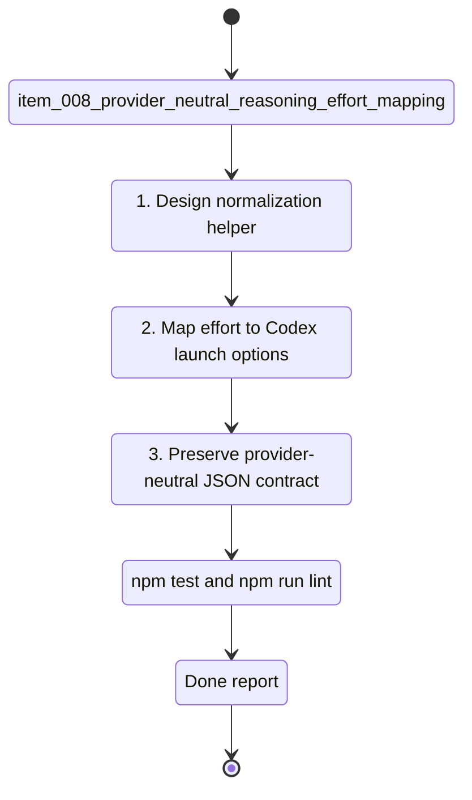

## task_008_provider_neutral_reasoning_effort_mapping - Provider-neutral reasoning effort mapping
> From version: 0.6.5
> Schema version: 1.0
> Status: Ready
> Understanding: 90
> Confidence: 82
> Progress: 0
> Complexity: Medium
> Theme: Integration
> Reminder: Update status/understanding/confidence/progress and linked request/backlog references when you edit this doc.

# Context
- Derived from backlog item `item_008_provider_neutral_reasoning_effort_mapping`.
- Source file: `logics/backlog/item_008_provider_neutral_reasoning_effort_mapping.md`.
- Related request(s): `req_000_orchestia_headless_json_task_runner`.
- Orchestia confirmed `--reasoning-effort low|medium|high` as the stable public name, with `--power` retained as a cdx alias.

# Plan
- [ ] 1. Add a central normalization helper for `--reasoning-effort` and `--power`.
- [ ] 2. Validate allowed values `low`, `medium`, and `high`.
- [ ] 3. Reject conflicting `--reasoning-effort` and `--power` values with `error.source: "cdx"`.
- [ ] 4. Map normalized effort to Codex launch options.
- [ ] 5. Return resolved `reasoning_effort` and `power` in `cdx run` and selection JSON responses.
- [ ] 6. Leave explicit extension points for Claude/Ollama mappings without changing the public schema.
- [ ] 7. Add tests for preferred option, alias option, conflict handling, invalid values, Codex mapping, and response fields.
- [ ] 8. Update CLI help/README and linked Logics docs.
- [ ] CHECKPOINT: leave the current wave commit-ready and update linked Logics docs before continuing.
- [ ] GATE: do not close the task until relevant tests and lint pass.

# Validation
- `npm run lint`
- `npm test`
- Focused parser/normalization tests for reasoning effort and power alias behavior.
- Focused Codex launch option test.

# AC Traceability
- AC1 -> Plan: preferred `--reasoning-effort`.
- AC2 -> Plan: `--power` alias.
- AC3 -> Plan: conflict validation.
- AC4 -> Plan: Codex mapping.
- AC5 -> Plan: JSON response fields.
- AC6 -> Plan: provider-neutral extension points.

# Decision framing
- Product framing: Consider
- Product signals: public automation terminology must stay stable.
- Product follow-up: Update docs and help text.
- Architecture framing: Required
- Architecture signals: provider option normalization and launch mapping.
- Architecture follow-up: Link ADR if provider mappings become extensive.

# Links
- Product brief(s): (none yet)
- Architecture decision(s): (none yet)
- Derived from `item_008_provider_neutral_reasoning_effort_mapping`
- Request(s): `req_000_orchestia_headless_json_task_runner`

# AI Context
- Summary: Implement `--reasoning-effort` as the provider-neutral public option and keep `--power` as an alias mapped to Codex launch options.
- Keywords: reasoning-effort, power, alias, Codex, model_reasoning_effort, provider-neutral
- Use when: Implementing or testing provider effort option handling.
- Skip when: Work is only about selection ranking or artifact output.

# Definition of Done (DoD)
- [ ] Scope implemented and acceptance criteria covered.
- [ ] Validation commands executed and results captured.
- [ ] Linked request/backlog/task docs updated.
- [ ] Status is `Done` and progress is `100%`.

# Report
